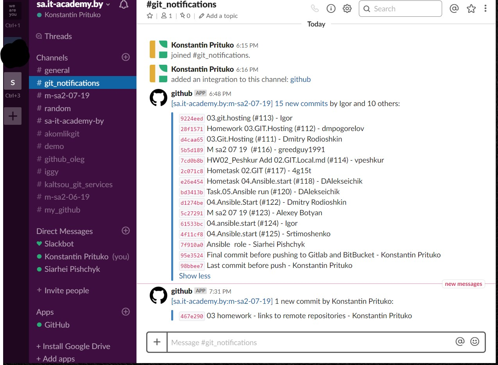

## 03. GIT hosting

# Links to repositories

- GitHub repository - [LINK](https://github.com/Kinstintin/super_puper_project)
- GitLab repository - [LINK](https://gitlab.com/Kinstintin/super_puper_project)
- BitBucket repository - [LINK](https://bitbucket.org/Kinstintin/super_puper_project/)

# GitHub + Slack integration

Screenshot:

First settings - set to "Send me everything."
Later changed to "Just the push event."

# Deploying local GitLab

- Local GitLab server was deployed on VirtualBox VM - Ubuntu 18.04.
- Access, notifications, project was set up.
- Invitation has been sent 3rd of May (about 01:30 - Minsk time) from email - kinstintin@gmail.com I used gmail.com as relay for email notifications. 
