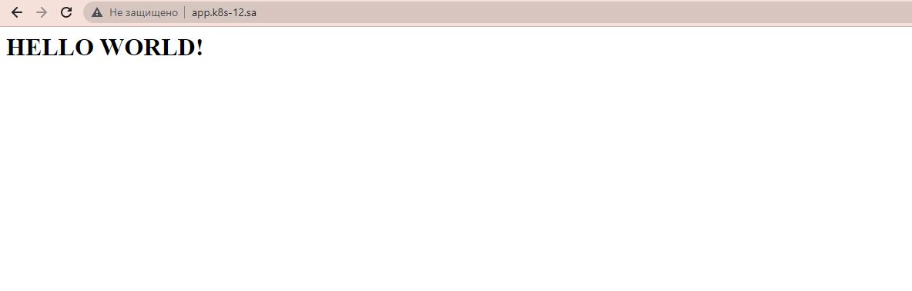
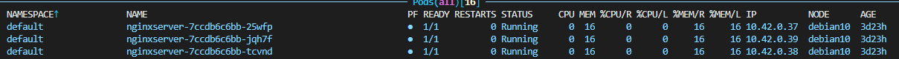
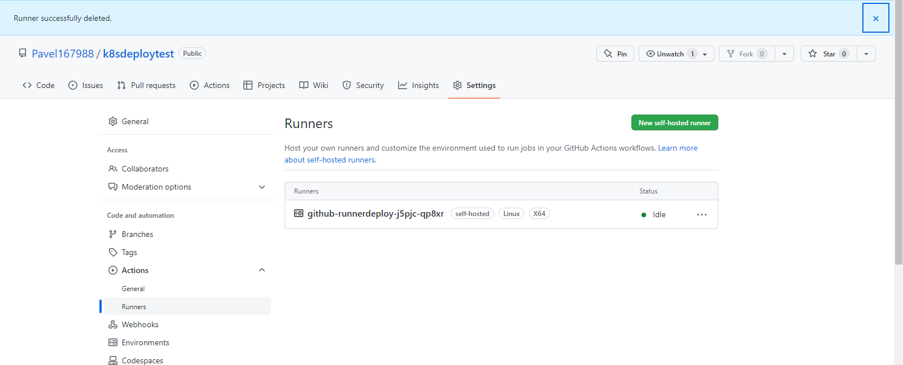
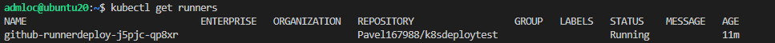

### 11.K8s


## deploy.yaml
```bash
---
apiVersion: apps/v1
kind: Deployment
metadata:
  name: nginxserver
  labels:
    app: simple-web
spec:
  replicas: 3
  selector:
    matchLabels:
      app: simple-web
  template:
    metadata:
      labels:
        app: simple-web
    spec:
      containers:
      - name: simple-web-server-nginx
        image: nginx
        ports:
        - containerPort: 80
        resources:
          requests:
            cpu: 100m
            memory: 100Mi
          limits:
            cpu: 200m
            memory: 100Mi
        volumeMounts:
        - name: config
          mountPath: /usr/share/nginx/html
      volumes:
      - name: config
        configMap:
          name: test-nginx
---
apiVersion: v1
kind: Service
metadata:
  name: simple-web
  labels:
    run: simple-web
spec:
  ports:
  - port: 80
    protocol: TCP
  selector:
    app: simple-web
---
apiVersion: networking.k8s.io/v1
kind: Ingress
metadata:
  name: ingress-sa
  annotations:
    kubernetes.io/ingress.class: nginx
    nginx.ingress.kubernetes.io/server-alias: "app.k8s-12.sa"
spec:
  rules:
    - host: app.k8s-12.sa
      http:
        paths:
          - path: /
            pathType: Prefix
            backend:
              service:
                name: simple-web
                port:
                  number: 80
---                  
apiVersion: v1
kind: ConfigMap
metadata:
  name: test-nginx
data:
  index.html: |
    <!DOCTYPE html>
    <html lang="en">
    <head>
    <meta charset="UTF-8">
    </head>
    <body>
    <h1>HELLO WORLD!<h1>
    </body>
    </html>

```
## Screen from browser
---

---
## Screen pods from k9s
---

---
## Screen runner from github
---

---
## Screen runners
---

---