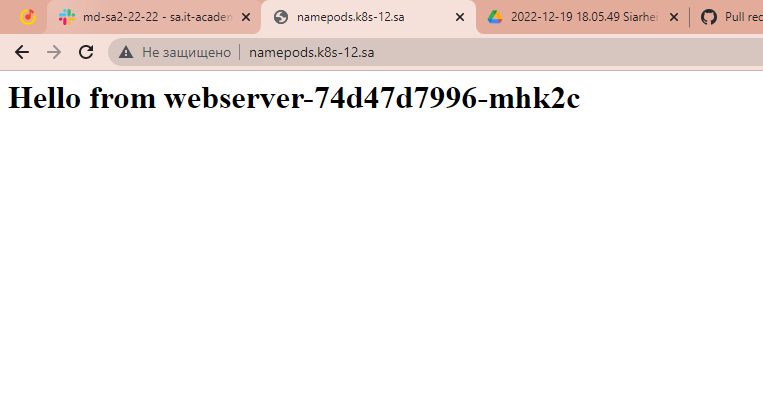
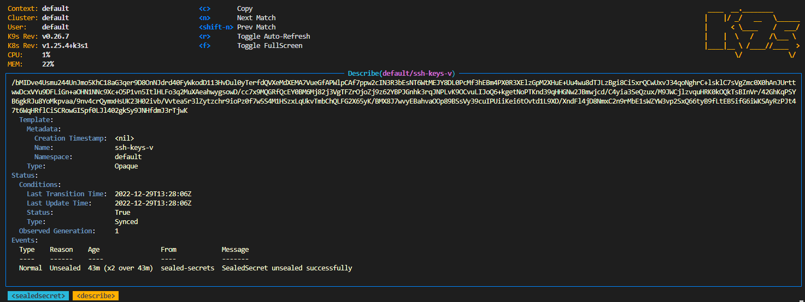
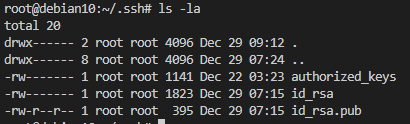
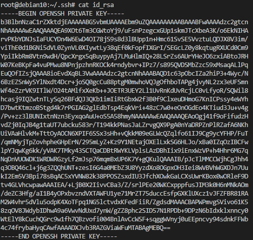

### 12.K8s


## dep.yaml
```bash
---
apiVersion: v1
kind: ConfigMap
metadata:
  name: test-config
data:
  index.php: |
    <?php
    $hostname = gethostname();
    echo "<h1>Hello from {$hostname}</h1>";
    ?>
---
apiVersion: apps/v1
kind: Deployment
metadata:
  name: webserver
  labels:
    app: simple-web
spec:
  replicas: 1
  strategy:
    type: RollingUpdate
    rollingUpdate:
      maxSurge: "100%"
      maxUnavailable: "0%"
  selector:
    matchLabels:
      app: simple-web
  template:
    metadata:
      labels:
        app: simple-web
    spec:
      containers:
      - name: php-container
        image: eboraas/apache-php
        ports:
        - containerPort: 80
        resources:
          requests:
            cpu: 100m
            memory: 100Mi
          limits:
            cpu: 200m
            memory: 100Mi    
        volumeMounts:
        - name: php-container
          mountPath: /var/www/html
        - name: ssh-keys-v
          mountPath: "/root/.ssh"          
      volumes:
      - name: php-container
        configMap:
          name: test-config
      - name: ssh-keys-v
        secret:
          secretName: ssh-keys-v
          defaultMode: 0600 
---
apiVersion: v1
kind: Service
metadata:
  name: simple-web
  labels:
    run: simple-web
spec:
  ports:
  - port: 80
    protocol: TCP
  selector:
    app: simple-web
---
apiVersion: networking.k8s.io/v1
kind: Ingress
metadata:
  name: ingress-sa
  annotations:
    kubernetes.io/ingress.class: php-container
spec:
  rules:
    - host: namepods.k8s-12.sa
      http:
        paths:
          - path: /
            pathType: Prefix
            backend:
              service:
                name: simple-web
                port:
                  number: 80
```
## Screen from browser (hostname pod)
---

---


## Gerenerate sealed_secret.yaml and apply in k8s
```bash
cat secret.yaml | kubeseal --format yaml > sealed_secret.yaml
kubectl apply -f sealed_secret.yaml
```

---

---

---

---

---

---

