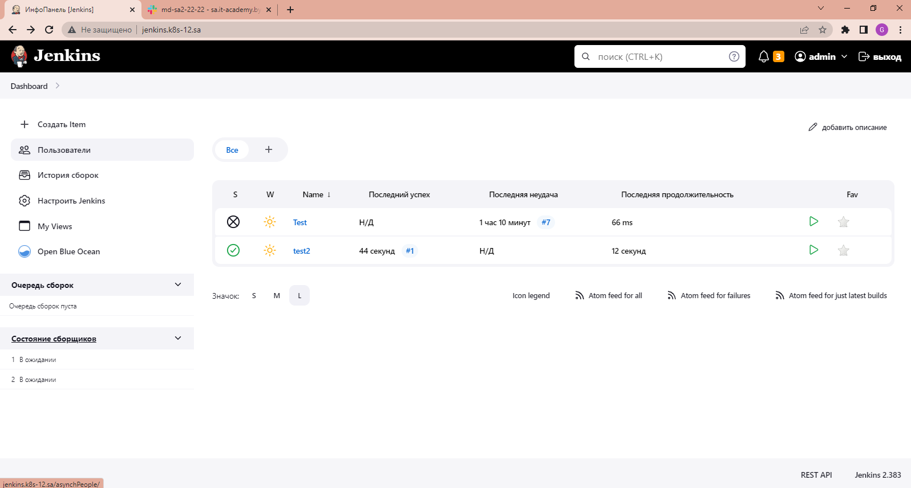

### 14.K8s


## Commands
```bash
  959  mkdir {helm-source,helm-releases}
  960  ls -la
  961  cd helm-
  962  cd helm-source/
  963  ls -la
  964  helm create jenkins
  965  ls -la
  966  cd jenkins/
  967  ls -la
  968  vim values.yaml
  969  rm values.yaml
  970  vim values.yaml
  974  vim Chart.yaml
  975  cd templates/
  976  ls -la
  977  vim deployment.yaml
  979  vim deployment.yaml
  981  vim ingress.yaml
  983  vim service.yaml
  985  vim serviceaccount.yaml
  991  helm package jenkins
  992  ls -la
  993  mv jenkins-0.1.0.tgz ../helm-releases/
 1087  helm install jenkins-0.1.0.tgz --generate-name
 1088  k9s
 1089  cd ..
 1090  ls -la
 1091  git init
 1092  git remote -v
 1093  git remote git config user.email "pasha.167988@yandex.by"
 1094  git config user.email "pasha.167988@yandex.by"
 1095  git config user.name "Kostenko"
 1096  git add --all
 1097  git remote add origin git@github.com:Pavel167988/jenkins-helm.git
 1098  git push origin master
 1099  git status
 1105  git commit -m "First commit"
 1106  git push origin master
 1107  echo -e "User-Agent: *\nDisallow: /" > robots.txt
 1108  ls -la
 1109  vim robots.txt
 1110  helm repo index --url https://pavel167988.github.io/jenkins-helm/ .
 1111  ls -la
 1112  vim index.yaml
 1113  cd helm-source/
 1114  ls -la
 1115  cd jenkins/
 1116  ls -la
 1124  vim Chart.yaml
 1125  cd ..
 1126  help repo add jenkins https://pavel167988.github.io/jenkins-helm/
 1128  helm repo add jenkins https://pavel167988.github.io/jenkins-helm/
 1129  git status
 1130  git add --all
 1131  git commit -m "Second commit"
 1132  git push origin master
 1133  helm repo add jenkins https://pavel167988.github.io/jenkins-helm/
 1134  helm repo update
 1138  helm search repo jenkins
 1139  helm package helm-source/jenkins/
 1140  mv jenkins-0.2.0.tgz helm-releases/
 1141  ls -la
 1142  cd helm-
 1143  cd helm-releases/
 1144  ls -la
 1145  history | grep helm
 1146  helm repo index --url https://pavel167988.github.io/jenkins-helm/ . --merge index.yaml
 1147  vim index.yaml
 1148  git add --all
 1149  git commit -m "Add new package"
 1150  git push origin master
 1151  helm repo update
 1152  helm search repo jenkins
 1153  helm search repo -l
 1154  helm search repo jenkins -l
 1155  vim index.yaml
 1156  git status
 1157  git add --all
 1159  git commit -m "Commit pack"
 1160  git push origin master
 1225  vim helm-source/jenkins/Chart.yaml
 1232  git add --all
 1233  git commit -m "3.0"
 1234  git push origin master
 1235  helm repo add jenkins https://pavel167988.github.io/jenkins-helm/
 1236  helm repo update
 1242  cd helm-releases/
 1243  helm repo update
 1244  helm search repo jenkins -l
 1245  cd ..
 1246  vim helm-source/jenkins/values.yaml
 1247  helm package helm-source/jenkins/
 1248  mv jenkins-0.3.0.tgz helm-releases/
 1249  helm install jenkins-0.3.0.tgz --generate-name
 1250  helm install helm-releases/jenkins-0.3.0.tgz --generate-name
```
## Screen from browser
---

---

### Url Repository
Github actions (https://github.com/Pavel167988/jenkins-helm);
