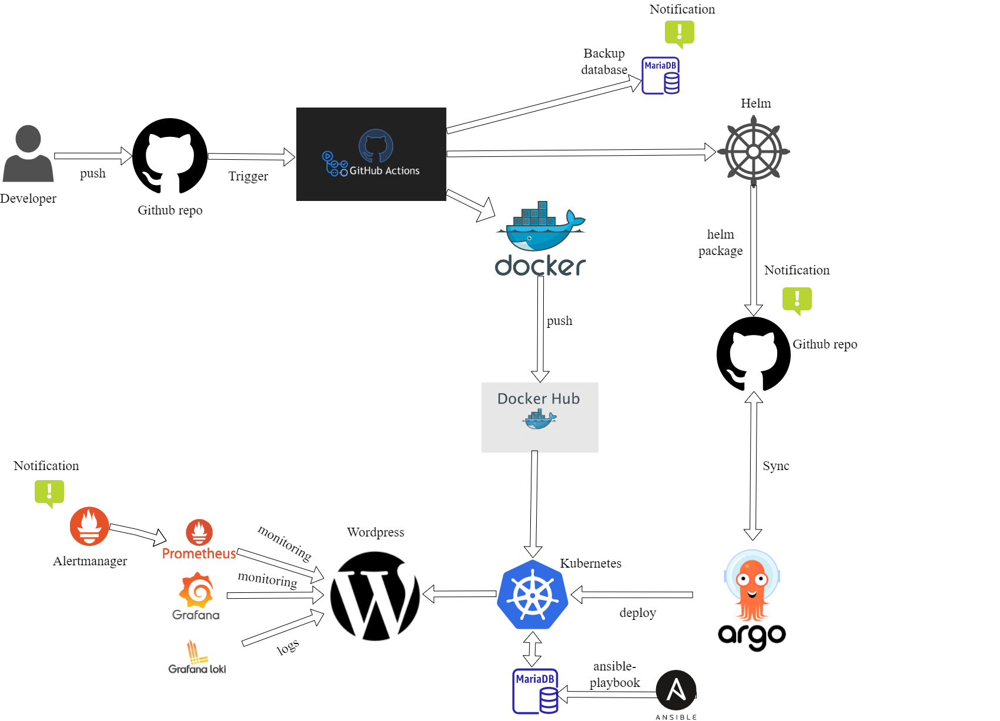

## Project report

**Project's reporter: Pavel Kostenko**

**Group number: md-sa2-22-22**

### Description of application for deployment

- Name of application - Wordpress
- Which programming language is this application written in: PHP
- What kind of DB: MariaDB
- Link on git repository/site/package repository: https://github.com/Pavel167988/project_wp

### Pipeline. High Level Design

---

### Technologies which were used in project

**Orchestration:** K8s

**Automation tools:** Ansible, Github Actions, Argo-CD

**Monitoring:** Prometheus, Alertmanager, Grafana, Grafana Loki

**Notification:** Slack

**CI description: The developer push the code in master branch to the repository, github actions:**

- Creates a new tag
- Install docker
- Build image and pushes that image with to the repository with tag that was generated
- Create backup of the database and push into the storage
- Update charts in helm (tag)
- Helm build the package and push to the repository
- There are notifications about results of pipeline

**Deployment flows short description:**

Argo-CD synchronize with the repository, sees the changes in the file (index.yaml), namely targetRevision and deploy new version of application in Kubernetes cluster.

**Rollback flow description and implementation:** ArgoCD can rollback apps in WebUI interface manually.

### Links
---
[Repository with pipeline and app](https://github.com/Pavel167988/project_wp)
---
[Images in Docker Hub](https://hub.docker.com/repository/docker/pavelogs/wordpress/general)
---
[Database install](https://github.com/Pavel167988/Install-maria_db/tree/main/db_install)
---