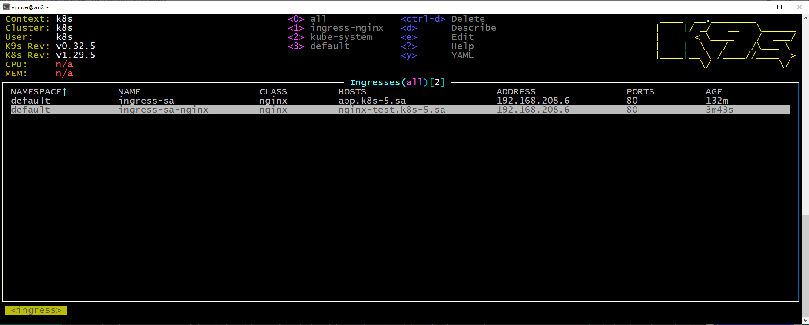
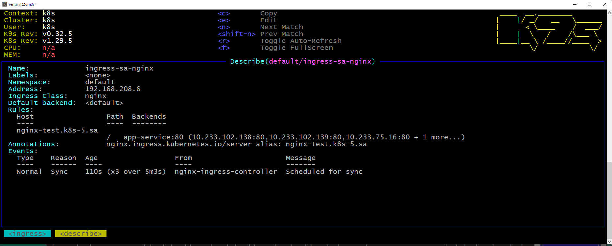
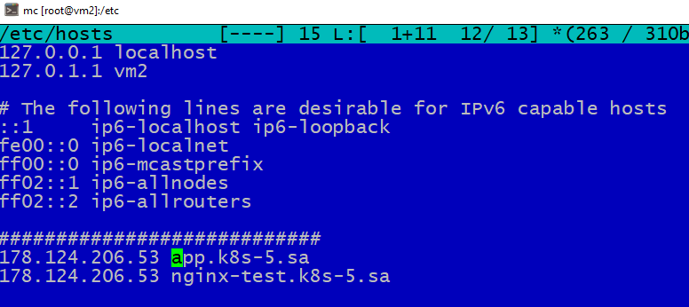

# 11. Kubernetes. Basic objects

Install ingress-nginx:
```bash
  259  wget https://raw.githubusercontent.com/kubernetes/ingress-nginx/main/deploy/static/provider/baremetal/deploy.yaml -O ingress-nginx.yaml
  260  kubectl create -f ingress-nginx.yaml
  261  kubectl get nodes
```

app-NginxServer.yaml:
```yaml
apiVersion: apps/v1
kind: Deployment
metadata:
  name: nginxserver
  labels:
    app: nginx
spec:
  replicas: 4
  strategy:
    type: RollingUpdate
    rollingUpdate:
      maxSurge: 3
      maxUnavailable: 1
  selector:
    matchLabels:
      app: nginx
  template:
    metadata:
      labels:
        app: nginx
    spec:
      containers:
      - name: nginx
        image: nginx:latest
        ports:
        - containerPort: 80
        resources:
          requests:
            cpu: 64m
            memory: 250Mi
          limits:
            cpu: 128m
            memory: 500Mi
---
apiVersion: v1
kind: Service
metadata:
  name: app-service
  labels:
    run: app-service
spec:
  ports:
  - protocol: TCP
    port: 80
  selector:
    app: nginx
---
apiVersion: networking.k8s.io/v1
kind: Ingress
metadata:
  name: ingress-sa-nginx
  annotations:
    nginx.ingress.kubernetes.io/server-alias: "nginx-test.k8s-5.sa"
spec:
  ingressClassName: nginx
  rules:
    - host: nginx-test.k8s-5.sa
      http:
        paths:
          - path: /
            pathType: Prefix
            backend:
              service:
                name: app-service
                port:
                  number: 80
```

Сreate app-NginxServer.yaml
```bash
  268  kubectl create -f app-NginxServer.yaml
  269  kubectl apply -f app-NginxServer.yaml
```
Result:



Edit file hosts:


Check work page http://nginx-test.k8s-5.sa
```bash
  270  curl http://nginx-test.k8s-5.sa
```
Result:
```bash
<!DOCTYPE html>
<html>
<head>
<title>Welcome to nginx!</title>
<style>
html { color-scheme: light dark; }
body { width: 35em; margin: 0 auto;
font-family: Tahoma, Verdana, Arial, sans-serif; }
</style>
</head>
<body>
<h1>Welcome to nginx!</h1>
<p>If you see this page, the nginx web server is successfully installed and
working. Further configuration is required.</p>

<p>For online documentation and support please refer to
<a href="http://nginx.org/">nginx.org</a>.<br/>
Commercial support is available at
<a href="http://nginx.com/">nginx.com</a>.</p>

<p><em>Thank you for using nginx.</em></p>
</body>
</html>
```
