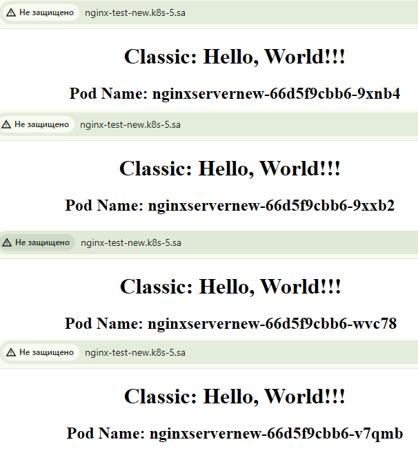
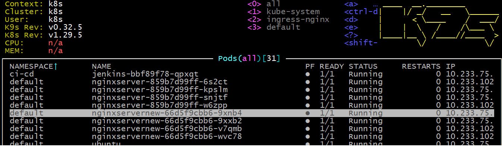

# 12. Kubernetes. Data. Security

launch the tunnel:
```bash
  297  ssh -L 6443:127.0.0.1:6443 root@192.168.208.5 -f -N
  298  cd 12.K8s.configmaps.secrets/
```
Install kubeseal:
```bash
kubectl apply -f https://github.com/bitnami-labs/sealed-secrets/releases/download/v0.27.0/controller.yaml
wget https://github.com/bitnami-labs/sealed-secrets/releases/download/v0.27.0/kubeseal-0.27.0-linux-amd64.tar.gz
sudo tar -C /usr/local/bin -xzf kubeseal-0.27.0-linux-amd64.tar.gz
kubeseal --version
```
Result:
```bash
kubeseal version: 0.27.0
```
app-NginxServer-new.yaml:
```yaml
apiVersion: v1
kind: ConfigMap
metadata:
  name: html-config
data:
  index.html: |
    <!DOCTYPE html>
    <html>
    <head>
        <meta charset="UTF-8">
        <title>Pod Hostname</title>
        <style>
          .text {
          text-align: center;
          }
        </style>
    </head>
    <body>
        <div class="text">
        <h1>Classic: Hello, World!!!</h1>
        <h2>Pod Name: HOSTNAME</h2>
        </div>
    </body>
    </html>
---
apiVersion: apps/v1
kind: Deployment
metadata:
  name: nginxservernew
  labels:
    app: nginx
spec:
  replicas: 4
  strategy:
    type: RollingUpdate
    rollingUpdate:
      maxSurge: 3
      maxUnavailable: 1
  selector:
    matchLabels:
      app: nginx
  template:
    metadata:
      labels:
        app: nginx
    spec:
      containers:
      - name: nginx
        image: nginx:latest
        ports:
        - containerPort: 80
        resources:
          requests:
            cpu: 64m
            memory: 250Mi
          limits:
            cpu: 128m
            memory: 500Mi
        volumeMounts:
        - name: index-html-for-nginx
          mountPath: /usr/share/nginx/html
        - name: ssh-secret
          mountPath: /root/.ssh
      initContainers:
      - name: config
        image: nginx:latest
        command: ["sh", "-c", 'cd /tmp/; sed -e "s/HOSTNAME/$HOSTNAME/" /tmp/index.html > /usr/share/nginx/html/index.html']
        env:
        - name: HTML_CONTENT
          valueFrom:
            configMapKeyRef:
              name: html-config
              key: index.html
        volumeMounts:
        - name: config-mount
          mountPath: /tmp
        - name: index-html-for-nginx
          mountPath: /usr/share/nginx/html
        - name: ssh-secret
          mountPath: /root/.ssh
      volumes:
      - name: config-mount
        configMap:
          name: html-config
      - name: index-html-for-nginx
        emptyDir: 
      - name: ssh-secret
        secret:
          secretName: ssh-keys
---
apiVersion: v1
kind: Service
metadata:
  name: nginx-service
  labels:
    run: nginx-service
spec:
  ports:
  - protocol: TCP
    port: 80
  selector:
    app: nginx
---
apiVersion: networking.k8s.io/v1
kind: Ingress
metadata:
  name: ingress-sa-nginx
  annotations:
    nginx.ingress.kubernetes.io/server-alias: "nginx-test-new.k8s-5.sa"
spec:
  ingressClassName: nginx
  rules:
    - host: nginx-test-new.k8s-5.sa
      http:
        paths:
          - path: /
            pathType: Prefix
            backend:
              service:
                name: nginx-service
                port:
                  number: 80
```

```bash
  304  kubectl create -f app-NginxServer-new.yaml
```

Create keys my_custom_key and my_custom_key.pub:
```bash
  310  ssh-keygen -t rsa -b 4096 -f ~/.ssh/my_custom_key
```

Generate secret:
```bash
  315  kubectl create secret generic ssh-keys --from-file=my_custom_key --from-file=my_custom_key.pub
```
Generate a ssh-keys-secret.yaml:
```bash
  317  kubectl get secret ssh-keys  -o yaml > ssh-keys-secret.yaml
```
Create a sealed secret:
```bash
  318  kubeseal < ssh-keys-secret.yaml > sealed-ssh-keys-secret.yaml
```

Apply secret:
```bash
  319  kubectl apply -f sealed-ssh-keys-secret.yaml
```
Apply -f app-NginxServer-new.yaml
```bash
  320  kubectl apply -f app-NginxServer-new.yaml
```
Check secret:
```bash
  324  kubectl exec -it nginxservernew-66d5f9cbb6-9xnb4 -- bash
```  
Result:
```bash
Defaulted container "nginx" out of: nginx, config (init)
root@nginxservernew-66d5f9cbb6-9xnb4:/# ls /root/.ssh
my_custom_key  my_custom_key.pub
root@nginxservernew-66d5f9cbb6-9xnb4:/# exit
exit
```

Result in browser:


Result in K9s:

