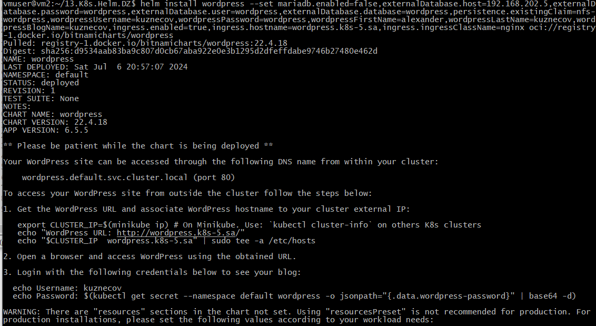
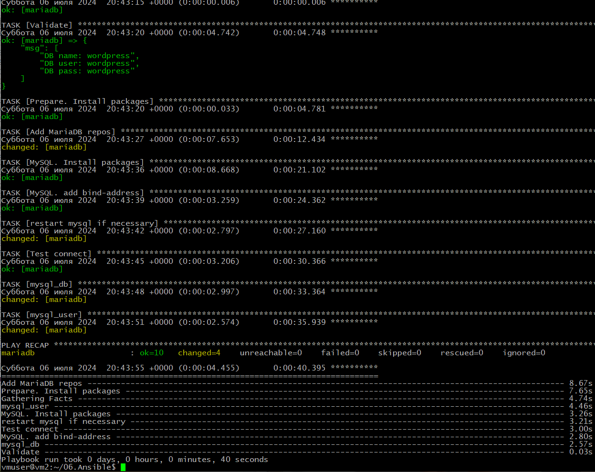
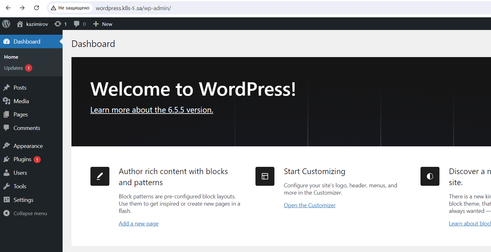
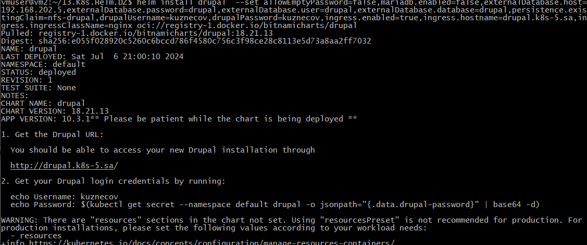
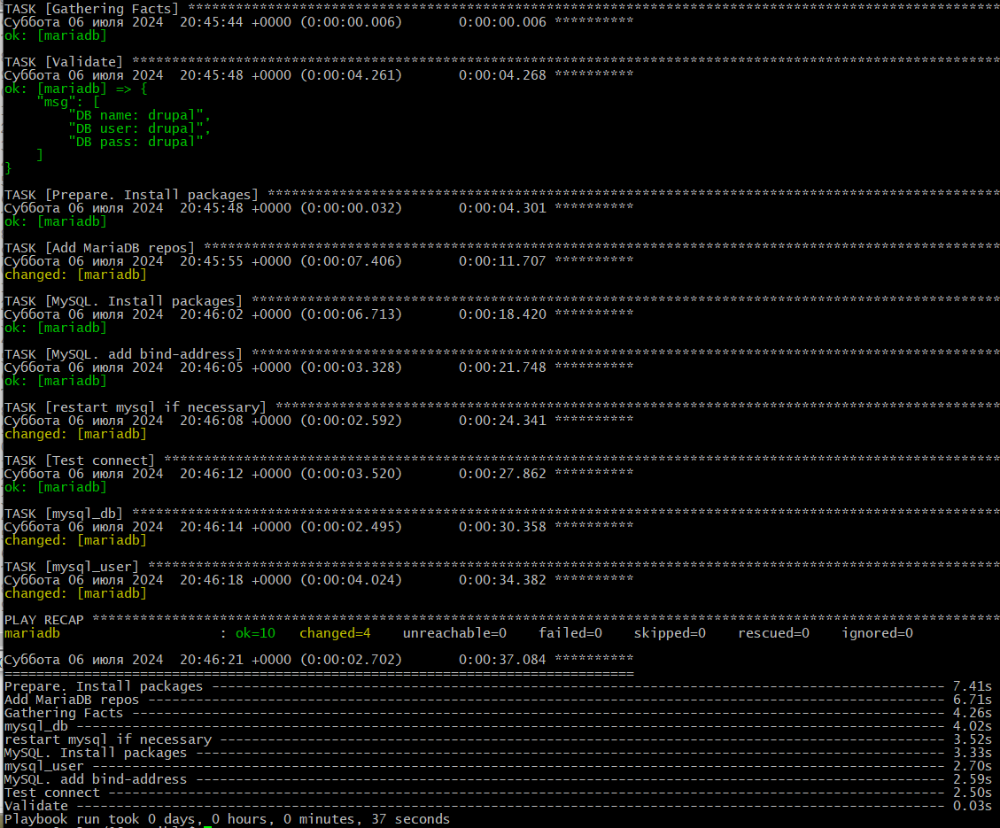
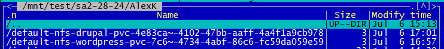

# 13. Kubernetes. Helm

kustomization.yaml:
```yaml
namespace: nfs-provisioner
bases:
  - github.com/kubernetes-sigs/nfs-subdir-external-provisioner//deploy
resources:
  - nfs-dynamic.yaml
patchesStrategicMerge:
  - patch_nfs_details.yaml
```

nfs-dynamic.yaml:
```yaml
apiVersion: v1
kind: Namespace
metadata:
  name: nfs-provisioner
```

patch_nfs_details.yaml:
```yaml
apiVersion: apps/v1
kind: Deployment
metadata:
  labels:
    app: nfs-client-provisioner
  name: nfs-client-provisioner
spec:
  template:
    spec:
      containers:
        - name: nfs-client-provisioner
          env:
            - name: NFS_SERVER
              value: 192.168.37.105
            - name: NFS_PATH
              value: /mnt/IT-Academy/nfs-data/sa2-28-24/AlexK
      volumes:
        - name: nfs-client-root
          nfs:
            server: 192.168.37.105
            path: /mnt/IT-Academy/nfs-data/sa2-28-24/AlexK
```

```bash
kubectl apply -k .
```

## Install MariaDB

```bash
nano mariadb.yaml
```

mariadb.yaml:

```yaml
---
- hosts: mariadb
  vars:
    app_packages:
      - mariadb-server
      - mariadb-client
      - python3-pymysql
      - python3-mysqldb
    db_name: "{{ name_db | default('test') }}"
    db_user: "{{ user_db | default('test') }}"
    db_pass: "{{ pass_db | default('test') }}"
  pre_tasks:
  - name: Validate
    debug:
      msg:
       - "DB name: {{ db_name }}"
       - "DB user: {{ db_user }}"
       - "DB pass: {{ db_pass }}"
  - name: Prepare. Install packages
    apt:
      name: "curl"
      state: latest
      update_cache: yes
    tags: install
  tasks:
  - name: Add MariaDB repos
    shell: |
      curl -LsS -O https://downloads.mariadb.com/MariaDB/mariadb_repo_setup
      bash mariadb_repo_setup --mariadb-server-version=10.6
    tags: install
  - name: MySQL. Install packages
    apt:
      name: "{{ app_packages }}"
      state: latest
    environment:
      DEBIAN_FRONTEND: noninteractive
    tags: install
  - name: MySQL. add bind-address
    ini_file:
      dest: /etc/mysql/my.cnf
      section: mysqld
      option: "bind-address"
      value: "{{ ansible_host }}"

  - name: restart mysql if necessary
    command: service mysql restart

  - name: Test connect
    wait_for:
      host: "{{ ansible_host }}"
      port: 3306
      timeout: 3

  - mysql_db:
      name: "{{ db_name }}"
      state: absent
      login_unix_socket: /var/run/mysqld/mysqld.sock
    tags: never

  - mysql_db:
      name: "{{ db_name }}"
      encoding: utf8
      login_unix_socket: /var/run/mysqld/mysqld.sock

  - mysql_user:
      name: "{{ db_user }}"
      host: "%"
      password: "{{ db_pass }}"
      priv: "{{ db_name }}.*:ALL"
      login_unix_socket: /var/run/mysqld/mysqld.sock
    no_log: yes
```

inv.yaml:
```yaml
db_all:
  vars:
    ansible_ssh_common_args: '-o ProxyCommand="ssh -W %h:%p -q jump_sa@178.124.206.53 -p 32510"'
  hosts:
    mariadb:
      ansible_host: 192.168.202.5
    mysql:
      ansible_host: 192.168.201.3
```

```bash
ansible-playbook -i inv.yaml mariadb.yaml -e name_db=wordpress -e user_db=wordpress -e pass_db=wordpress -l mariadb -u root --ask-pass
```

```bash
ansible-playbook -i inv.yaml mariadb.yaml -e name_db=drupal -e user_db=drupal -e pass_db=drupal -l mariadb -u root --ask-pass
```

## Install Wordpress

```bash
nano pvc_wordpress.yaml
```

pvc_wordpress.yaml:

```yaml
apiVersion: v1
kind: PersistentVolumeClaim
metadata:
  name: nfs-wordpress
  labels:
    storage.k8s.io/name: nfs
    storage.k8s.io/part-of: kubernetes-complete-reference
spec:
  accessModes:
    - ReadWriteMany
  storageClassName: nfs-client
  resources:
    requests:
      storage: 1Gi
```

```bash
kubectl apply -f pvc_wordpress.yaml
```


```bash
helm install wordpress --set mariadb.enabled=false,externalDatabase.host=192.168.202.5,externalDatabase.password=wordpress,externalDatabase.user=wordpress,externalDatabase.database=wordpress,persistence.existingClaim=nfs-wordpress,wordpressUsername=kuznecov,wordpressPassword=wordpress,wordpressFirstName=alexander,wordpressLastName=kuznecov,wordpressBlogName=kuznecov,ingress.enabled=true,ingress.hostname=wordpress.k8s-5.sa,ingress.ingressClassName=nginx oci://registry-1.docker.io/bitnamicharts/wordpress
```


Result:


## Install Drupal

```bash
nano pvc_drupal.yaml
```

pvc_drupal.yaml:

```yaml
apiVersion: v1
kind: PersistentVolumeClaim
metadata:
  name: nfs-drupal
  labels:
    storage.k8s.io/name: nfs
    storage.k8s.io/part-of: kubernetes-complete-reference
spec:
  accessModes:
    - ReadWriteMany
  storageClassName: nfs-client
  resources:
    requests:
      storage: 1Gi
```

```bash
kubectl apply -f pvc_drupal.yaml
```


```bash
helm install drupal  --set allowEmptyPassword=false,mariadb.enabled=false,externalDatabase.host=192.168.202.5,externalDatabase.password=drupal,externalDatabase.user=drupal,externalDatabase.database=drupal,persistence.existingClaim=nfs-drupal,drupalUsername=kuznecov,drupalPassword=kuznecov,ingress.enabled=true,ingress.hostname=drupal.k8s-5.sa,ingress.ingressClassName=nginx oci://registry-1.docker.io/bitnamicharts/drupal
```


Result:


Result:

