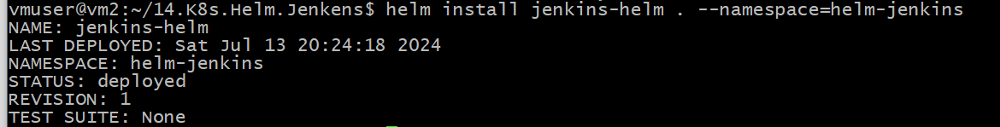

# 14.Transform Jenkins deployment to Helm
Create namespace
```bash
kubectl create namespace helm-jenkins
```
Install Jenkins-helm
```bash
helm install jenkins-helm . --namespace=helm-jenkins
```



Chart.yaml
```yaml
apiVersion: v2
name: jenkins-helm
description: A Helm chart for Kubernetes

# A chart can be either an 'application' or a 'library' chart.
#
# Application charts are a collection of templates that can be packaged into versioned archives
# to be deployed.
#
# Library charts provide useful utilities or functions for the chart developer. They're included as
# a dependency of application charts to inject those utilities and functions into the rendering
# pipeline. Library charts do not define any templates and therefore cannot be deployed.
type: application

# This is the chart version. This version number should be incremented each time you make changes
# to the chart and its templates, including the app version.
# Versions are expected to follow Semantic Versioning (https://semver.org/)
version: 0.1.0

# This is the version number of the application being deployed. This version number should be
# incremented each time you make changes to the application. Versions are not expected to
# follow Semantic Versioning. They should reflect the version the application is using.
# It is recommended to use it with quotes.
appVersion: "1.16.0"
```

values.yaml
```yaml
replicaCount: 1
namespace: helm-jenkins
name: helm-jenkins

image:
  repository: jfrog.it-academy.by/public/jenkins-ci
  pullPolicy: IfNotPresent
  tag: "AlexK"

imagePullSecrets: []
nameOverride: ""
fullnameOverride: ""

serviceAccount:
  create: true
  automount: true
  annotations: {}
  name: ""

podAnnotations: {}
podLabels: {}

podSecurityContext: {}

securityContext:
  runAsUser: 0

env:
  JAVA_OPTS: "-Djenkins.install.runSetupWizard=false"
  CASC_JENKINS_CONFIG: /var/jenkins_home/casc_configs/jenkins.yaml

port:
  httpPort: 8080
  jnlpPort: 50000

service:
  type: ClusterIP
  port: 8080

ingress:
  annotations: {}
  host: helm-jenkins.k8s-5.sa
  tls: []

resources:
  limits:
    cpu: 3
    memory: 3Gi
  requests:
    cpu: 2
    memory: 2Gi

autoscaling:
  enabled: false
  minReplicas: 1
  maxReplicas: 100
  targetCPUUtilizationPercentage: 80

configmap:
  basicName: basic-security
  jenkinsName: jenkins-config

nfs:
  server: 192.168.37.105
  path: /mnt/IT-Academy/nfs-data/sa2-28-24/AlexK/jenkins

volumeMounts:
  jenkinsAuthConfig: /var/jenkins_home/init.groovy.d/basic-security.groovy
  jenkinsAuthConfigSubPath: basic-security.groovy
  jenkinsConfigYaml: /var/jenkins_home/casc_configs/jenkins.yaml
  jenkinsConfigYamlSubPath: jenkins.yaml
  jenkinsConfig: /var/jenkins_home

nodeSelector: {}

tolerations: []

affinity: {}
```
