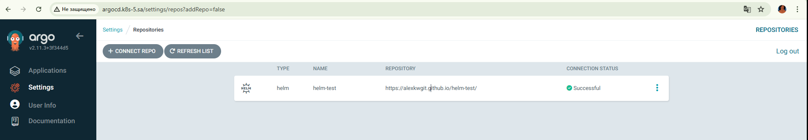
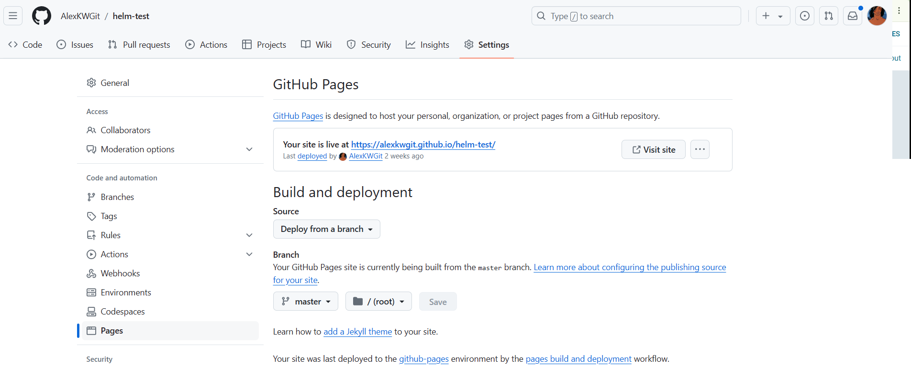
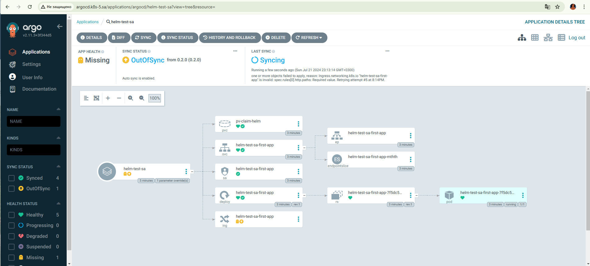
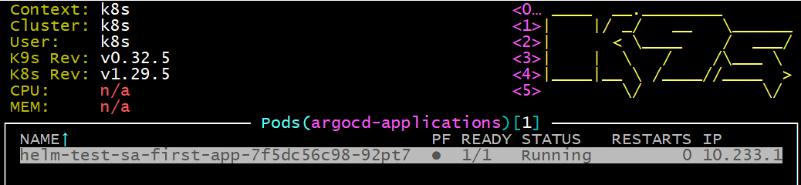
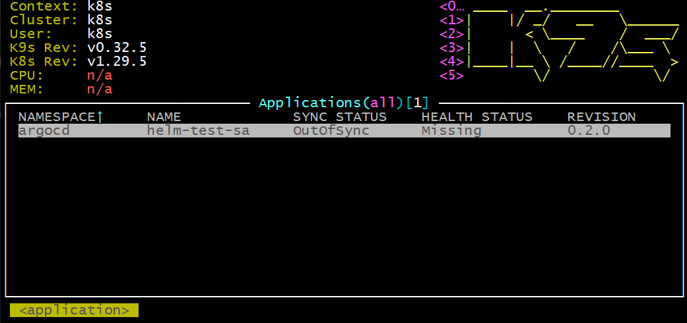
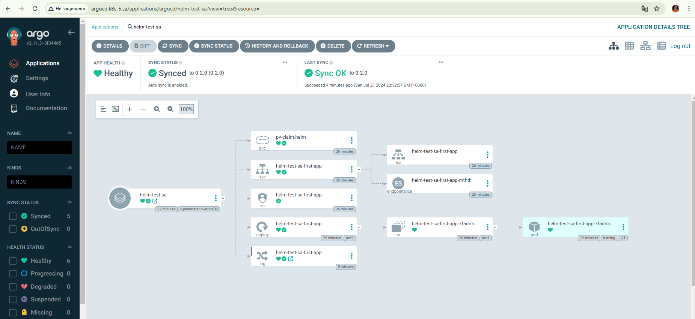
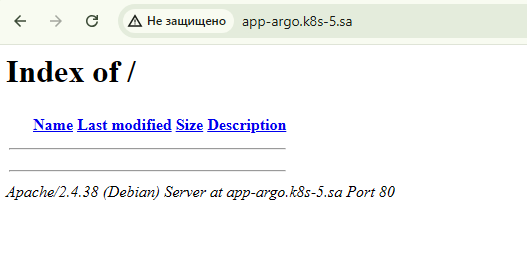
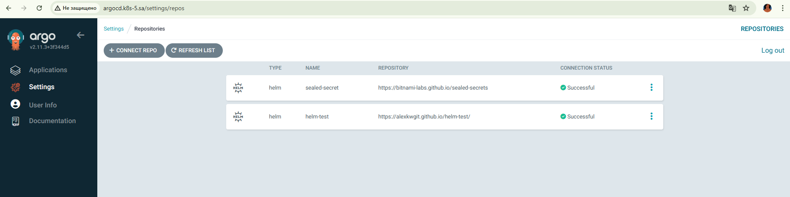
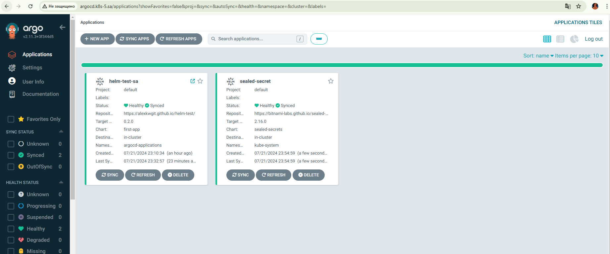
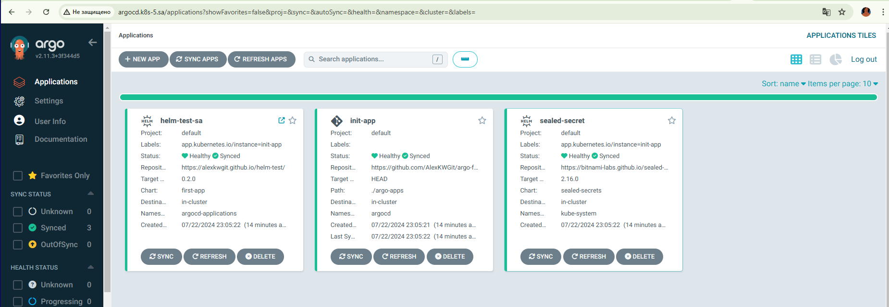

# 15. Kubernetes CI CD
##  ArgoCD deployment and application
```bash
  420  mkdir 15.K8s.Argo
  421  cd 15.K8s.Argo/
  422  kubectl create namespace argocd
  423  ssh -L 6443:127.0.0.1:6443 root@192.168.208.5 -f -N
  424  kubectl create namespace argocd
  427  wget https://raw.githubusercontent.com/argoproj/argo-cd/stable/manifests/install.yaml -O argocd-install.yaml
  428  mc
  440  kubectl apply -f argocd-install.yaml -n argocd
  441  kubectl -n argocd get secret argocd-initial-admin-secret -o jsonpath="{.data.password}" | base64 -d

  450  git add --all
  452  git commit -m "Init"
  460  git config --global user.email "AlexKWGit@example.com"
  461  git config --global user.name "Alexandr Kuznetsov"
  462  git push --set-upstream origin master
```
My test repository for github manifest:
[My test repository](https://github.com/AlexKWGit/argo-flux-test)












