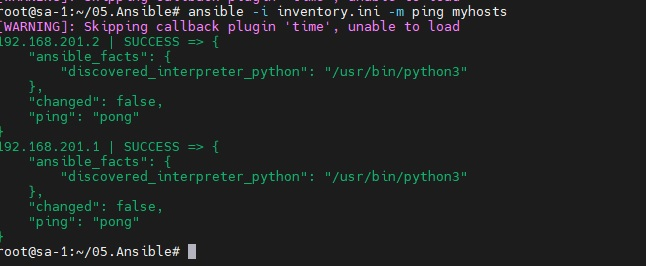
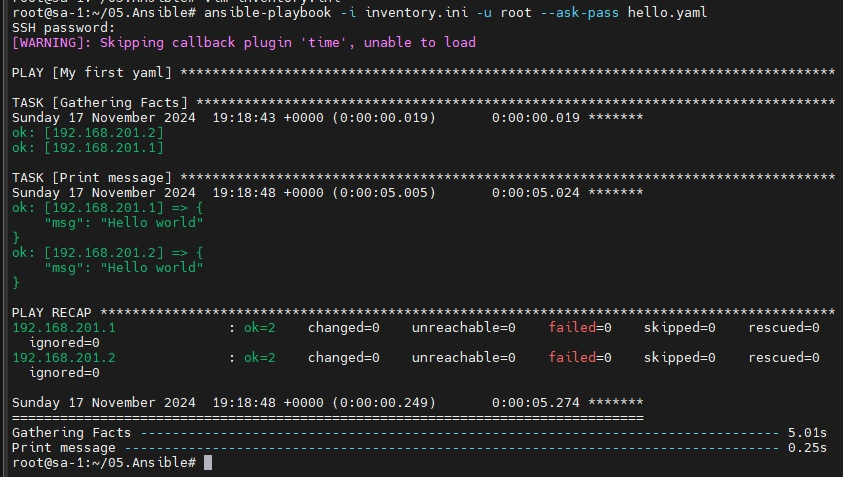
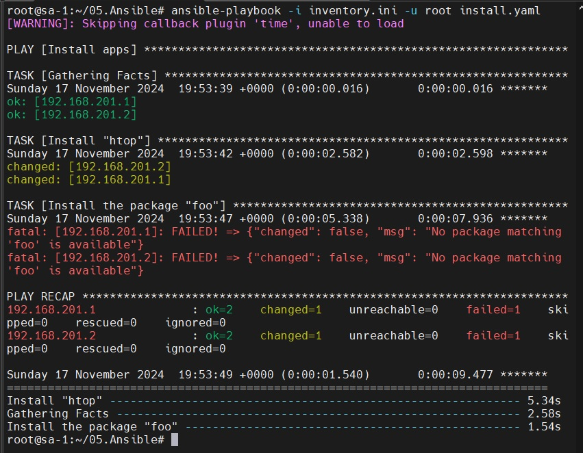
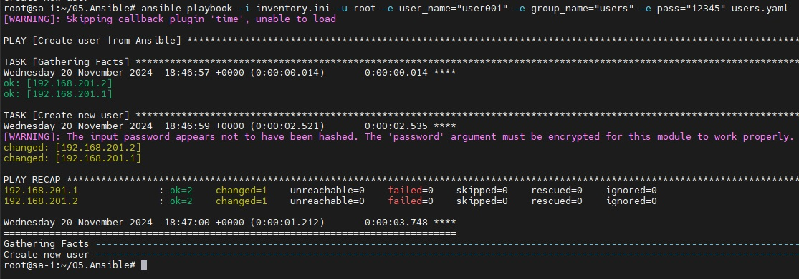

#### 05. Ansible start
### Homework Assignment 1: Setting Up Ansible
### Ping-Pong


### Первый запуск playbook Hello world
```bash
ansible-playbook -i inventory.ini -u root hello.yaml
```


### Проброс публичного ключа
```bash
ansible -i inventory.ini -m authorized_key -a "user=root key=\"{{lookup('file', '~/.ssh/id_rsa.pub') }}\"" -u root myhosts --ask-pass
ansible -i inventory.ini -m authorized_key -a "user=root key=\"{{lookup('file', '~/.ssh/id_rsa.pub') }}\"" -u root myhosts
```

### Homework Assignment 2: Managing Remote Hosts
```bash
ansible-playbook -i inventory.ini -u root  install.yaml
```



### Homework Assignment 3: Managing Users and Groups
```bash
ansible-playbook -i inventory.ini -u root -e user_name="user001" -e user_group=users -e user_pass=12345 users.yaml
```

