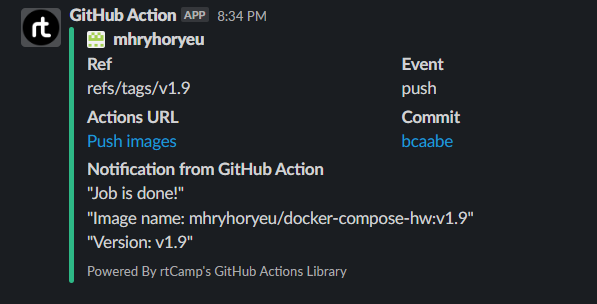

## 08.Docker.Docker-compose
[GitHub repository](https://github.com/mhryhoryeu/docker-compose-hw)

[Docker Hub Registry](https://hub.docker.com/repository/docker/wolthrax/docker-compose-hw/tags?page=1&ordering=last_updated)

[GitHub Registry](https://github.com/users/mhryhoryeu/packages/container/package/docker-compose-hw)

[GitHub actions file](https://github.com/mhryhoryeu/docker-compose-hw/blob/main/.github/workflows/build.yaml)

### GitHub actions file
```yaml
name: Push images

on:
  push:
    branches:
      - master
    tags:
      - v*.*

jobs:
  build:
    runs-on: ubuntu-latest
    permissions:
      packages: write
      contents: read
    steps:
      - name: Check out the repo
        uses: actions/checkout@v2

      - name: Container registry login
        uses: docker/login-action@v1
        with:
          registry: ghcr.io
          username: ${{ github.actor }}
          password: ${{ secrets.CR_TOKEN }}

      - name: Docker Hub login
        uses: docker/login-action@v2
        with:
          username: ${{ secrets.DH_USER }}
          password: ${{ secrets.DH_TOKEN }}

      - name: Build and push Docker images
        uses: docker/build-push-action@v2
        with:
          context: .
          push: true
          tags: |
            ghcr.io/mhryhoryeu/docker-compose-hw:${{ github.ref_name }}
            ${{ secrets.DH_USER }}/docker-compose-hw:${{ github.ref_name }}

      - name: Slack Notification
        uses: rtCamp/action-slack-notify@v2
        env:
          SLACK_CHANNEL: notification_channel
          SLACK_COLOR: ${{ job.status }}
          SLACK_ICON: https://github.com/rtCamp.png?size=48
          SLACK_MESSAGE: |
            "Job is done!"
            "Image name: mhryhoryeu/docker-compose-hw:${{ github.ref_name }}"
            "Version: ${{ github.ref_name }}"
          SLACK_TITLE: 'Notification from GitHub Action'
          SLACK_USERNAME: GitHub Action
          SLACK_WEBHOOK: ${{ secrets.SLACK_WEBHOOK_URL }}
```
### Slack notification

