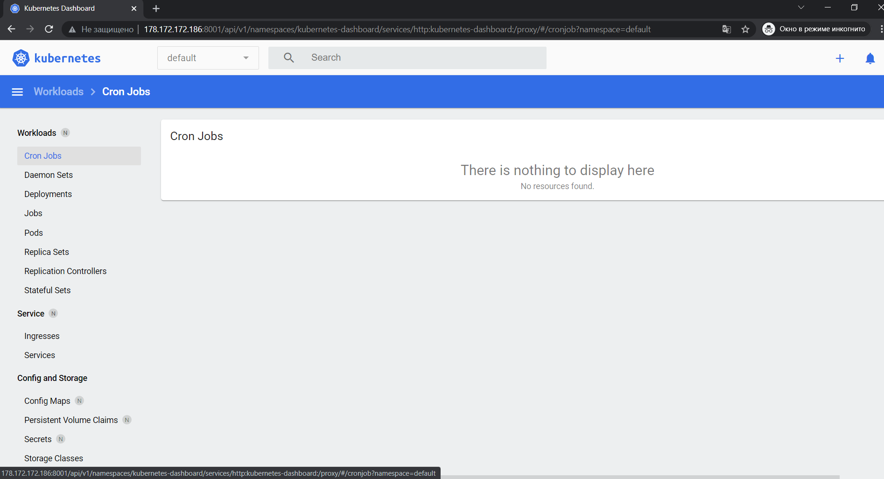

# 10.Kubernetes Maxim Radaman

## Minikube commands
```bash
    1  minikube status
    2  minikube start --vm-driver=docker
    3  minikube status
    5  minikube dashboard
   12  minikube status
   13  minikube stop
   14  minikube start
   15  minikube delete
   16  minikube start
   17  docker ps
   18  docker ps -a
   19  minikube status
   20  minikube stop
   21  docker ps -a
   22  minikube status
   23  minikube stop
   24  minikube delete
   25  docker ps -a
   26  docker ps
   27  minikube stop
   28  minikube start
   29  kubectl proxy --address='0.0.0.0' --disable-filter=true
   30  curl -I http://127.0.0.1:37755/api/v1/namespaces/kubernetes-dashboard/services/http:kubernetes-dashboard:/proxy/
   31  curl -Lv http://127.0.0.1:37755/api/v1/namespaces/kubernetes-dashboard/services/http:kubernetes-dashboard:/proxy/
   32  kubectl proxy --address='0.0.0.0' --disable-filter=true
   33  kubectl proxy --address='0.0.0.0' --disable-filter=true &
   37  minikube stop
   38  minikube delete
   41  minikube start --memory 1800 --cpus 2
   42  minikube addons enable ingress
   43  minikube delete
   44  minikube start
   45  minikube dashboard
   46  minikube status
   47  minikube dashboard
   48  history
```

## Dasboard screenshot


## final summary of ansible play kubespray

```bash
PLAY RECAP *******************************************************************************************************************************************************************************************************
localhost                  : ok=4    changed=0    unreachable=0    failed=0    skipped=0    rescued=0    ignored=0
node1                      : ok=703  changed=148  unreachable=0    failed=0    skipped=1177 rescued=0    ignored=3
node2                      : ok=570  changed=117  unreachable=0    failed=0    skipped=975  rescued=0    ignored=2

Saturday 12 February 2022  17:45:09 +0300 (0:00:00.044)       0:32:08.863 *****
===============================================================================
download : download_container | Download image if required ---------------------------------------------------------------------------------------------------------------------------------------------- 139.18s
kubernetes/preinstall : Install packages requirements ---------------------------------------------------------------------------------------------------------------------------------------------------- 71.55s
download : download_container | Download image if required ----------------------------------------------------------------------------------------------------------------------------------------------- 47.58s
download : download_container | Download image if required ----------------------------------------------------------------------------------------------------------------------------------------------- 43.67s
download : download_container | Download image if required ----------------------------------------------------------------------------------------------------------------------------------------------- 39.90s
kubernetes-apps/ansible : Kubernetes Apps | Lay Down CoreDNS templates ----------------------------------------------------------------------------------------------------------------------------------- 37.42s
kubernetes/control-plane : kubeadm | Initialize first master --------------------------------------------------------------------------------------------------------------------------------------------- 32.83s
download : download_container | Download image if required ----------------------------------------------------------------------------------------------------------------------------------------------- 31.92s
kubernetes/control-plane : Joining control plane node to the cluster. ------------------------------------------------------------------------------------------------------------------------------------ 30.85s
kubernetes-apps/ansible : Kubernetes Apps | Start Resources ---------------------------------------------------------------------------------------------------------------------------------------------- 28.08s
container-engine/crictl : download_file | Download item -------------------------------------------------------------------------------------------------------------------------------------------------- 26.33s
download : download_file | Download item ----------------------------------------------------------------------------------------------------------------------------------------------------------------- 24.05s
bootstrap-os : Assign inventory name to unconfigured hostnames (non-CoreOS, non-Flatcar, Suse and ClearLinux, non-Fedora) -------------------------------------------------------------------------------- 22.73s
network_plugin/calico : Calico | Create calico manifests ------------------------------------------------------------------------------------------------------------------------------------------------- 22.50s
download : download_container | Download image if required ----------------------------------------------------------------------------------------------------------------------------------------------- 21.99s
download : download_container | Download image if required ----------------------------------------------------------------------------------------------------------------------------------------------- 20.64s
container-engine/containerd : download_file | Download item ---------------------------------------------------------------------------------------------------------------------------------------------- 20.35s
download : download_container | Download image if required ----------------------------------------------------------------------------------------------------------------------------------------------- 20.24s
download : download_container | Download image if required ----------------------------------------------------------------------------------------------------------------------------------------------- 19.98s
download : download_file | Download item ----------------------------------------------------------------------------------------------------------------------------------------------------------------- 19.93s
```
