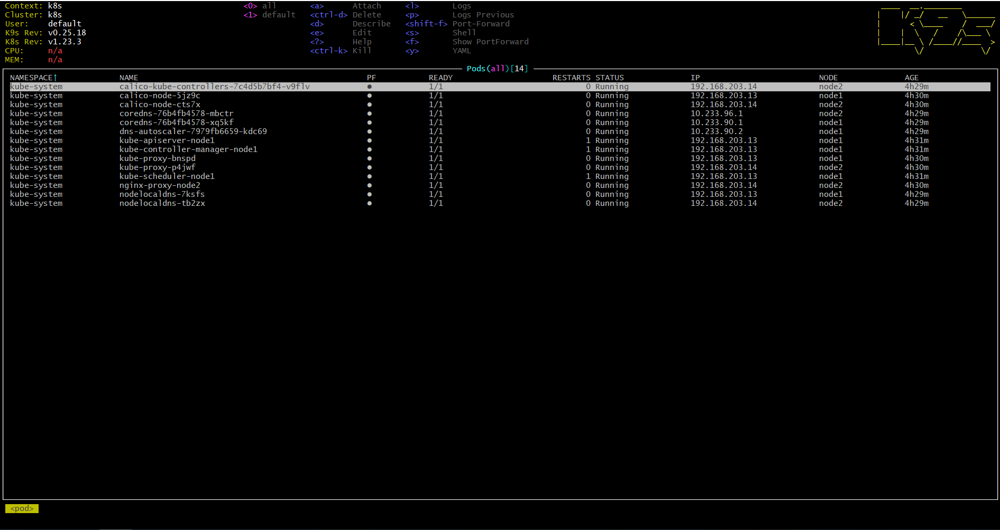
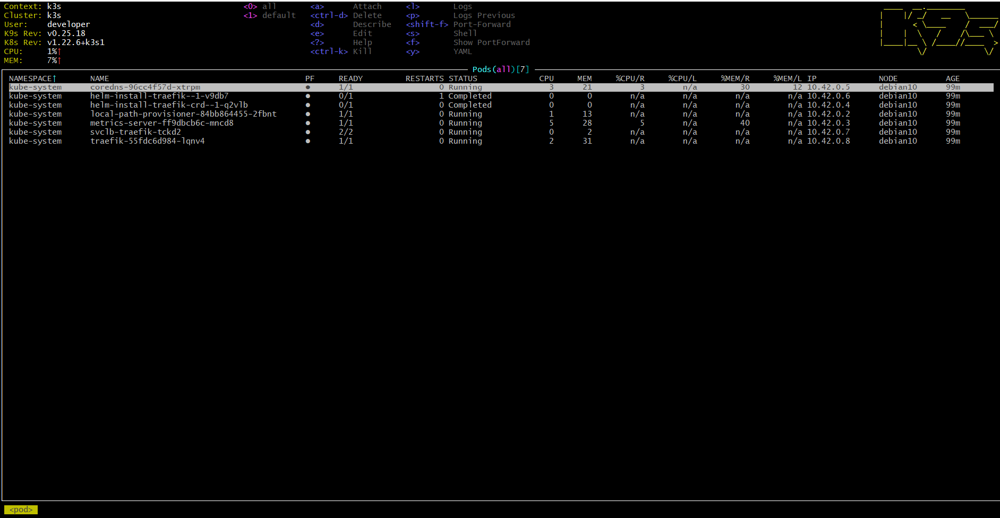

# 11. Kubernetes installation Maxim Radaman

## Config file two clusters
```bash
kubectl config view

apiVersion: v1
clusters:
- cluster:
    certificate-authority-data: DATA+OMITTED
    server: https://192.168.203.31:6443
  name: k3s
- cluster:
    certificate-authority-data: DATA+OMITTED
    server: https://192.168.203.13:6443
  name: k8s
contexts:
- context:
    cluster: k3s
    namespace: dev
    user: developer
  name: k3s
- context:
    cluster: k8s
    user: default
  name: k8s
current-context: k8s
kind: Config
preferences: {}
users:
- name: default
  user:
    client-certificate-data: REDACTED
    client-key-data: REDACTED
- name: developer
  user:
    client-certificate-data: REDACTED
    client-key-data: REDACTED

```

## Switching to different clusters

```bash
kubectl config get-contexts

CURRENT   NAME   CLUSTER   AUTHINFO    NAMESPACE
          k3s    k3s       developer   dev
*         k8s    k8s       default

kubectl config use-context k3s

Switched to context "k3s".

kubectl get nodes
NAME       STATUS   ROLES                  AGE   VERSION
debian10   Ready    control-plane,master   97m   v1.22.6+k3s1

kubectl config use-context k8s

Switched to context "k8s".

kubectl get nodes

NAME    STATUS   ROLES                  AGE     VERSION
node1   Ready    control-plane,master   4h37m   v1.23.3
node2   Ready    <none>                 4h36m   v1.23.3
```
## k9s on k8s cluster



## k9s on k3s cluster


