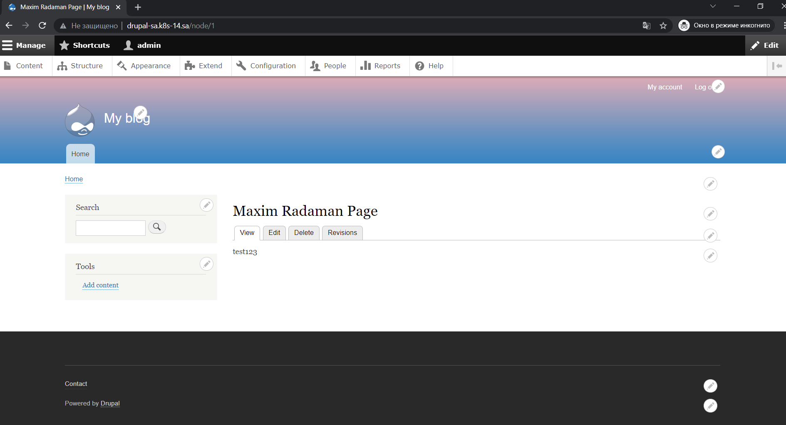
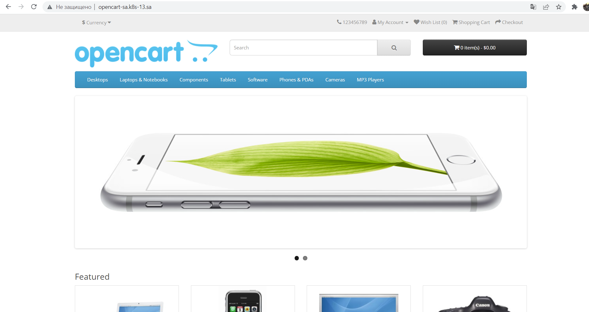

# 13.Kubernetes.Helm Maxim Radaman
## History
```bash

 1653  sshuttle -r ec_bastion 192.168.0.0/16 &
 1654  helm install opencart  --set global.storageClass=nfs-client,opencartUsername=admin,opencartPassword=password,ingress.enabled=True,ingress.hostname=opencart-sa.k8s-13.sa,ingress.path="/",ingress.annotations=["kubernetes.io/ingress.class: nginx"],serviceType=ClusterIP bitnami/opencart
 1655  helm repo add bitnami https://charts.bitnami.com/bitnami
 1656  helm repo add stable https://charts.helm.sh/stable
 1657  cat opencart-ingress.yaml
 1658  kubectl apply -f opencart-ingress.yaml
 1659  helm install my-release   --set wordpressUsername=admin   --set wordpressPassword=password   --set mariadb.mariadbRootPassword=secretpassword     stable/wordpress
 1660  k9s
 1664  helm install wordpress2  --set global.storageClass=nfs-client,wordpressUsername=admin,wordpressPassword=password,serviceType=ClusterIP stable/wordpress
 1665  kubectl get node
 1667  kubectl get node
 1668  helm install wordpress2  --set global.storageClass=nfs-client,wordpressUsername=admin,wordpressPassword=password,serviceType=ClusterIP stable/wordpress
 1669  k9s
 1670  cat wordpress-ingress.yaml
 1671  kubectl apply -f wordpress-ingress.yaml
 1672  k9s
 1673  kubectl delete ingress ingress-wp
 1674  kubectl apply -f wordpress-ingress.yaml
 1675  nano wordpress-ingress.yaml
 1676  kubectl apply -f wordpress-ingress.yaml
 1677  kubectl get pod
 1678  k9s
 1679  ll
 1680  helm install drupal  --set global.storageClass=nfs-client,drupalUsername=admin,drupalPassword=password,ingress.enabled=True,ingress.hostname=drupal-sa.k8s-13.sa,ingress.path="/",serviceType=ClusterIP bitnami/drupal
 1681  k9s
 1682  cp opencart-ingress.yaml drupal-ingress.yaml
 1683  nano drupal-ingress.yaml
 1684  kubectl apply -f drupal-ingress.yaml
 1685  history

```
## Screenshots 



