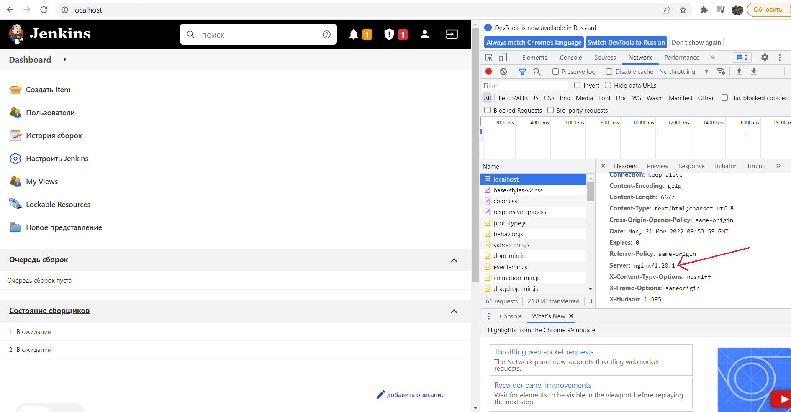
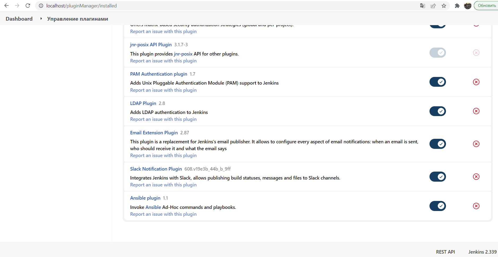
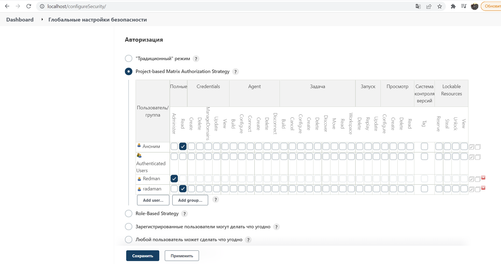

# 18.Jenkins.Start by Maxim.Radaman

## Jenkins with nginx proxy

```bash
1) add jenkins.conf file to /etc/nginx/conf.d/
2) disable SELinux
3) systemctl restart nginx
```
## Installation plugin in Jenkins (ansible, slack_notification)


## Set role to restricted user


