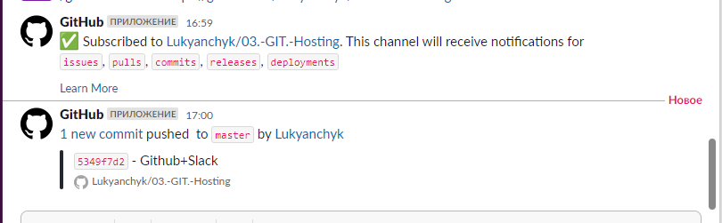
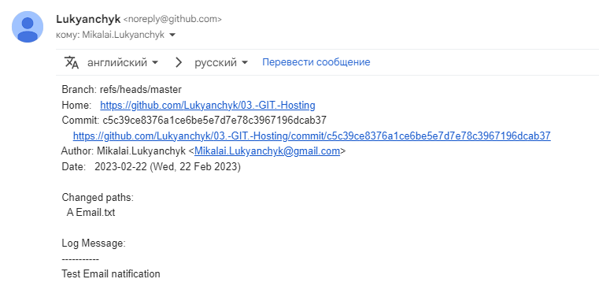

# **03.Git.Hosting**
## **History**
```bash
   77  git remote add origin-github git@github.com:Lukyanchyk/03.-GIT.-Hosting.git
   78  git remote add origin-gitlab git@gitlab.com:mikalai.lukyanchyk/03.git.hosting.git
   79  git remote
   80  ssh-keygen
   81  cat /c/Users/Goodfix/.ssh/id_rsa.pub
   82  nano .push_script
   83  chmod 777 push_script_test.sh
   87  alias testpush="/c/Users/Goodfix/git/push_script_test.sh"
   88  testpush
   109  history
   ```

## **Links to projects**

[Github](https://github.com/Lukyanchyk/03.-GIT.-Hosting)<br>
[Gitlab](https://gitlab.com/mikalai.lukyanchyk/03.git.hosting)

## **SCRIPT** ##
```bash
git add --all
Echo "Enter a commit"
read commit
git commit -m "$commit"
for remo in $(git remote)
do
git push --all $remo
done
```

## **PLAY script**
```bash
$ testpush
Enter a commit
Push all
[master b08f6bd] Push all
 3 files changed, 119 insertions(+)
 create mode 100644 README.md
 create mode 100644 push_script_test.sh
 create mode 100644 test.txt
Enumerating objects: 6, done.
Counting objects: 100% (6/6), done.
Delta compression using up to 12 threads
Compressing objects: 100% (5/5), done.
Writing objects: 100% (5/5), 1.17 KiB | 1.17 MiB/s, done.
Total 5 (delta 1), reused 0 (delta 0), pack-reused 0
remote: Resolving deltas: 100% (1/1), completed with 1 local object.
To github.com:Lukyanchyk/03.-GIT.-Hosting.git
   333ad69..b08f6bd  master -> master
Enumerating objects: 6, done.
Counting objects: 100% (6/6), done.
Delta compression using up to 12 threads
Compressing objects: 100% (5/5), done.
Writing objects: 100% (5/5), 1.17 KiB | 1.17 MiB/s, done.
Total 5 (delta 1), reused 0 (delta 0), pack-reused 0
remote: 
remote: To create a merge request for master, visit:
remote:   https://gitlab.com/mikalai.lukyanchyk/03.git.hosting/-/merge_requests/new?merge_request%5Bsource_branch%5D=master
remote:
To gitlab.com:mikalai.lukyanchyk/03.git.hosting.git
   333ad69..b08f6bd  master -> master
```

## Slack Notification ##



## Email Notification ##
