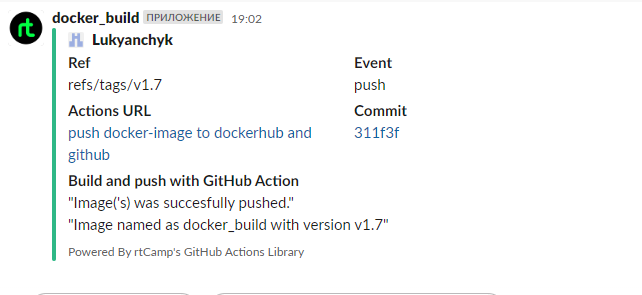

# 08.Docker.Compose

## Workflow
```yaml
name: push docker-image to dockerhub and github


on:
  push:
    tags:
      - v*
jobs:
  build_image_job:
    runs-on: ubuntu-latest
    name: Build Docker Image
    permissions:
      packages: write
      contents: read
    steps:
      - name: Check out the repo
        uses: actions/checkout@v2

      - name: Log in to the Container registry
        uses: docker/login-action@v1
        with:
          registry: ghcr.io
          username: ${{ github.actor }}
          password: ${{ secrets.CR_TOKEN }}


      - name: Login to Docker Hub
        uses: docker/login-action@v1
        with:
          username: ${{ secrets.DOCKERHUB_USERNAME }}
          password: ${{ secrets.DOCKERHUB_PASSWORD }}

      - name: Extract metadata (tags, labels) for Docker
        id: meta
        uses: docker/metadata-action@v4
        with:
          images: |
            lukyanchyk/docker_build
            ghcr.io/${{ github.repository }}

      - name: Build and push
        uses: docker/build-push-action@v2
        with:
          context: .
          push: true
          tags: ${{ steps.meta.outputs.tags }}
          labels: ${{ steps.meta.outputs.labels }}

  - name: Slack Notification by success
        uses: rtCamp/action-slack-notify@v2
        if: success()
        env:
          SLACK_COLOR: ${{ job.status }}
          SLACK_USERNAME: docker_build
          SLACK_MESSAGE: |-
            "Image('s) was succesfully pushed."
            "Image named as docker_build with version ${{github.ref_name}}"
          SLACK_TITLE: 'Build and push with GitHub Action'
          SLACK_WEBHOOK: ${{ secrets.SLACK_WEBHOOK }}

      - name: Slack Notification by failure
        uses: rtCamp/action-slack-notify@v2
        if: failure()
        env:
          SLACK_COLOR: ${{ job.status }}
          SLACK_USERNAME: docker_build
          SLACK_MESSAGE: |-
            "Image('s) was not succesfully pushed."
            "Image named as docker_build with version ${{github.ref_name}}"
          SLACK_TITLE: 'Build and push with GitHub Action'
          SLACK_WEBHOOK: ${{ secrets.SLACK_WEBHOOK }}


```

## Link to repositories
[hub.docker.com](https://hub.docker.com/repository/docker/lukyanchyk/docker_build/general)

[Github repositories](https://github.com/Lukyanchyk/docker_build)

[Github packages](https://github.com/Lukyanchyk/docker_build/pkgs/container/docker_build)

## Link to GithubAction
[GithubAction](https://github.com/Lukyanchyk/docker_build/actions/runs/4393076865)

## Slack notification
