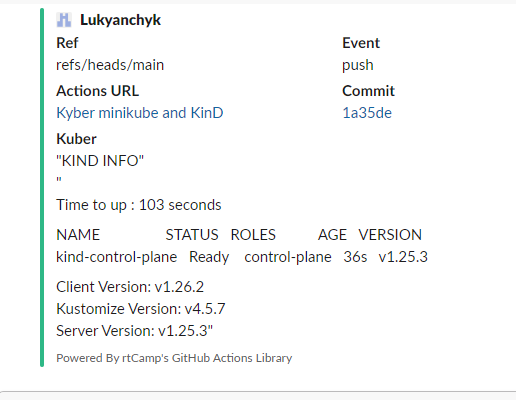

# 09. Kubernetes

## Workflow
```yaml
name:  Kyber minikube and KinD

on:
  - push
          
jobs:
  minikube:
    outputs:
      output1: ${{ steps.info.outputs.info }}
      output2: ${{ steps.time_s.outputs.time_s}}
    runs-on: ubuntu-latest
    name: Minikube
    steps:
      - name: time_s
        id: time_s
        run: echo "time_s=$(date '+%s')" >> $GITHUB_OUTPUT
      - name: start minikube
        id: minikube
        uses: medyagh/setup-minikube@latest
      - name: Info
        id: info
        run: |
         echo "info<<EOF" >> $GITHUB_OUTPUT
         echo -e "\nTime to up : $(($(date '+%s')-${{steps.time_s.outputs.time_s}})) seconds\n" >> $GITHUB_OUTPUT
         echo -e "\n$(kubectl get node)" >> $GITHUB_OUTPUT
         echo -e "\n$(kubectl version --short)\n" >> $GITHUB_OUTPUT
         echo "EOF" >> $GITHUB_OUTPUT

  Notification_minikube:
    needs: minikube
    runs-on: ubuntu-latest
    name: Notification minikube
    steps:
      - name: Slack Notification by success
        uses: rtCamp/action-slack-notify@v2
        if: success()
        env:
          SLACK_COLOR: ${{ job.status }}
          SLACK_USERNAME: Kuber
          SLACK_MESSAGE: |-
            "MINIKUBE INFO"
            "${{ needs.minikube.outputs.output1 }}"
          SLACK_TITLE: 'Kuber'
          SLACK_WEBHOOK: ${{ secrets.SLACK_WEBHOOK }}

  KinD:
    outputs:
      output1: ${{ steps.info.outputs.info }}
      output2: ${{ steps.time_s.outputs.time_s}}
    runs-on: ubuntu-latest
    name: KinD
    steps:
      - name: time_s
        id: time_s
        run: echo "time_s=$(date '+%s')" >> $GITHUB_OUTPUT
      - name: Start KinD
        uses: engineerd/setup-kind@v0.5.0
        with:
          version: "v0.17.0"
      - name: Info
        id: info
        run: |
         echo "info<<EOF" >> $GITHUB_OUTPUT
         echo -e "\nTime to up : $(($(date '+%s')-${{steps.time_s.outputs.time_s}})) seconds" >> $GITHUB_OUTPUT
         echo -e "\n$(kubectl get node)" >> $GITHUB_OUTPUT
         echo -e "\n$(kubectl version --short)" >> $GITHUB_OUTPUT
         echo "EOF" >> $GITHUB_OUTPUT

  Notification_KinD:
    needs: KinD
    runs-on: ubuntu-latest
    name: Notification KinD
    steps:
      - name: Slack Notification by success
        uses: rtCamp/action-slack-notify@v2
        if: success()
        env:
          SLACK_COLOR: ${{ job.status }}
          SLACK_USERNAME: Kuber
          SLACK_MESSAGE: |-
            "KIND INFO"
            "${{ needs.KinD.outputs.output1 }}"
          SLACK_TITLE: 'Kuber'
          SLACK_WEBHOOK: ${{ secrets.SLACK_WEBHOOK }}
```

## Link to GithubAction
[GithubAction](https://github.com/Lukyanchyk/docker_build/actions/runs/4418388748)

## Slack notification


