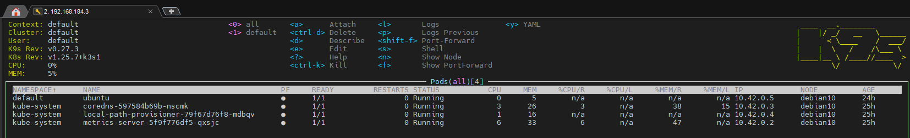
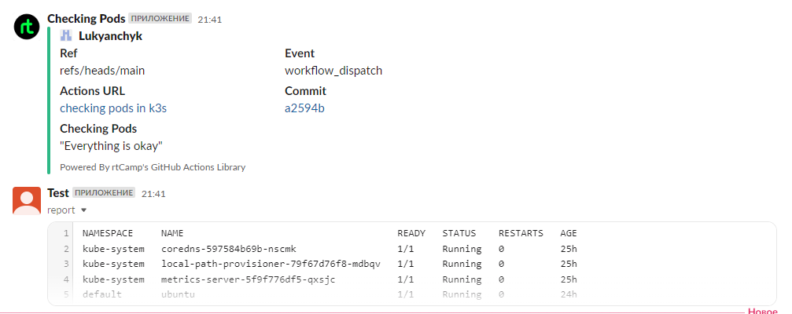
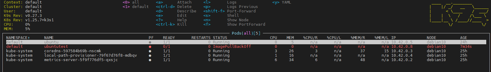
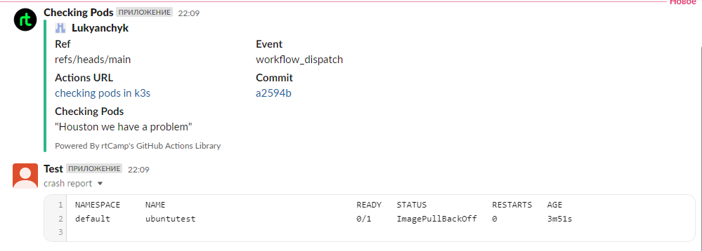

# 10. Kubernetes installation (WS)

## Link to GithubAction
[GithubAction](https://github.com/Lukyanchyk/Kuber/actions/workflows/check_access.yaml)

## Localhost: ##

### Install kubectl for local run (DONE)  ###
```bash
git@testgit:~/10.K8s_WS$ kubectl version --short
Client Version: v1.26.2
Kustomize Version: v4.5.7
Server Version: v1.25.7+k3s1
```
### Install k9s to maintain cluster (DONE) ###
```bash
git@testgit:~/10.K8s_WS$ k9s version
 ____  __.________
|    |/ _/   __   \______
|      < \____    /  ___/
|    |  \   /    /\___ \
|____|__ \ /____//____  >
        \/            \/

Version:    v0.27.3
Commit:     7c76691c389e4e7de29516932a304f7029307c6d
Date:       2023-02-12T15:19:22Z
```

### Make print-screen of k9s with pods in all namespaces (DONE) ###


## Kubernetes host ## 
* ### Finish workshop deployment if it is not done yet (DONE) ### 
* ### Deploy shell pod in default namespace which you can you use for internal checks inside the cluster (DONE)  ###

## TESTING ##

### Everything is fine ###



### We have a problem ###

