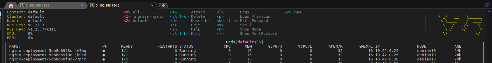
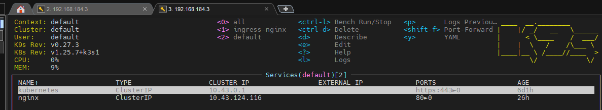
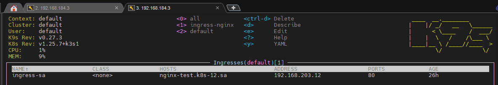
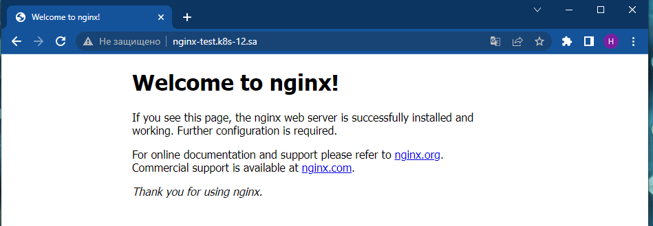
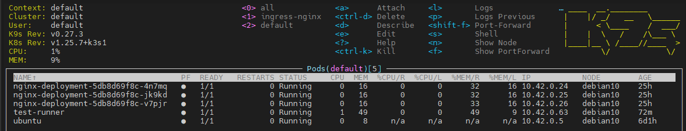
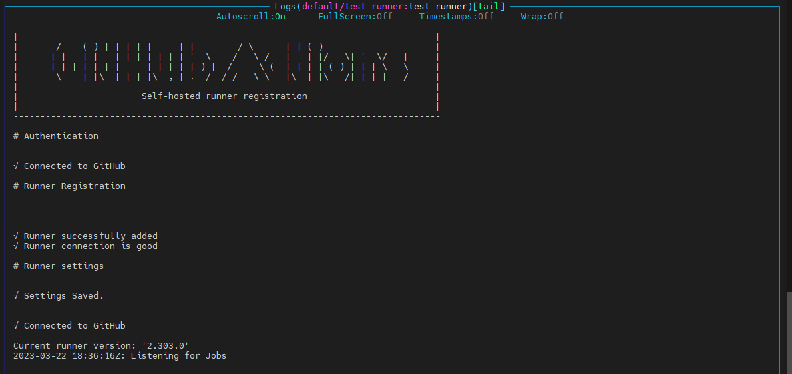
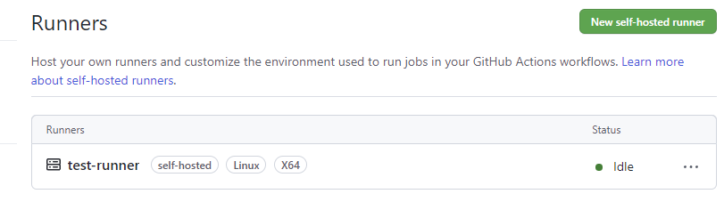

# 11. Kubernetes. Basic objects

## Main task:
 Create deployment of nginx service:
- replicas: 3
- set resources for pods
- deployment shouldn't have any outage (service is available all time)
- ingress rule for host name (nginx-test.k8s-<NUMBER>.sa)


### Steps: ###

1) Create yaml file with deployment block for k8s application \
   After applying in k9s, we observe the following changes:
   

2) Add services block to yaml file and apply changes (command: **kybectl apply -f <name yaml file>** ) \
   After applying in k9s, we observe the following changes:


3) install ingress-controller in our cluster (in our assignment is set [Ingress-controller](https://github.com/kubernetes/ingress-nginx))
4) Add ingress block to yaml file and apply changes \
   After applying in k9s, we observe the following changes:
   

5) Add an entry to the hosts file. \
After adding the entry, we can open the browser and check the availability of the web server from outside


6) Full yaml **deploy.yaml**


## Additional task:
* deploy pod inside k8s which should be connected to github as self-hosted runner

### Steps: ###
1) Create a Dockerfile to create an image and small script

#### Dockerfile
```bash
FROM ubuntu:20.04

LABEL MAINTAINER="Mikalai Lukyanchyk"
LABEL description="A Docker container to serve a simple ubuntu server"

ARG RUNNER_VERSION="2.303.0"

WORKDIR /actions-runner

ENV TZ=Europe/Minsk
RUN ln -snf /usr/share/zoneinfo/$TZ /etc/localtime && echo $TZ > /etc/timezone
RUN apt update && apt upgrade -yqq
RUN apt install -yqq mc vim curl wget git telnet netcat \
	&& apt-get purge --auto-remove -yqq \
	&& apt-get clean \
	&& rm -rf \
	/var/lib/apt/lists/* \
	/tmp/* \
	/var/tmp/* \
	/usr/share/man \
	/usr/share/doc \
	/usr/share/doc-base

RUN curl -o actions-runner-linux-x64-${RUNNER_VERSION}.tar.gz -L https://github.com/actions/runner/releases/download/v${RUNNER_VERSION}/actions-runner-linux-x64-${RUNNER_VERSION}.tar.gz \
	&& tar xzf ./actions-runner-linux-x64-${RUNNER_VERSION}.tar.gz \
	&& rm ./actions-runner-linux-x64-${RUNNER_VERSION}.tar.gz

COPY test.sh ./

RUN chmod +x test.sh

ENTRYPOINT ["./test.sh"]
```

#### Script
```bash
#!/bin/bash

REPO=<your_repo>
TOKEN=<tocken_to_add_github_runner>

cd /actions-runner

export RUNNER_ALLOW_RUNASROOT="1"

./config.sh --unattended --replace --url https://github.com/${REPO} --token ${TOKEN}

./run.sh & wait $!
```
2) To create an image use this [Build_yaml](https://github.com/Lukyanchyk/docker_build/blob/main/.github/workflows/test_kuber.yaml)
3) On a host with access to the cluster, create a yaml file to test the self-hosted runner \
   Сreate and apply
```bash
apiVersion: v1
kind: Pod
metadata:
  name: test-runner
  labels:
    app: test-runner
spec:
  containers:
  - name: test-runner
    image: ghcr.io/lukyanchyk/test:latest
    imagePullPolicy: Always
    resources:
      requests:
        cpu: 101m
        memory: 100Mi
      limits:
        cpu: 200m
        memory: 200Mi

  restartPolicy: Never

```
4) After applying in k9s, we observe the following changes:



