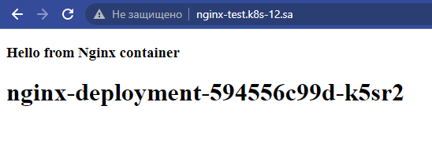
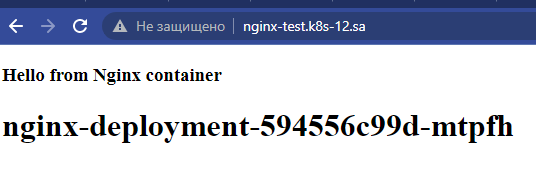
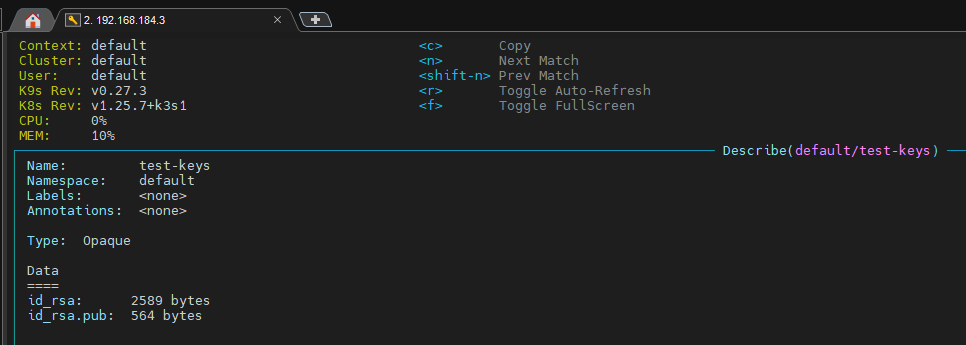
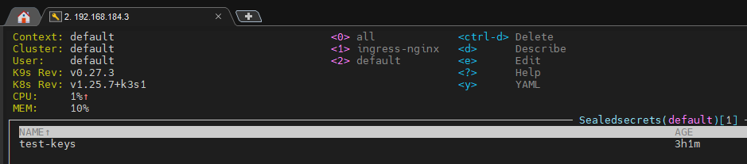
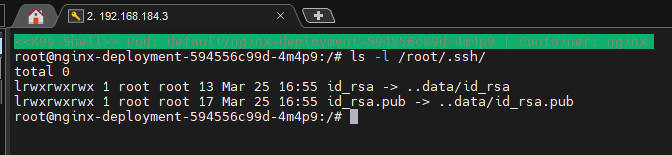

# 12. Kubernetes. Data. Security

## Main task:
* Add index.php... page as config map, which should display hostname of pod as first level header, or **generate inside init container**
* generate pair public and private keys (**or use existing**) and add them to the pod for user root as secrets, please use sealsecret object for that
* Validate secrets and index.html display


### Steps: ###

1) Add ConfigMap block to yaml file  

```yaml
---
apiVersion: v1
kind: ConfigMap
metadata:
  name: test-config
data:
  index.html: |
    <!DOCTYPE html><html><body>
    <h3>Hello from Nginx container</h3>
    <h1>_HOSTNAME_</h1>
    </body></html>
```

2) Add initContainers and volume block to yaml file to write hostname to index.html and deploy it to /usr/share/nginx/html/
```yaml
        volumeMounts:
          - mountPath: /usr/share/nginx/html/
            name: index

      initContainers:
      - name: test
        image: nginx:latest
        command: ["bash", "-c"]
        args:
          - cd /tmp;
            sed -e "s/_HOSTNAME_/$HOSTNAME/" index.html > /usr/share/nginx/html/index.html;

        volumeMounts:
        - name: test-config-mount
          mountPath: /tmp/index.html
          subPath: index.html
          readOnly: false
        - mountPath: /usr/share/nginx/html/
          name: index
      volumes:
      - name: test-config-mount
        configMap:
          name: test-config
      - name: index
        emptyDir: {}
```
After applying in k9s, we observe the following changes: \



3) Install kubeseal on local VM and sealed-secrets-controller in k8s
 (in our assignment is set [sealed-secrets](https://github.com/bitnami-labs/sealed-secrets))

 ```bash
 1338  wget https://github.com/bitnami-labs/sealed-secrets/releases/download/v0.20.2/kubeseal-0.20.2-linux-amd64.tar.gz
 1339  sudo tar -C /usr/local/bin -xzf kubeseal-0.20.2-linux-amd64.tar.gz
 1341  kubeseal --version
 1342  kubectl apply -f https://github.com/bitnami-labs/sealed-secrets/releases/download/v0.20.2/controller.yaml
 ```

4) Using kubeseal and hashing our secret.yaml file
```yaml
---
apiVersion: v1
kind: Secret
metadata:
     name: test-keys
type: Opaque
data:
    id_rsa: <<your_data_in_BASE64>>
    id_rsa.pub: <<your_data_in_BASE64>>
```
```bash
1354  cat secret.yaml | kubeseal --format yaml > sealer_secret.yaml
1355  kubectl apply -f sealer_secret.yaml
```
After applying in k9s, we observe the following changes:



5) And now we supplement the Volume blocks to transfer secrets inside the pod for root
```yaml
        volumeMounts:
          - mountPath: /usr/share/nginx/html/
            name: index
          - mountPath: /root/.ssh/
            name: ssh-key

      initContainers:
      - name: test
        image: nginx:latest
        command: ["bash", "-c"]
        args:
          - cd /tmp;
            sed -e "s/_HOSTNAME_/$HOSTNAME/" index.html > /usr/share/nginx/html/index.html;

        volumeMounts:
        - name: test-config-mount
          mountPath: /tmp/index.html
          subPath: index.html
          readOnly: false
        - mountPath: /usr/share/nginx/html/
          name: index
        - mountPath: /root/.ssh/
          name: ssh
      volumes:
      - name: test-config-mount
        configMap:
          name: test-config
      - name: index
        emptyDir: {}
      - name: ssh
        emptyDir: {}
      - name: ssh-key
        secret:
          secretName: test-keys

```



6) Full yaml **deploy.yaml**
