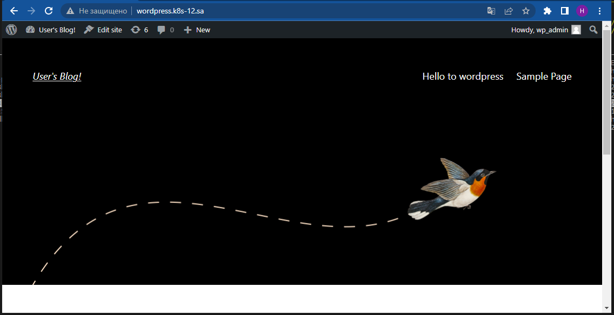
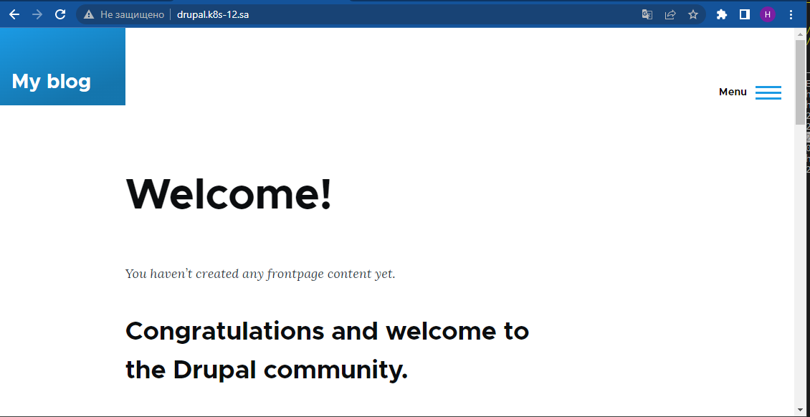

# 13. Kubernetes. Helm

## Main task:
Deploy in your K8s cluster the following applications using helm charts from public repositories:

* Wordpress
* Drupa


# Preparing to deploy Wordpress adn Drupal using Helm: #

### Install Helm, add Bitnami repo

```bash
1394  curl -fsSL -o get_helm.sh https://raw.githubusercontent.com/helm/helm/main/scripts/get-helm-3
1395  chmod 700 get_helm.sh
1396  ./get_helm.sh
1397  helm repo add bitnami https://charts.bitnami.com/bitnami
1398  helm list
1401  helm repo update
```

### Create yaml file to deploy NFS-provisioner on cluster and create two new StorageClass ###
```yaml
---
apiVersion: helm.cattle.io/v1
kind: HelmChart
metadata:
  name: nfs
  namespace: default
spec:
  chart: nfs-subdir-external-provisioner
  repo: https://kubernetes-sigs.github.io/nfs-subdir-external-provisioner
  targetNamespace: default
  set:
    nfs.server: <IP nfs server>
    nfs.path: /mnt/IT-Academy/nfs-data/sa2-23-23/Mikalai.Lukyanchyk/
    storageClass.name: nfs

---
apiVersion: storage.k8s.io/v1
kind: StorageClass
metadata:
  name: nfs-wordpress
provisioner: cluster.local/nfs-nfs-subdir-external-provisioner
parameters:
  onDelete: "retain"
  pathPattern: "/wordpress/"

---
apiVersion: storage.k8s.io/v1
kind: StorageClass
metadata:
  name: nfs-drupal
provisioner: cluster.local/nfs-nfs-subdir-external-provisioner
parameters:
  onDelete: "retain"
  pathPattern: "/drupal/"

```
And apply the yaml file to kubernetes with the command **kubectl apply -f "namefile".yaml**

## Use ansible which we learned in the sixth lesson to create 2 databases on the local machine ##

```bash
1572  ansible-playbook -i invent.yaml maria_db.yaml -e "db_name=wordpress db_user=db_wp_admin db_pass=db_wp_admin"

1573  ansible-playbook -i invent.yaml maria_db.yaml -e "db_name=drupal db_user=db_drupal_admin db_pass=db_drupal_admin"
```

## Create yaml file to deploy ingress ##
```yaml
--
apiVersion: networking.k8s.io/v1
kind: Ingress
metadata:
  name: ingress-wordpress
  annotations:
    kubernetes.io/ingress.class: nginx
spec:
  rules:
    - host: wordpress.k8s-12.sa
      http:
        paths:
          - path: /
            pathType: Prefix
            backend:
              service:
                name: sa-wordpress
                port:
                  number: 80


---
apiVersion: networking.k8s.io/v1
kind: Ingress
metadata:
  name: ingress-drupal
  annotations:
    kubernetes.io/ingress.class: nginx
spec:
  rules:
    - host: drupal.k8s-12.sa
      http:
        paths:
          - path: /
            pathType: Prefix
            backend:
              service:
                name: sa-drupal
                port:
                  number: 80

```

And apply the yaml file to kubernetes with the command **kubectl apply -f "namefile".yaml**

# And now we can deploy Wordpress and Drupal using helm #
```bash
 1542  helm install sa-wordpress --set mariadb.enabled=false,externalDatabase.host=192.168.201.12,externalDatabase.user=db_wp_admin,externalDatabase.password=db_wp_admin,externalDatabase.database=wordpress,global.storageClass=nfs,wordpressUsername=wp_admin,wordpressPassword=wp_admin,wordpressEmail=Mikalai.Lukyanchyk@gmail.com bitnami/wordpress 

 1577  helm install sa-drupal --set mariadb.enabled=false,externalDatabase.host=192.168.201.12,externalDatabase.user=db_drupal_admin,externalDatabase.password=db_drupal_admin,externalDatabase.database=drupal,global.storageClass=nfs-drupal,drupalUsername=admin,drupalPassword=admin,drupalEmail=Mikalai.Lukyanchyk@gmail.com bitnami/drupal
```
## **Warning** ##
1) If your pod restarts during ContainerCreating , add parameters **livenessProbe.initialDelaySeconds = 600
readinessProbe.initialDelaySeconds = 60** to start line
2) Don't forget to make an entry in the hosts file


# After the done actions, we can open our browser and observe the following : #




