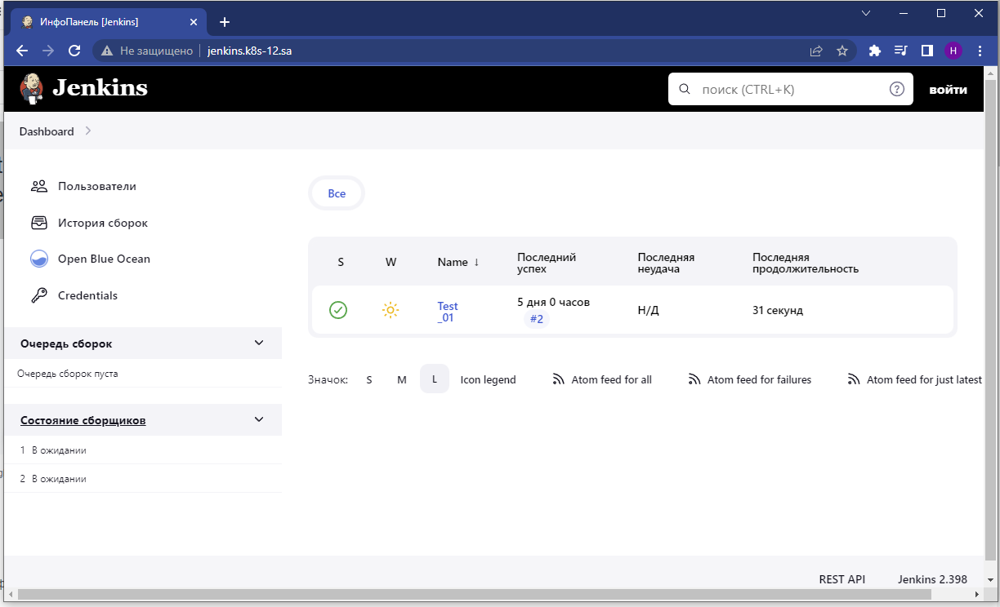

# 14. Kubernetes.
## Link to repositories [GITHUB](https://github.com/Lukyanchyk/helm_14hw) ##

## Main task:
* Finish application deployment
* Create helm package for your Jenkins application 
  1) all variables should be inside variable file
  2) publish helm on your repository


# Steps: #

## Create Helm

```bash
1629  helm create jenkins
```

## Making changes to yaml files ##
### deployment.yaml
```yaml
---
apiVersion: v1
kind: Namespace
metadata:
  name: {{ .Values.namespace }}
  
---
apiVersion: apps/v1
kind: Deployment
metadata:
  name: {{ .Values.name }}
  namespace: {{ .Values.namespace }}
spec:
  replicas: {{ .Values.replicaCount }}
  selector:
    matchLabels:
      app: {{ .Values.name }}
  template:
    metadata:
      labels:
        app: {{ .Values.name }}
    spec:
      containers:
        - name: {{ .Values.name }}
          image: "{{ .Values.image.repository }}:{{ .Values.image.tag | default .Chart.AppVersion }}"
          imagePullPolicy: {{ .Values.image.pullPolicy }}
          env:
            - name: JAVA_OPTS
              value: "-Djenkins.install.runSetupWizard=false"
            - name: CASC_JENKINS_CONFIG
              value: /var/jenkins_home/casc_configs/jenkins.yaml
          ports:
            - name: http-port
              containerPort: 8080
            - name: jnlp-port
              containerPort: 50000
          securityContext:
            runAsUser: 0
          resources:
          {{- toYaml .Values.resources | nindent 12 }}
          volumeMounts:
            - name: jenkins-auth-config
              mountPath: /var/jenkins_home/init.groovy.d/basic-security.groovy
              subPath: basic-security.groovy
            - name: jenkins-config-yaml
              mountPath: /var/jenkins_home/casc_configs/jenkins.yaml
              subPath: jenkins.yaml
            - name: jenkins-config
              mountPath: /var/jenkins_home
      volumes:
        - name: jenkins-auth-config
          configMap:
            name: {{ .Values.name }}-basic-security
        - name: jenkins-config-yaml
          configMap:
            name: jenkins-config
        - name: jenkins-config
          nfs:
            server: {{ .Values.ip_server }}
            path: {{ .Values.nfs_mount }}
---
apiVersion: v1
kind: ConfigMap
metadata:
  name: {{ .Values.name }}-basic-security
  namespace: {{ .Values.namespace }}
data:
  basic-security.groovy: |
    #!groovy
    import jenkins.model.*
    import hudson.security.*
    def instance = Jenkins.getInstance()
    println "--> creating local user 'admin'"
    def password = System.getenv("PASS")
    def hudsonRealm = new HudsonPrivateSecurityRealm(false)
    hudsonRealm.createAccount('admin',"admin")
    instance.setSecurityRealm(hudsonRealm)
    def strategy = new FullControlOnceLoggedInAuthorizationStrategy()
    strategy.setAllowAnonymousRead(true)
    instance.setAuthorizationStrategy(strategy)
    instance.save()
---
apiVersion: v1
kind: ConfigMap
metadata:
  name: jenkins-config
  namespace: {{ .Values.namespace }}
data:
  jenkins.yaml: |
        jenkins:
          numExecutors: 2
          clouds:
          - kubernetes:
              containerCapStr: "10"
              maxRequestsPerHostStr: "32"
              jenkinsUrl: "http://jenkins:8080"
              name: "kubernetes"
              namespace: "{{ .Values.namespace }}"
              skipTlsVerify: true
        credentials:
          system:
            domainCredentials:
            - credentials:
              - usernamePassword:
                  description: "Githubuser"
                  id: "some_randome"
                  password: "{{ .Values.pswd }}"
                  scope: GLOBAL
                  username: "{{ .Values.uname }}"
        unclassified:
          location:
            adminAddress: "Mikalai.Lukyanchyk@gmail.com"
            url: "http://jenkins.k8s-12.sa/"
          shell:
            shell: "/bin/bash"
```
### ingress.yaml ###
```yaml
apiVersion: networking.k8s.io/v1
kind: Ingress
metadata:
  name: {{ .Values.name }}
  namespace: {{ .Values.namespace }}
  annotations:
    kubernetes.io/ingress.class: nginx
    nginx.ingress.kubernetes.io/server-alias: {{ .Values.server_alias }}
spec:
  rules:
    - host: {{ .Values.host_ingress }}
      http:
        paths:
          - path: /
            pathType: Prefix
            backend:
              service:
                name: {{ .Values.name }}
                port:
                  number: {{ .Values.ingress_port }}
```
### value.yaml ###
```yaml
namespace: jenkins
name: jenkins-helm

image:
  repository: ghcr.io/lukyanchyk/jenkins
  pullPolicy: IfNotPresent
  tag: "latest"

replicaCount: 1

resources:
  limits:
    cpu: 3000m
    memory: 3000Mi
  requests:
    cpu: 2000m
    memory: 2000Mi
    
    
ip_server: 192.168.37.105
nfs_mount: /mnt/IT-Academy/nfs-data/sa2-23-23/Mikalai.Lukyanchyk/jenkins

ingress:
  enabled: true
host_ingress: jenkins.k8s-12.sa
server_alias: "jenkins.k8s-12.sa"
ingress_port: 8080

master_p: 8080
master_t: 8080
slave_p: 50000
slave_t: 50000 
```
### service.yaml ###
```yaml
---
apiVersion: v1
kind: Service
metadata:
  name: {{ .Values.name }}
  namespace: {{ .Values.namespace }}
spec:
  ports:
    - name: master
      port: {{ .Values.master_p }}
      targetPort: {{ .Values.master_t }}
    - name: slave
      port: {{ .Values.slave_p }}
      targetPort: {{ .Values.slave_t }}
  selector:
    app: {{ .Values.name }}

```
### serviceaccount.yaml ###
```yaml
---
apiVersion: rbac.authorization.k8s.io/v1
kind: ClusterRoleBinding
metadata:
  name: {{ .Values.name }}
  namespace: {{ .Values.namespace }}
roleRef:
  apiGroup: rbac.authorization.k8s.io
  kind: ClusterRole
  name: cluster-admin
subjects:
- kind: ServiceAccount
  name: default
  namespace: {{ .Values.namespace }}
```
## Create a package , move it to the releases folder and deploy helm to the cluster ##
```bash
 1695  helm package jenkins
 1696  mv jenkins-0.1.0.tgz ../helm-releases/
 1697  helm install jenkins ../helm-releases/jenkins-0.1.0.tgz
```
## After the done actions, we can open our browser and observe the following :



