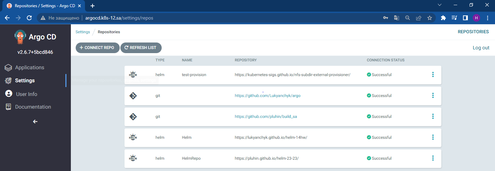
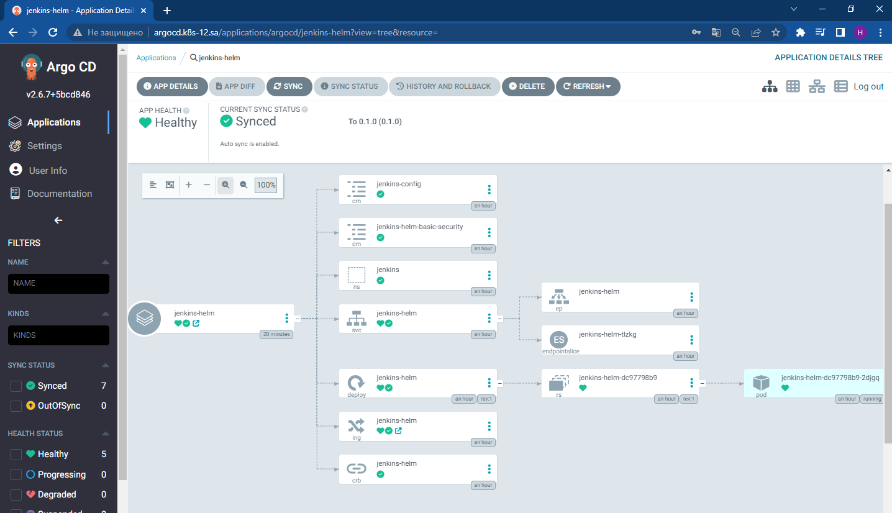

# 15. Kubernetes CI CD
## Link to Helm repositories [HELM](https://github.com/Lukyanchyk/helm-14hw) ##

## Link to ARGO repositories [ARGO](https://github.com/Lukyanchyk/argo) ##

## Main task:
* deploy ArgoCD into your cluster(DONE)
* add your repositories with helm packages as source for deployment(DONE)
* create separate repository which contains application manifests for ArgoCD(DONE)
 1) application objects
 2) git secrets objects as sealsecret objects
* add this repository as project for your applications (DONE)


# Steps: #
## deploy ArgoCD into your cluster ##
```bash
1604  kubectl create namespace argocd
1605  wget https://raw.githubusercontent.com/argoproj/argo-cd/stable/manifests/install.yaml -O argocd-install.yaml
1606  nano argocd-install.yaml
1607  vim argocd-install.yaml
1608  kubectl apply -f argocd-install.yaml -n argocd
```

## Create separate repository which contains application manifests for ArgoCD ##
### application objects ###
```bash
 1762  mkdir app
 1763  cd app/
 1764  kubectl get application jenkins-helm -n argocd -o yaml >jenkins-helm.yaml
 1766  vim jenkins-helm.yaml
 1767  kubectl get application helm-app -n argocd -o yaml > helm-app.yaml
 1768  vim helm-app.yaml
 1769  kubectl get application provision -n argocd -o yaml > provision.yaml
 1770  vim provision.yaml
 1771  git add --all
 1772  git commit -m "add app"
 1773  git push
```

### git secrets objects as sealsecret objects ###
```bash
 1787  kubectl get secret repo-<your repo> -n argocd -o yaml > secret.yaml
 1788  cat secret.yaml | kubeseal --format yaml > sealed_secret.yaml
 1789  git add --all
 1790  git commit -m "Add sealed secret git repo"
 1791  git push
```
# Pritscreen #
## Argo repository ##

## Init ##

## Jenkins with helm ##

## All app ##
