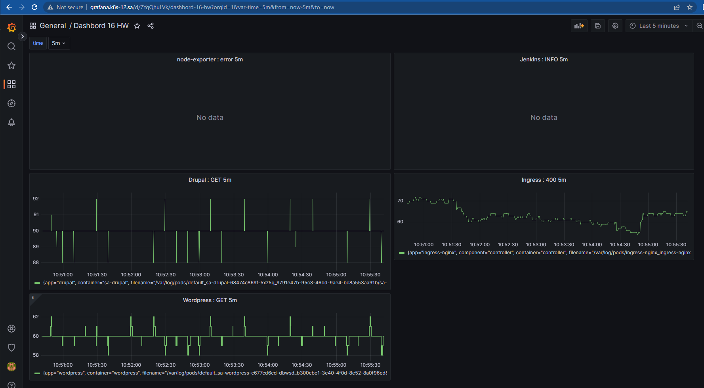
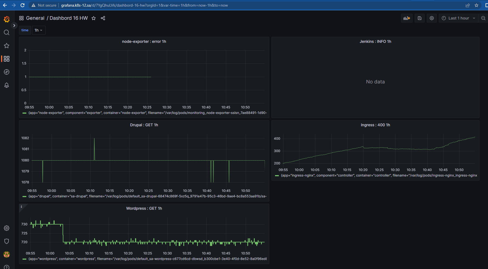

# 17. Kubernetes. Log monitoring

## Main task:
* Deploy Grafana loki inside your cluster
* Create Grafana dashboard to monitor counts errors for the following application inside your cluster
1) Jenkins
2) Ingress
3) node-exporter
4) Drupal|Wordpress
* Dashboard style can be any of your choice
* Counts of error should be as parameter from list: 5m, 1h, 1d

## Changes ##
### Jenkins ###
Search criteria "INFO" because there were no errors
### ###
### Drupal ###
Search criteria "GET" because there were no errors
### ###
### Wordpress ###
Search criteria "GET" because there were no errors

## Screenshots with Results ##
### 5m ###

### 1h ###

### 24h ###

