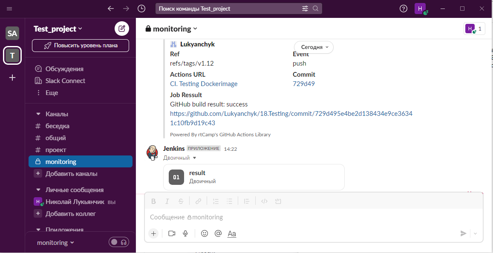
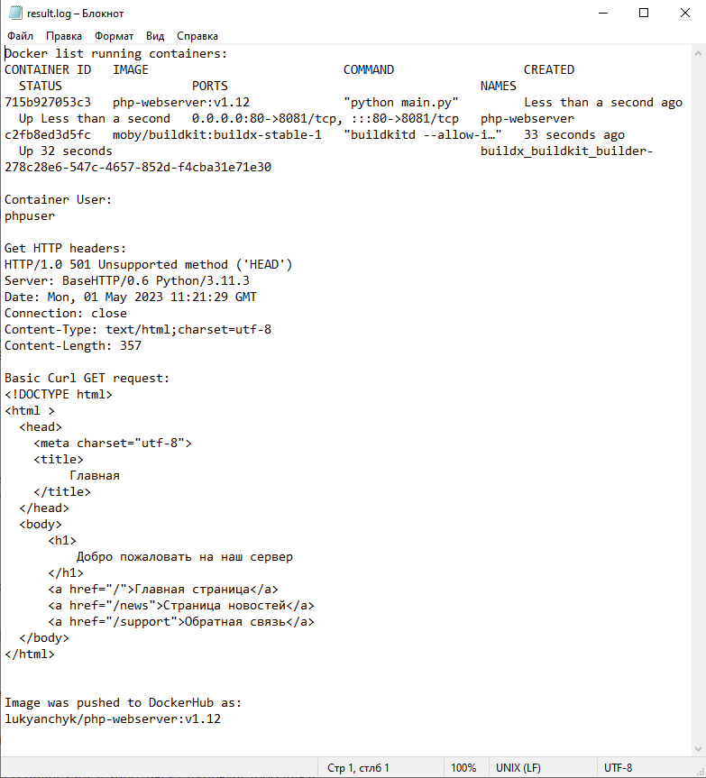
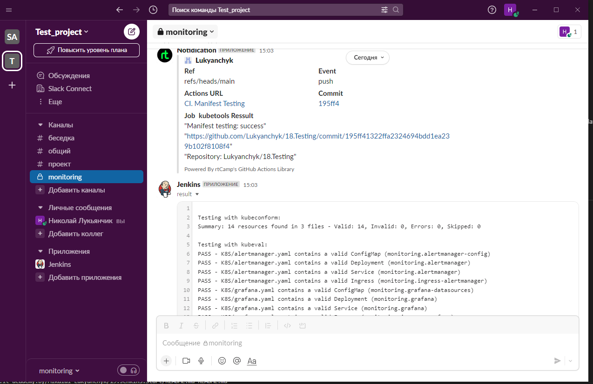

# **18. Testing**

## Main task:
Automate Docker images test by github action:
* deploy docker image for test
* test by requesting data from image
* test if image has not root access inside

Create CI for testing Kubernetes manifests using kubeval
* start on push or create PR to manifests repository
* all tools are inside container/pods
* integrate notification about status of validation
* (optional) if you have more then one manifest, you have to implement parallel validation for them

Create PR to with your manifests and short report

# Steps #
## 1) Automate Docker images test by github action: ##
**Preparing :** 
* For this task, we will use the Docker image from the previous task (07.Docker)
* For Slack notification, we use the bot created when running HW Jenkins, so the name of the bot is appropriate
* Create new Repositories for this HW [>> HERE <<](https://github.com/Lukyanchyk/18.Testing)

**Dockerfile**
```config
FROM python:3.11-slim


LABEL MAINTAINER="Mikalai Lukyanchyk"
LABEL description="A Docker container to serve a simple Python web server"

RUN apt-get update \
    && apt-get upgrade -y
RUN apt-get install -yqq mc vim curl wget git telnet netcat

RUN useradd -m phpuser
WORKDIR /home/phpuser/webserver
COPY ./pages/* ./pages/
COPY main.py ./

EXPOSE 8081
USER phpuser

ENTRYPOINT ["python", "main.py"] 
```

**Workflow TestDocker.yaml**
```yaml
name: CI. Testing Dockerimage

on:
  push:
    tags:
      - "v*"
#    branches:
#      - 'main'

env:
    IMAGE_NAME: "php-webserver"
    RESULT_FILE: result.log
    WAITING_TIMER: 5
    ARTIFACT: result-artifact

jobs:
  docker:
    if: startsWith(github.ref, 'refs/tags/v')
    runs-on: ubuntu-latest
    outputs:
      out-job-status: ${{ job.status }}
    steps:
      - name: Check out the repo
        uses: actions/checkout@v2

      - name: Set up Docker Buildx
        uses: docker/setup-buildx-action@v2

      - name: Build Dokerimage
        run: |
          docker build -f Dockerfile . --network=host -t ${{ env.IMAGE_NAME }}:${{  github.ref_name }}
          docker run -d --rm -p 80:8081 --name ${{ env.IMAGE_NAME }} ${{ env.IMAGE_NAME }}:${{  github.ref_name }}
          echo "Docker list running containers:" >> ${{ env.RESULT_FILE }}
          docker ps >> ${{ env.RESULT_FILE }}
          sleep ${{ env.WAITING_TIMER }}

      - name: Testing Doker Container User
        id: container-user
        run: |
          echo -e "\nContainer User:"  >> ${{ env.RESULT_FILE }}
          docker exec ${{ env.IMAGE_NAME }} whoami >> ${{ env.RESULT_FILE }}
          echo "container-user=$(docker exec ${{ env.IMAGE_NAME }} whoami)" >> $GITHUB_OUTPUT

      - name: Container-User
        run: |
          echo "Container user is: ${{ steps.container-user.outputs.container-user }}"

      - name: Slack Notification by root
        uses: rtCamp/action-slack-notify@v2
        if: ${{ steps.container-user.outputs.container-user == 'root' }}
        env:
          SLACK_COLOR: #E01E5A
          SLACK_USERNAME: warning
          SLACK_MESSAGE: "Warning! Building image user is root!"
          SLACK_TITLE: 'Warning'
          SLACK_WEBHOOK: ${{ secrets.SLACK_WEBHOOK }}

      - name: Testing Doker Container with CURL
        run: |
          echo -e "\nGet HTTP headers:" >> ${{ env.RESULT_FILE }}
          curl -I http://localhost:80 >> ${{ env.RESULT_FILE }}
          echo "Basic Curl GET request:"  >> ${{ env.RESULT_FILE }}
          curl http://localhost:80 >> ${{ env.RESULT_FILE }}

      - name: Login to Docker Hub
        uses: docker/login-action@v1
        with:
          username: ${{ secrets.DOCKERHUB_USERNAME }}
          password: ${{ secrets.DOCKERHUB_PASSWORD }}

      - name: Push image to Docker Hub
        run: |
          docker tag ${{ env.IMAGE_NAME }}:${{  github.ref_name }} ${{ secrets.DOCKERHUB_USERNAME }}/${{ env.IMAGE_NAME }}:${{  github.ref_name }}
          docker tag ${{ env.IMAGE_NAME }}:${{  github.ref_name }} ${{ secrets.DOCKERHUB_USERNAME }}/${{ env.IMAGE_NAME }}:latest
          docker push ${{ secrets.DOCKERHUB_USERNAME }}/${{ env.IMAGE_NAME }}:${{  github.ref_name }}
          docker push ${{ secrets.DOCKERHUB_USERNAME }}/${{ env.IMAGE_NAME }}:latest
          echo -e "\n\nImage was pushed to DockerHub as:"  >> ${{ env.RESULT_FILE }}
          echo "${{ secrets.DOCKERHUB_USERNAME }}/${{ env.IMAGE_NAME }}:${{  github.ref_name }}"  >> ${{ env.RESULT_FILE }}

      - name: Upload artifacts
        uses: actions/upload-artifact@v3
        with:
          name: ${{ env.ARTIFACT }}
          path: ${{ env.RESULT_FILE }}

  slack:
    needs: [docker]
    if: ${{ always() }}
    runs-on: ubuntu-latest
    steps:
      - name: Post to a Slack channel
        id: slack
        uses: rtCamp/action-slack-notify@v2
        env:
          SLACK_COLOR: #2EB67D
          SLACK_USERNAME: Notidication
          SLACK_MESSAGE: "GitHub build result: ${{ needs.docker.outputs.out-job-status }}\n${{ github.event.pull_request.html_url || github.event.head_commit.url }}"
          SLACK_TITLE: 'Job Ressult'
          SLACK_WEBHOOK: ${{ secrets.SLACK_WEBHOOK }}

      - name: Check out the repo
        uses: actions/checkout@v3

      - name: Download artifact
        uses: actions/download-artifact@v3
        with:
          name: ${{ env.ARTIFACT }}


      - name: Upload to slack step
        uses: adrey/slack-file-upload-action@master
        with:
          token: ${{ secrets.SLACK_BOT }}
          path: ${{ env.RESULT_FILE }}
          channel: monitoring

```

### RESULT ###



## 2) Create CI for testing Kubernetes manifests using kubeval: ##

**Workflow TestDocker.yaml**
```yaml
name: CI. Manifest Testing

on:
  push:
    branches:
      - 'main'

env:
    RESULT_FILE: result.log
    ARTIFACT: result-artifact
    TESTING_PATH: ./K8S/

jobs:
  kubetools:
    runs-on: ubuntu-latest
    container: deck15/kubeval-tools:latest
    outputs:
      out-job-status: ${{ job.status }}
    steps:
      - name: Check out the repo
        uses: actions/checkout@v3

      - name: Test kubeconform
        continue-on-error: true
        run: |
          echo -e "\nTesting with kubeconform:" >> ${{ env.RESULT_FILE }}
          kubeconform -summary ${{ env.TESTING_PATH }} >> ${{ env.RESULT_FILE }}

      - name: Test kubeval
        continue-on-error: true
        run: |
          echo -e "\nTesting with kubeval:" >> ${{ env.RESULT_FILE }}
          kubeval --schema-location https://raw.githubusercontent.com/yannh/kubernetes-json-schema/master -d ${{ env.TESTING_PATH }} >> ${{ env.RESULT_FILE }}

      - name: Upload artifacts
        uses: actions/upload-artifact@v3
        with:
          name: ${{ env.ARTIFACT }}
          path: ${{ env.RESULT_FILE }}

  slack:
    needs: [kubetools]
    if: ${{ always() }}
    runs-on: ubuntu-latest
    steps:
      - name: Post to a Slack channel
        id: slack
        uses: rtCamp/action-slack-notify@v2
        env:
          SLACK_COLOR: #2EB67D
          SLACK_USERNAME: Notidication
          SLACK_MESSAGE: |-
            "Manifest testing: ${{ needs.kubetools.outputs.out-job-status }}"
            "${{ github.event.pull_request.html_url || github.event.head_commit.url }}"
            "Repository: ${{ github.repository }}"
          SLACK_TITLE: 'Job  kubetools Ressult'
          SLACK_WEBHOOK: ${{ secrets.SLACK_WEBHOOK }}

      - name: Check out the repo
        uses: actions/checkout@v3

      - name: Download artifact
        uses: actions/download-artifact@v3
        with:
          name: ${{ env.ARTIFACT }}


      - name: Upload to slack step
        uses: adrey/slack-file-upload-action@master
        with:
          token: ${{ secrets.SLACK_BOT }}
          path: ${{ env.RESULT_FILE }}
          channel: monitoring
```

### RESULT ###
