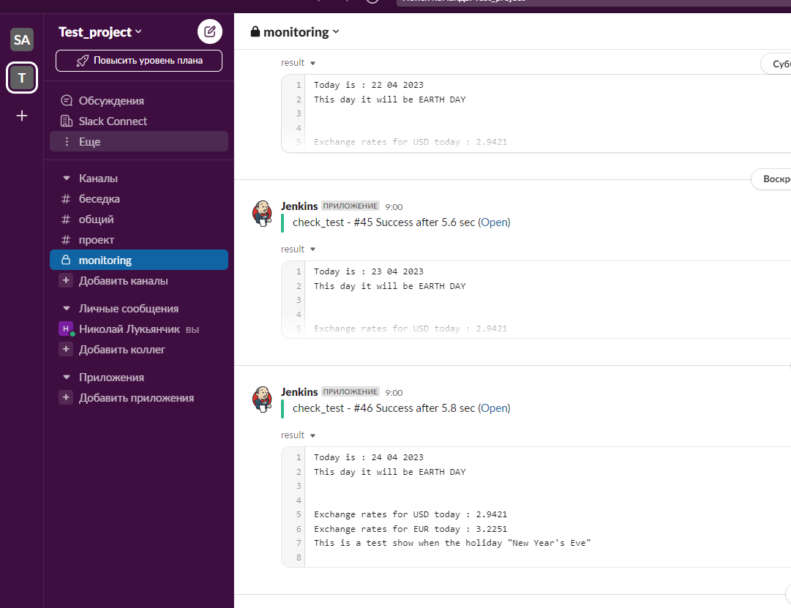
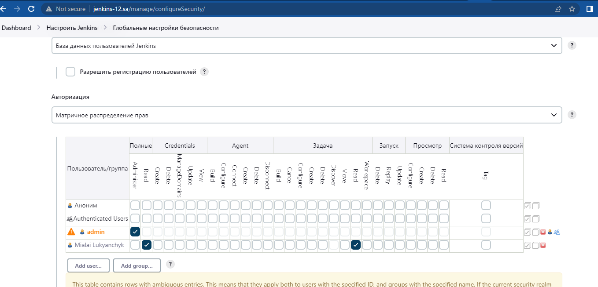

# **19. Jenkins. Start**

## Main task:
Deploy Jenkins inside your home environment

* Install Jenkins
* Setup the following
  1) install plugins: Ansible, slack notification
  2) add restricted user to view Jobs, without any changes inside Jobs and Jenkins settings
* Hide Jenkins behind the web server (Nginx, Apache)
Create Job

* Create job to run each day and collect data and send as artefacts to the slack:
  1) Check if today holiday in Belarus: in my HW used https://holidayapi.com/countries/by/2023
  2) Inform about exchange rates for current day (please find any)
  3) Can be included in one file-artefacts or simple message in slack
Config files with Jenkins proxing on Web server and xml file for job add PR

## Steps ##
All the following steps are done with script.
  * Install jenkins
  * Install Jenkins plugin

For Check "if today holiday in Belarus" I use API on http://holidays.abstractapi.com

For inform about exchange rates - http://nbrb.by

### script.sh ###
```bash
#!/bin/bash
apt update && apt upgrade -yqq && apt install -yqq openjdk-11-jdk wget git curl
curl -fsSL https://pkg.jenkins.io/debian-stable/jenkins.io-2023.key | sudo tee   /usr/share/keyrings/jenkins-keyring.asc > /dev/null
echo deb [signed-by=/usr/share/keyrings/jenkins-keyring.asc]   https://pkg.jenkins.io/debian-stable binary/ | sudo tee   /etc/apt/sources.list.d/jenkins.list > /dev/null
apt update && apt install -yqq jenkins
service jenkins stop
#####################################
echo 'JAVA_ARGS="-Djenkins.install.runSetupWizard=false"' >> /etc/default/jenkins
rm -rf /var/lib/jenkins/init.groovy.d && mkdir /var/lib/jenkins/init.groovy.d
cp -v 01_AuthorizationStrategy.groovy /var/lib/jenkins/init.groovy.d/
cp -v 02_addUser.groovy /var/lib/jenkins/init.groovy.d/
service jenkins start
sleep 1m
####################################
JENKINSPWD=$(sudo cat /var/lib/jenkins/secrets/initialAdminPassword)
rm -f jenkins_cli.jar.*
wget -q http://localhost:8080/jnlpJars/jenkins-cli.jar
while IFS= read -r line
do
  list=$list' '$line
done < jenkinsPlugins.txt
java -jar ./jenkins-cli.jar -auth admin:$JENKINSPWD -s http://localhost:8080 install-plugin $list
service jenkins restart
sleep 1m
####################################
runuser -l jenkins -c 'echo -e "\n\n\n" | ssh-keygen -t rsa'
runuser -l jenkins -c 'cat ~/.ssh/id_rsa'
runuser -l jenkins -c 'cat ~/.ssh/id_rsa.pub'
echo "Master ready!"
```
### 01_AuthorizationStrategy.groovy ###
```groovy
import jenkins.model.*
import hudson.security.*

def instance = Jenkins.getInstance()

def strategy = instance.getAuthorizationStrategy()
if (!(strategy instanceof GlobalMatrixAuthorizationStrategy)) {
  strategy = new GlobalMatrixAuthorizationStrategy()
  instance.setAuthorizationStrategy(strategy)
  instance.save()
  instance.doSafeRestart()
}
```
### 02_addUser.groovy ###
```groovy
import jenkins.model.*
import hudson.security.*

def instance = Jenkins.getInstance()

def hudsonRealm = new HudsonPrivateSecurityRealm(false)
hudsonRealm.createAccount("admin", "admin")
instance.setSecurityRealm(hudsonRealm)

def strategy = (GlobalMatrixAuthorizationStrategy) instance.getAuthorizationStrategy()
strategy.add(Jenkins.ADMINISTER, "admin")
instance.setAuthorizationStrategy(strategy)

instance.save()
```
### config.xml ###
```config
<?xml version='1.1' encoding='UTF-8'?>
<project>
  <actions/>
  <description></description>
  <keepDependencies>false</keepDependencies>
  <properties>
    <com.sonyericsson.rebuild.RebuildSettings plugin="rebuild@1.34">
      <autoRebuild>false</autoRebuild>
      <rebuildDisabled>false</rebuildDisabled>
    </com.sonyericsson.rebuild.RebuildSettings>
    <jenkins.model.BuildDiscarderProperty>
      <strategy class="hudson.tasks.LogRotator">
        <daysToKeep>-1</daysToKeep>
        <numToKeep>1</numToKeep>
        <artifactDaysToKeep>-1</artifactDaysToKeep>
        <artifactNumToKeep>-1</artifactNumToKeep>
      </strategy>
    </jenkins.model.BuildDiscarderProperty>
  </properties>
  <scm class="hudson.scm.NullSCM"/>
  <canRoam>true</canRoam>
  <disabled>false</disabled>
  <blockBuildWhenDownstreamBuilding>false</blockBuildWhenDownstreamBuilding>
  <blockBuildWhenUpstreamBuilding>false</blockBuildWhenUpstreamBuilding>
  <triggers>
    <hudson.triggers.TimerTrigger>
      <spec>00 09 * * *</spec>
    </hudson.triggers.TimerTrigger>
  </triggers>
  <concurrentBuild>false</concurrentBuild>
  <builders>
    <hudson.tasks.Shell>
      <command>#!/bin/bash
rm -rf result.txt
daten=$(echo -e &quot;&amp;year=$(date +%Y)&amp;month=$(date +%m)&amp;day=$(date +%d)&quot;)
CHECK=$(curl -s &quot;https://holidays.abstractapi.com/v1/?api_key=$api_key&amp;country=BY$daten&quot;)
sleep 2
CHECK2=$(curl -s &quot;https://holidays.abstractapi.com/v1/?api_key=$api_key&amp;country=BY&amp;year=2023&amp;month=12&amp;day=31&quot;)
sleep 2
echo &quot;Today is : $(date +&quot;%d %m %Y&quot;)&quot; | tee -a result.txt
if [[ &quot;$CHECK&quot; == &quot;[]&quot; ]]; then
  echo &quot;This day it will be EARTH DAY &quot; | tee -a result.txt
else
  echo &quot;This day it $(echo $CHECK | sed &apos;s/.*name&quot;://g; s/,&quot;name_local.*//g&apos;)&quot; | tee -a result.txt
fi
echo -e &quot;\n&quot; | tee -a result.txt
echo &quot;Exchange rates for USD today : $(curl -s https://www.nbrb.by/api/exrates/rates/USD?parammode=2 | sed -nr &apos;s/.+Cur_OfficialRate&quot;:(.+)}+/\1/p&apos;)&quot; | tee -a result.txt
echo &quot;Exchange rates for EUR today : $(curl -s https://www.nbrb.by/api/exrates/rates/EUR?parammode=2 | sed -nr &apos;s/.+Cur_OfficialRate&quot;:(.+)}+/\1/p&apos;)&quot; | tee -a result.txt
echo -e &quot;\n&quot; | tee -a
echo &quot;This is a test show when the holiday $( echo $CHECK2 | sed &apos;s/.*name&quot;://g; s/,&quot;name_local.*//g&apos;)&quot; | tee -a result.txt
echo -e &quot;\n&quot; | tee -a

</command>
      <configuredLocalRules/>
    </hudson.tasks.Shell>
  </builders>
  <publishers>
    <jenkins.plugins.slack.SlackNotifier plugin="slack@664.vc9a_90f8b_c24a_">
      <baseUrl></baseUrl>
      <teamDomain></teamDomain>
      <authToken></authToken>
      <tokenCredentialId>slack-3</tokenCredentialId>
      <botUser>true</botUser>
      <room></room>
      <sendAsText>false</sendAsText>
      <iconEmoji></iconEmoji>
      <username></username>
      <startNotification>false</startNotification>
      <notifySuccess>true</notifySuccess>
      <notifyAborted>false</notifyAborted>
      <notifyNotBuilt>false</notifyNotBuilt>
      <notifyUnstable>false</notifyUnstable>
      <notifyRegression>false</notifyRegression>
      <notifyFailure>false</notifyFailure>
      <notifyEveryFailure>false</notifyEveryFailure>
      <notifyBackToNormal>false</notifyBackToNormal>
      <notifyRepeatedFailure>false</notifyRepeatedFailure>
      <includeTestSummary>false</includeTestSummary>
      <includeFailedTests>false</includeFailedTests>
      <uploadFiles>true</uploadFiles>
      <artifactIncludes>result.txt</artifactIncludes>
      <commitInfoChoice>NONE</commitInfoChoice>
      <includeCustomMessage>false</includeCustomMessage>
      <customMessage></customMessage>
      <customMessageSuccess></customMessageSuccess>
      <customMessageAborted></customMessageAborted>
      <customMessageNotBuilt></customMessageNotBuilt>
      <customMessageUnstable></customMessageUnstable>
      <customMessageFailure></customMessageFailure>
    </jenkins.plugins.slack.SlackNotifier>
  </publishers>
  <buildWrappers/>
</project>
```
## Slack and user preference ##


### **Warning** ### 
* If you want to send via jenkins to a slack file, then you need to use a bot