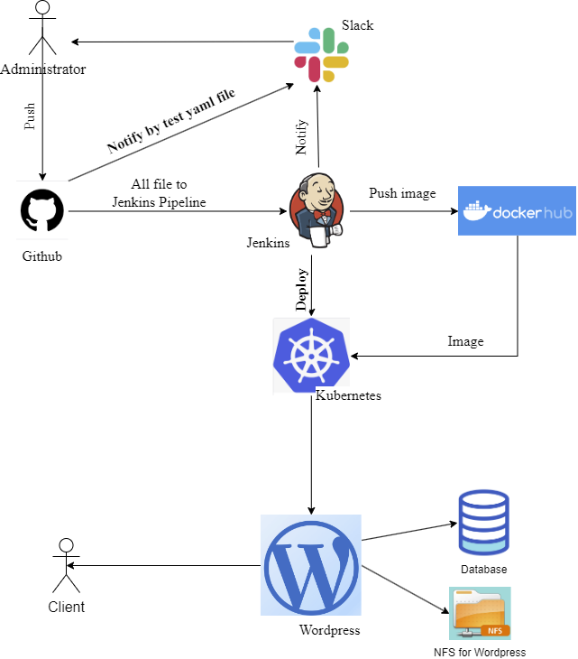

# Project report

**Project's reporter:** Mikalai Lukyanchyk

**Group number:** md-sa2-23-23

## Description of application for deployment

- **Application:**  wp-project

- **Programming language:** PHP, bash

- **Database:** Mariadb

Mariadb database is used on an external server.

## Pipeline. High Level Design

## Technologies which were used in project

**Orchestration:** Kubernetes

**Automation tools:** Github Actions, Jenkins

**Other used technologies**: HELM, Docker, MariaDB

**Notifications:** Slack

## CI/CD description

**General description:**

By pushing with application version CI Github Action was triggered.  CI Github Action starts 

CI/CD Action tests yaml manifests and notificate by Slack.

Each versions of application is placed in own catalog on NFS server.

## CI/CD pipeline description:
Every business day, Jenkins checks the repository for changes. If there are changes, the assembly starts and the image is sent to DockerHub. Then the application is installed in the cluster, if the installation fails, then the rollback stage occurs. Slack receives a notification of the result.

### Links

[Project Repository](https://github.com/Lukyanchyk/project-sa)

[DockerHub Registry](https://hub.docker.com/repository/docker/lukyanchyk/project-sa)

[Git Wordpress Docker library](https://github.com/docker-library/wordpress)