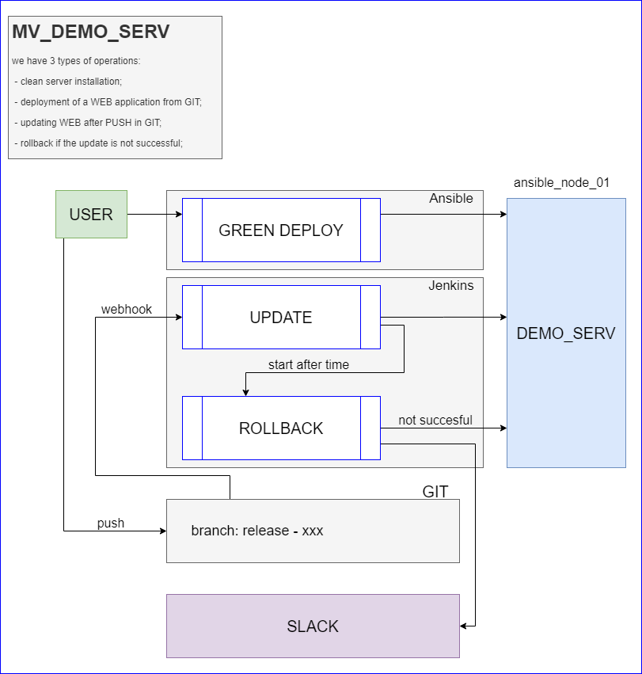

## Project report

##### Project's reporter: Mikalail Rysnik
##### Group number: m-sa2-13-20
### Description of application for deployment
 - Name of application: MV_DEMO_SERVER
 - Which programming language is this application written in: Python, Vui
 - NGINX-GUNICORN-DJANGO-POSRGRESQL  
 - What kind of DB: POSTGRESQL  

Links:
 -  [GIT](https://github.com/RysnikM/project_devops)  
  - [Jenkins](http://185.92.149.191:8080/)  user: guest, pass: guest  
 -  [Demo_server](http://92.119.115.101/)  

Pipeline. High Level Design:  
  

Links:
 - Green deployment [pipeline](https://github.com/RysnikM/project_devops/tree/deploy)
 - Upgrade web [pipeline](http://185.92.149.191:8080/)
 - Rollback [pipeline](https://github.com/RysnikM/project_devops/tree/jenkins_pipeline)

Technologies which were used in project:  
 - Orchestration: Jenkins, git runners, Ansible;  
 - Automation tools: Ansible;
 - Notification: SLACK;
 - CI description: Webhooks;
 