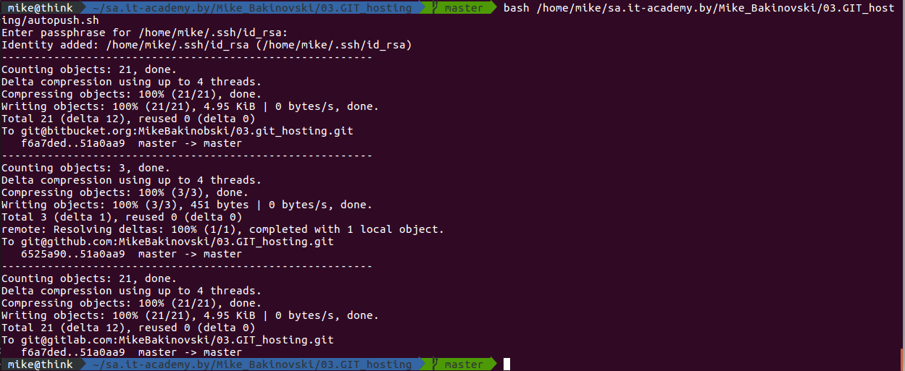

# 03. GIT hosting home work 

## GIT Hosting Links

[GitHub](https://github.com/MikeBakinovski/03.GIT_hosting)  
[GitLab](https://gitlab.com/MikeBakinovski/03.GIT_hosting)  
[Bitbucket](https://bitbucket.org/MikeBakinobski/03.git_hosting/src/master/)


## CLI commands for creating remote repositories

#### CLI should be set to 03.GIT_hosting folder.
```bash
git init
git config --global user.name "MikeBakinovski"
git config --global user.email "mike.bakinovski@gmail.com"
```
#### Create and push Github remote repository 
```bash
git remote add origin_github git@github.com:MikeBakinovski/03.GIT_hosting.git
git push -u origin_github master
```
#### Create and push Gitlab remote repository
```bash
git remote add origin_gitlab git@gitlab.com:MikeBakinovski/03.GIT_hosting.git
git push -u origin_gitlab master
```
#### Create and push Bitbucket remote repository
```bash
git remote add origin_bitbucket git@bitbucket.org:MikeBakinobski/03.git_hosting.git
git push -u origin_bitbucket master
```
## Create slack/email integration push/commit events

#### For GitHub 
<<<<<<< HEAD
<<<<<<< HEAD
  
=======
  
>>>>>>> 03.GIT_hosting Home work (#845)
=======
  
>>>>>>> 03.GIT_hosting Home work (#845)

## Bash script for pushing changes to all remote repositories
```bash
#!/bin/bash

ssh-add
git remote show | while read line
do 
    echo "---------------------------------------------------------"
    git push $line master 
done
```
### Result of autopush.sh running
<<<<<<< HEAD
<<<<<<< HEAD


# 03.GIT_hosting 
### Additional task

* Deploy GitLab.  
* Setup access and email notification.  
* Create project  
* Send me invitation to this project using GitLab notification  
* Check difference between EE and CE

### Vagrantfile and comments.

```bash

# -*- mode: ruby -*-
# vi: set ft=ruby 

gitlab_IP = "192.168.100.44"

Vagrant.configure("2") do |config|

    config.vm.box = "ubuntu/bionic64"
    config.vm.box_check_update = false 

    config.vm.provision "shell", inline: <<-FORALL
    sudo timedatectl set-timezone Europe/Minsk
    sudo sh -c 'echo root:root | chpasswd'
    sudo sh -c 'echo vagrant:root | chpasswd'
    echo -en "\e[37;1;41m ROOT PASSWORD SET TO ROOT \e[0m"	

    sudo apt-get install -y vim
    echo -en "\e[37;1;41m VIM INSTALLED \e[0m"

    sudo grep -rl 'PasswordAuthentication no' /etc/ssh/sshd_config | xargs sudo sed -i 's/PasswordAuthentication no/PasswordAuthentication yes/g'
    echo -en "\e[37;1;41m PasswordAuthentication yes \e[0m"

    sudo grep -rl 'ChallengeResponseAuthentication no' /etc/ssh/sshd_config | xargs sudo sed -i 's/ChallengeResponseAuthentication no/ChallengeResponseAuthentication yes/g'
    echo -en "\e[37;1;41m ChallengeResponseAuthentication yes \e[0m"
  
    FORALL

    config.vm.define "gitlab" do |gitlab|

        gitlab.vm.network "public_network", ip: gitlab_IP, bridge: "wlp3s0"
        gitlab.vm.hostname = "gitlab"
        gitlab.ssh.forward_agent = true

        gitlab.vm.provider "virtualbox" do |vb|
        vb.gui = false
        vb.memory = "4096"			#4Gb RAM is a minimum
        vb.name = "gitlab"

    end

        gitlab.vm.provision "shell", inline: <<-SHELL
        
        sudo apt-get update
        sudo apt-get install -y curl openssh-server ca-certificates

        reboot
        SHELL

    end
end

```

## Following installation and configuration

```bash
sudo apt-get install -y postfix # Shold be  set to "Internet site" other settings as default
curl -s https://packages.gitlab.com/install/repositories/gitlab/gitlab-ce/script.deb.sh | sudo bash
sudo apt-get install gitlab-ce
```
### GitLab configuration
```bash
vim /etc/gitlab/gitlab.rb # external_url 'http://example.com'

```
### Gmail SMTP configuration ./gitlab.rb
```
gitlab_rails['smtp_enable'] = true
gitlab_rails['smtp_address'] = "smtp.gmail.com"
gitlab_rails['smtp_port'] = 587
gitlab_rails['smtp_user_name'] = "my.email@gmail.com"
gitlab_rails['smtp_password'] = "my-gmail-password"
gitlab_rails['smtp_domain'] = "smtp.gmail.com"
gitlab_rails['smtp_authentication'] = "login"
gitlab_rails['smtp_enable_starttls_auto'] = true
gitlab_rails['smtp_tls'] = false
gitlab_rails['smtp_openssl_verify_mode'] = 'none'

```
### Continue with followng commands.

```bash
sudo gitlab-ctl reconfigure
gitlab-ctl status
service gitlab-runsvdir status
sudo gitlab-rails console # for debbuging
irb(main):003:0> Notify.test_email('youremail@email.com', 'Topic', 'Message').deliver_now

```
### Web interface configutation

* Add user and password
* Add new project and push README.md
* Add notification recipients to (Project>Setings>Integrations>Email on push) then test it.
* Add project members email address (Project>Members) and send invite.

### Result
```
Invite notification sent to pluhin@gmail.com
Test push notification sent to pluhin@gmail.com

```

=======

>>>>>>> 03.GIT_hosting Home work (#845)
=======

>>>>>>> 03.GIT_hosting Home work (#845)

