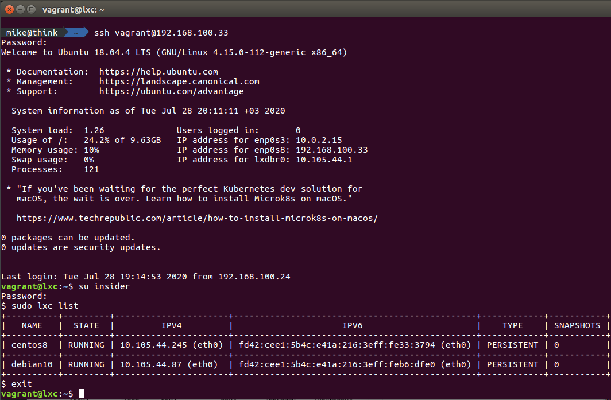

# 04. Infra home work 

## Vagrant file for both requested hosts
```ruby
# - *- mode: ruby -*-
# vi: set ft=ruby 

DEB_IP = "192.168.100.11" # Debian virtual mashine
CEN_IP = "192.168.100.22" # CentOS virtual mashine

Vagrant.configure("2") do |config|

    config.vm.box_check_update = false 

    config.vm.provision "shell", inline: <<-FORALL
    sudo timedatectl set-timezone Europe/Minsk
    sudo sh -c 'echo root:root | chpasswd'
    sudo sh -c 'echo vagrant:root | chpasswd'
    echo -en "\e[37;1;41m ROOT PASSWORD SET TO ROOT \e[0m"

    sudo useradd updater
    sudo sh -c 'echo updater:vagrant | chpasswd'
    sudo echo "updater ALL=(ALL) NOPASSWD:ALL" >> /etc/sudoers

#SECURITY 

    sudo grep -rl 'PasswordAuthentication no' /etc/ssh/sshd_config | xargs sudo sed -i 's/PasswordAuthentication no/PasswordAuthentication yes/g'
    echo -en "\e[37;1;41m PasswordAuthentication yes \e[0m"

    sudo grep -rl 'ChallengeResponseAuthentication no' /etc/ssh/sshd_config | xargs sudo sed -i 's/ChallengeResponseAuthentication no/ChallengeResponseAuthentication yes/g'
    echo -en "\e[37;1;41m ChallengeResponseAuthentication yes \e[0m"
 
    FORALL

# Debian virtual mashine
    config.vm.define "deb" do |deb|

        deb.vm.box = "debian/buster64"

        deb.vm.network "public_network", ip: DEB_IP, bridge: "wlp3s0"
        deb.vm.hostname = "deb"
        deb.ssh.forward_agent = true

        deb.vm.provider "virtualbox" do |vb|
        vb.gui = false
        vb.memory = "512"
        vb.name = "deb"

    end

        deb.vm.provision "shell", inline: <<-SHELL

            sudo apt-get install -y vim
            echo -en "\e[37;1;41m VIM INSTALLED \e[0m"

            sudo apt-get install -y git
            echo -en "\e[37;1;41m GIT INSTALLED \e[0m"

            sudo apt-get install -y wget
            echo -en "\e[37;1;41m WGET INSTALLED \e[0m"

            sudo apt-get install -y curl
            echo -en "\e[37;1;41m CURL INSTALLED \e[0m"

        reboot
        SHELL

    end

# CentOS virtual mashine
    config.vm.define "cen" do |cen|

        cen.vm.box = "centos/8"

        cen.vm.network "public_network", ip: CEN_IP, bridge: "wlp3s0"
        cen.vm.hostname = "cen"
        cen.ssh.forward_agent = true

        cen.vm.provider "virtualbox" do |vb|
        vb.gui = false
        vb.memory = "512"
        vb.name = "cen"

    end

        cen.vm.provision "shell", inline: <<-SHELL

            sudo yum install -y vim
            echo -en "\e[37;1;41m VIM INSTALLED \e[0m"

            sudo yum install -y git
            echo -en "\e[37;1;41m GIT INSTALLED \e[0m"

            sudo yum install -y wget
            echo -en "\e[37;1;41m WGET INSTALLED \e[0m"

            sudo yum install -y curl
            echo -en "\e[37;1;41m CURL INSTALLED \e[0m"
        
        reboot
        SHELL

    end

end
```

### Both vagrant boxes placed to Vgrant cloud

[Box with CentOS 8](https://app.vagrantup.com/MikeBox/boxes/CentOS_200726_v8)  
[Box with Debian 10](https://app.vagrantup.com/MikeBox/boxes/Debian_200726_v10)  

# LXC Infrastructure

## Vagrant file for linux containers
```ruby
# -*- mode: ruby -*-
# vi: set ft=ruby 

lxc_IP = "192.168.100.33" # Database server VM IP addres

Vagrant.configure("2") do |config|

    config.vm.box = "ubuntu/bionic64"
    config.vm.box_check_update = false 

    config.vm.provision "shell", inline: <<-FORALL
        sudo timedatectl set-timezone Europe/Minsk
        sudo sh -c 'echo root:root | chpasswd'
        sudo sh -c 'echo vagrant:root | chpasswd'
        echo -en "\e[37;1;41m ROOT PASSWORD SET TO ROOT \e[0m"

        sudo useradd insider
        sudo sh -c 'echo insider:root | chpasswd'
        sudo echo "insider ALL=(ALL) NOPASSWD:ALL" >> /etc/sudoers

        #SECURITY systems disabled				
        #sudo systemctl stop firewalld
        #sudo systemctl disable firewalld
        #sudo sed -i -e 's/SELINUX=.*/SELINUX=disabled/' /etc/selinux/config
        #echo -en "\e[37;1;41m FIREWALL AND SELINUX DISABLED \e[0m"

        #sudo apt-get install -y vim
        #echo -en "\e[37;1;41m VIM INSTALLED \e[0m"

        sudo grep -rl 'PasswordAuthentication no' /etc/ssh/sshd_config | xargs sudo sed -i 's/PasswordAuthentication no/PasswordAuthentication yes/g'
        echo -en "\e[37;1;41m PasswordAuthentication yes \e[0m"

        sudo grep -rl 'ChallengeResponseAuthentication no' /etc/ssh/sshd_config | xargs sudo sed -i 's/ChallengeResponseAuthentication no/ChallengeResponseAuthentication yes/g'
        echo -en "\e[37;1;41m ChallengeResponseAuthentication yes \e[0m"
    
    FORALL

    config.vm.define "lxc" do |lxc|

        lxc.vm.network "public_network", ip: lxc_IP, bridge: "wlp3s0"
        lxc.vm.hostname = "lxc"
        lxc.ssh.forward_agent = true

        lxc.vm.provider "virtualbox" do |vb|
        vb.gui = false
        vb.memory = "2048"
        vb.name = "lxc"

    end

        lxc.vm.provision "shell", inline: <<-SHELL

            sudo apt-get update
            sudo apt-get install -y lxd
            sudo systemctl enable --now lxd

            #getent group lxd
            #sudo gpasswd -a insider lxd

            reboot
        SHELL

    end
end
```

## LXD initialisation
```
$ lxd init
Would you like to use LXD clustering? (yes/no) [default=no]: no
Do you want to configure a new storage pool? (yes/no) [default=yes]: yes
Name of the new storage pool [default=default]: default
Name of the storage backend to use (btrfs, dir, lvm) [default=btrfs]: dir
Would you like to connect to a MAAS server? (yes/no) [default=no]: no
Would you like to create a new local network bridge? (yes/no) [default=yes]: yes
What should the new bridge be called? [default=lxdbr0]: lxdbr0
What IPv4 address should be used? (CIDR subnet notation, “auto” or “none”) [default=auto]: auto
What IPv6 address should be used? (CIDR subnet notation, “auto” or “none”) [default=auto]: auto
Would you like LXD to be available over the network? (yes/no) [default=no]: no
Would you like stale cached images to be updated automatically? (yes/no) [default=yes] yes
Would you like a YAML "lxd init" preseed to be printed? (yes/no) [default=no]: no
```

## Create linux container with CentOS 8
```
sudo lxc launch images:centos/8
```

### Remame container and set memory limit
```
lxc stop <container name>
lxc move <old randome name> centos8
lxc start centos8
lxc config set centos8 limits.memory 512MB
lxc exec centos8 bash # test go inside container
```

## Create linux container with Debian 10
```
sudo lxc launch images:debian/10
```

### Remame container and set memory limit
```
lxc stop <container name>
lxc move <old randome name> debian10
lxc start debian10
lxc config set debian10 limits.memory 512MB
lxc exec debian10 bash # test go inside container
```
### Login to VM as 'insider' user and check configs and containers list.

### centos8 container config
```
lxc.log.file = /var/log/lxd/centos8/lxc.log
lxc.log.level = warn
lxc.console.buffer.size = auto
lxc.console.size = auto
lxc.console.logfile = /var/log/lxd/centos8/console.log
lxc.mount.auto = proc:rw sys:rw
lxc.autodev = 1
lxc.pty.max = 1024
lxc.mount.entry = /dev/fuse dev/fuse none bind,create=file,optional
lxc.mount.entry = /dev/net/tun dev/net/tun none bind,create=file,optional
lxc.mount.entry = /proc/sys/fs/binfmt_misc proc/sys/fs/binfmt_misc none rbind,create=dir,optional
lxc.mount.entry = /sys/fs/fuse/connections sys/fs/fuse/connections none rbind,create=dir,optional
lxc.mount.entry = /sys/fs/pstore sys/fs/pstore none rbind,create=dir,optional
lxc.mount.entry = /sys/kernel/debug sys/kernel/debug none rbind,create=dir,optional
lxc.mount.entry = /sys/kernel/security sys/kernel/security none rbind,create=dir,optional
lxc.mount.entry = /dev/mqueue dev/mqueue none rbind,create=dir,optional
lxc.include = /usr/share/lxc/config/common.conf.d/
lxc.arch = linux64
lxc.hook.pre-start = /usr/lib/lxd/lxd callhook /var/lib/lxd 2 start
lxc.hook.post-stop = /usr/lib/lxd/lxd callhook /var/lib/lxd 2 stop
lxc.tty.max = 0
lxc.uts.name = centos8
lxc.mount.entry = /var/lib/lxd/devlxd dev/lxd none bind,create=dir 0 0
lxc.apparmor.profile = lxd-centos8_</var/lib/lxd>//&:lxd-centos8_<var-lib-lxd>:
lxc.seccomp.profile = /var/lib/lxd/security/seccomp/centos8
lxc.idmap = u 0 100000 65536
lxc.idmap = g 0 100000 65536
lxc.cgroup.memory.limit_in_bytes = 512000000
lxc.cgroup.memory.soft_limit_in_bytes = 460800000
lxc.rootfs.path = dir:/var/lib/lxd/containers/centos8/rootfs
lxc.net.0.type = veth
lxc.net.0.flags = up
lxc.net.0.link = lxdbr0
lxc.net.0.hwaddr = 00:16:3e:33:37:94
lxc.net.0.name = eth0
lxc.mount.entry = /var/lib/lxd/shmounts/centos8 dev/.lxd-mounts none bind,create=dir 0 0
```

### debian10 container config
```
lxc.log.file = /var/log/lxd/debian10/lxc.log
lxc.log.level = warn
lxc.console.buffer.size = auto
lxc.console.size = auto
lxc.console.logfile = /var/log/lxd/debian10/console.log
lxc.mount.auto = proc:rw sys:rw
lxc.autodev = 1
lxc.pty.max = 1024
lxc.mount.entry = /dev/fuse dev/fuse none bind,create=file,optional
lxc.mount.entry = /dev/net/tun dev/net/tun none bind,create=file,optional
lxc.mount.entry = /proc/sys/fs/binfmt_misc proc/sys/fs/binfmt_misc none rbind,create=dir,optional
lxc.mount.entry = /sys/fs/fuse/connections sys/fs/fuse/connections none rbind,create=dir,optional
lxc.mount.entry = /sys/fs/pstore sys/fs/pstore none rbind,create=dir,optional
lxc.mount.entry = /sys/kernel/debug sys/kernel/debug none rbind,create=dir,optional
lxc.mount.entry = /sys/kernel/security sys/kernel/security none rbind,create=dir,optional
lxc.mount.entry = /dev/mqueue dev/mqueue none rbind,create=dir,optional
lxc.include = /usr/share/lxc/config/common.conf.d/
lxc.arch = linux64
lxc.hook.pre-start = /usr/lib/lxd/lxd callhook /var/lib/lxd 1 start
lxc.hook.post-stop = /usr/lib/lxd/lxd callhook /var/lib/lxd 1 stop
lxc.tty.max = 0
lxc.uts.name = debian10
lxc.mount.entry = /var/lib/lxd/devlxd dev/lxd none bind,create=dir 0 0
lxc.apparmor.profile = lxd-debian10_</var/lib/lxd>//&:lxd-debian10_<var-lib-lxd>:
lxc.seccomp.profile = /var/lib/lxd/security/seccomp/debian10
lxc.idmap = u 0 100000 65536
lxc.idmap = g 0 100000 65536
lxc.cgroup.memory.limit_in_bytes = 512000000
lxc.cgroup.memory.soft_limit_in_bytes = 460800000
lxc.rootfs.path = dir:/var/lib/lxd/containers/debian10/rootfs
lxc.net.0.type = veth
lxc.net.0.flags = up
lxc.net.0.link = lxdbr0
lxc.net.0.hwaddr = 00:16:3e:b6:df:e0
lxc.net.0.name = eth0
lxc.mount.entry = /var/lib/lxd/shmounts/debian10 dev/.lxd-mounts none bind,create=dir 0 0
```
### Containers list




