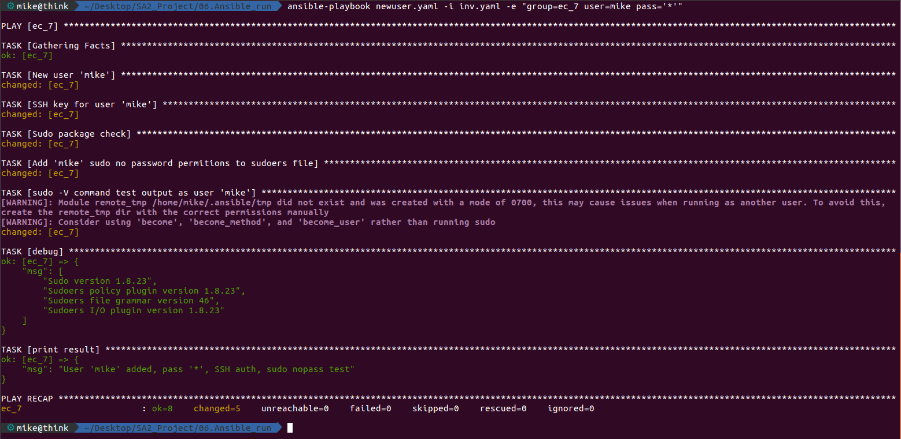

# 06. Ansible run home work

### Inventory

```yaml
ec:
  vars:
    ansible_user: root
  hosts:
    ec_5:
      ansible_host: 192.168.203.5
    ec_6:
      ansible_host: 192.168.203.6
    ec_7:
      ansible_host: 192.168.203.7
    ec_8:
      ansible_host: 192.168.203.8
```

### Requaired parameters from remote hosts:
* OS/version
* Mount point/capacity/used
* RAM/capacity/free

### Playbook
```yaml
---
- hosts: "{{ group }}"
  tasks:
    - name: Print OS/version
      vars:
        msg: |
          OS/version: {{ ansible_distribution }}/{{ ansible_distribution_version }}
      debug:
        msg: "{{ msg.split('\n') }}"
      tags:
        - os

    - name: Print mount point/capacity/used
      shell: 
         "df -H --output=source,size,used,avail"
      register: dfcmd
      tags: 
        - dfcmd

    - debug: msg="{{dfcmd.stdout_lines}}"
      tags:
        - dfcmd

    - name: Print RAM/capacity/free
      shell:
         "free -h"
      register: freecmd
      tags:
        - freecmd

    - debug: msg="{{freecmd.stdout_lines}}"
      tags:
        - freecmd
```
### $ ansible-playbook param.yaml -i inv.yaml -e "group=ec"
```bash
PLAY [ec] ***********************************************************************************************************************

TASK [Gathering Facts] **********************************************************************************************************
ok: [ec_7]
ok: [ec_5]
ok: [ec_6]
ok: [ec_8]

TASK [Print OS/version] *********************************************************************************************************
ok: [ec_5] => {
    "msg": [
        "OS/version: CentOS/7.8", 
        ""
    ]
}
ok: [ec_7] => {
    "msg": [
        "OS/version: CentOS/7.8", 
        ""
    ]
}
ok: [ec_6] => {
    "msg": [
        "OS/version: Ubuntu/18.04", 
        ""
    ]
}
ok: [ec_8] => {
    "msg": [
        "OS/version: Ubuntu/18.04", 
        ""
    ]
}

TASK [Print mount point/capacity/used] ******************************************************************************************
changed: [ec_6]
changed: [ec_8]
changed: [ec_7]
changed: [ec_5]

TASK [debug] ********************************************************************************************************************
ok: [ec_5] => {
    "msg": [
        "Filesystem                         Size  Used Avail", 
        "/dev/mapper/d01-vm--3005--disk--0  6.3G  683M  5.3G", 
        "none                               504k     0  504k", 
        "tmpfs                              136G     0  136G", 
        "tmpfs                              136G  8.7M  136G", 
        "tmpfs                              136G     0  136G", 
        "tmpfs                              430M     0  430M"
    ]
}
ok: [ec_7] => {
    "msg": [
        "Filesystem                         Size  Used Avail", 
        "/dev/mapper/d01-vm--3007--disk--0  6.3G  683M  5.3G", 
        "none                               504k     0  504k", 
        "tmpfs                              136G     0  136G", 
        "tmpfs                              136G  8.7M  136G", 
        "tmpfs                              136G     0  136G", 
        "tmpfs                              430M     0  430M"
    ]
}
ok: [ec_6] => {
    "msg": [
        "Filesystem                         Size  Used Avail", 
        "/dev/mapper/d01-vm--3006--disk--0  6.3G  1.1G  5.0G", 
        "none                               504k     0  504k", 
        "tmpfs                              136G     0  136G", 
        "tmpfs                              136G  107k  136G", 
        "tmpfs                              5.3M     0  5.3M", 
        "tmpfs                              136G     0  136G", 
        "tmpfs                               28G     0   28G"
    ]
}
ok: [ec_8] => {
    "msg": [
        "Filesystem                         Size  Used Avail", 
        "/dev/mapper/d01-vm--3008--disk--0  6.3G  1.1G  5.0G", 
        "none                               504k     0  504k", 
        "tmpfs                              136G     0  136G", 
        "tmpfs                              136G  107k  136G", 
        "tmpfs                              5.3M     0  5.3M", 
        "tmpfs                              136G     0  136G", 
        "tmpfs                               28G     0   28G"
    ]
}

TASK [Print RAM/capacity/free] **************************************************************************************************
changed: [ec_5]
changed: [ec_7]
changed: [ec_6]
changed: [ec_8]

TASK [debug] ********************************************************************************************************************
ok: [ec_5] => {
    "msg": [
        "              total        used        free      shared  buff/cache   available", 
        "Mem:           4.0G         78M        3.5G        8.4M        413M        3.9G", 
        "Swap:          6.0G          0B        6.0G"
    ]
}
ok: [ec_7] => {
    "msg": [
        "              total        used        free      shared  buff/cache   available", 
        "Mem:           4.0G         78M        3.5G        8.0M        414M        3.9G", 
        "Swap:          6.0G          0B        6.0G"
    ]
}
ok: [ec_6] => {
    "msg": [
        "              total        used        free      shared  buff/cache   available", 
        "Mem:           4.0G         61M        3.7G         92K        285M        3.9G", 
        "Swap:          6.0G          0B        6.0G"
    ]
}
ok: [ec_8] => {
    "msg": [
        "              total        used        free      shared  buff/cache   available", 
        "Mem:           4.0G         61M        3.7G         88K        284M        3.9G", 
        "Swap:          6.0G          0B        6.0G"
    ]
}

PLAY RECAP **********************************************************************************************************************
ec_5                       : ok=6    changed=2    unreachable=0    failed=0    skipped=0    rescued=0    ignored=0   
ec_6                       : ok=6    changed=2    unreachable=0    failed=0    skipped=0    rescued=0    ignored=0   
ec_7                       : ok=6    changed=2    unreachable=0    failed=0    skipped=0    rescued=0    ignored=0   
ec_8                       : ok=6    changed=2    unreachable=0    failed=0    skipped=0    rescued=0    ignored=0   
```
## New user
### Playbook
```yaml
---
- hosts: "{{ group }}"
  user: root
  vars:
    user_name: "{{ user }}"
    user_pass: "{{ pass }}"
  tasks:
    - name: New user '{{ user_name }}'
      user: 
        name: "{{ user_name }}"  
        password: "{{ user_pass }}"
        comment: Manage by ansible
        state: present
      tags:
        - useradd

    - name: SSH key for user '{{ user_name }}'
      authorized_key:
        user: "{{ user_name }}"
        state: present
        key: "{{ lookup('file', '~/.ssh/id_rsa.pub') }}"
      tags:
        - sshkey

    - name: Sudo package check
      package:
        name: sudo
        state: present
      tags:
        -sudocheck

    - name: Add '{{ user_name }}' sudo no password permitions to sudoers file
      lineinfile: 
        dest: /etc/sudoers 
        line: "{{ user_name }} ALL=(ALL) NOPASSWD: ALL" 
        validate: 'visudo -cf %s'
      tags:
        - sudonopass

    - name: sudo -V command test output as user '{{ user_name }}'
      command: sudo -V
      become: true
      become_user: mike
      register: sudoid
      tags:
        - sudotest
    - debug: msg="{{sudoid.stdout_lines}}"
      tags:
        - sudotest

    - name: Print result message
      debug: 
        msg: "User '{{ user_name }}' added, pass '{{ user_pass }}', SSH auth, sudo nopass test"  
      tags: 
        - printres
```
### $ ansible-playbook newuser.yaml -i inv.yaml -e "group=ec_7 user=mike pass='*'"





