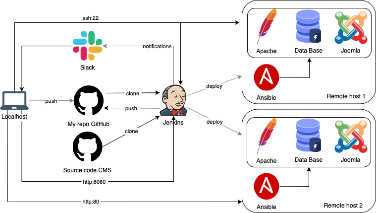
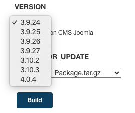
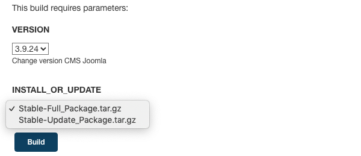

## My project

## Project's reporter: Murashevich Mikhail

Group number: md-sa2-18-21

Description of application for deployment

SCM GitHub

Name: Joomla

Database: MariaDB

Webserver: Apache

## Pipeline

Technologies which were used in project

Orchestration: Jenkins

Automation tools: Ansible

SCM: Github

Tool for building and managing virtual machine: Vagrant

Notification: Slack

---

## CI description

First deploy: 

Copy ssh keys (Jenkins host, remote hosts) 

Starting a job with Jenkins UI.

Navigate to our job and click the Build with Parameters

This will take us to a screen that asks for choises for joomla version which we want to deploy.

After clicking Build with Parameters, the changes are sent to the Playbook Joomla [repository](https://github.com/mikevoice/project)

Start the deployment procedure - Jenkinsfile [repository](https://github.com/mikevoice/pipe) 

Jenkins pipeline launches ansible playbook. 

Start roles: webserver, data base, joomla. 
    
## Update:

Jenkins UI. Navigate to our job and click the Build with Parameters. 

Select in  menu "version and update" of the package "Stable-Update_Package"

Start update procedure - Jenkinsfile [repository](https://github.com/mikevoice/pipe)

## Rollback

Jenkins UI. Navigate to our job and click the Build with Parameters.

Choose the old joomla version on which we want to rollback.

Select in menu "version and update" of the package "Stable-Full_Package"

Start rollback procedure - Jenkinsfile [repository](https://github.com/mikevoice/pipe)

## Playbook syntax check

ansible-lint into [jenkinsfile](https://github.com/mikevoice/pipe/blob/master/Jenkinsfile)

---

Links
### Project [repository](https://github.com/mikevoice/project)
### Jenkinsfile [repository](https://github.com/mikevoice/pipe)
