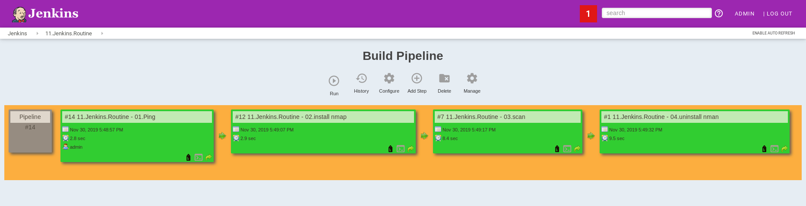

# 11.Jenkins.Routine

## Jenkins tasks

### 11.Jenkins.Routine - 01.Ping

#### Build

##### Invoke Ansible Ad-Hoc Command

Module: `ping`
arguments: none

#### Post-build Actions

Projects to build: **11.Jenkins.Routine - 02.install nmap**

### 11.Jenkins.Routine - 02.install nmap

#### Build

##### Invoke Ansible Ad-Hoc Command

Module: `apt`
arguments: `name=nmap,proxychains state=present`

#### Post-build Actions

Projects to build: **11.Jenkins.Routine - 03.scan**

### 11.Jenkins.Routine - 03.scan

#### Build

##### Invoke Ansible Ad-Hoc Command

Module: `shell`
arguments: `proxychains nmap -v -Pn -sn 192.168.200.0-255`

#### Post-build Actions

Projects to build: **11.Jenkins.Routine - 04.uninstall nman**

### 11.Jenkins.Routine - 04.uninstall nman

#### Build

##### Invoke Ansible Ad-Hoc Command

Module: `apt`
arguments: `name=nmap,proxychains state=absent`

## Pipeline



## Scan output

```
Started by upstream project "11.Jenkins.Routine - 02.install nmap" build number 12
originally caused by:
 Started by upstream project "11.Jenkins.Routine - 01.Ping" build number 14
 originally caused by:
  Started by user admin
Running as SYSTEM
Building in workspace /var/jenkins_home/workspace/11.Jenkins.Routine - 03.scan
[11.Jenkins.Routine - 03.scan] $ sshpass ******** ansible all -i /tmp/inventory5349748726197572645.ini -m shell -a "proxychains nmap -v -Pn -sn 192.168.200.0-255" -f 5 -u root -k
94.156.35.165 | SUCCESS | rc=0 >>
ProxyChains-3.1 (http://proxychains.sf.net)

Starting Nmap 7.60 ( https://nmap.org ) at 2019-11-30 18:49 CET
Initiating Parallel DNS resolution of 256 hosts. at 18:49
Completed Parallel DNS resolution of 256 hosts. at 18:49, 6.50s elapsed
Nmap scan report for 192.168.200.0
Host is up.
Nmap scan report for 192.168.200.1
Host is up.
Nmap scan report for 192.168.200.2
Host is up.
Nmap scan report for 192.168.200.3
Host is up.
Nmap scan report for 192.168.200.4
Host is up.
Nmap scan report for 192.168.200.5
Host is up.
Nmap scan report for 192.168.200.6
Host is up.
Nmap scan report for 192.168.200.7
Host is up.
Nmap scan report for 192.168.200.8
Host is up.
Nmap scan report for 192.168.200.9
Host is up.
Nmap scan report for 192.168.200.10
Host is up.
Nmap scan report for 192.168.200.11
Host is up.
Nmap scan report for 192.168.200.12
Host is up.
Nmap scan report for 192.168.200.13
Host is up.
Nmap scan report for 192.168.200.14
Host is up.
Nmap scan report for 192.168.200.15
Host is up.
Nmap scan report for 192.168.200.16
Host is up.
Nmap scan report for 192.168.200.17
Host is up.
Nmap scan report for 192.168.200.18
Host is up.
Nmap scan report for 192.168.200.19
Host is up.
Nmap scan report for 192.168.200.20
Host is up.
Nmap scan report for 192.168.200.21
Host is up.
Nmap scan report for 192.168.200.22
Host is up.
Nmap scan report for 192.168.200.23
Host is up.
Nmap scan report for 192.168.200.24
Host is up.
Nmap scan report for 192.168.200.25
Host is up.
Nmap scan report for 192.168.200.26
Host is up.
Nmap scan report for 192.168.200.27
Host is up.
Nmap scan report for 192.168.200.28
Host is up.
Nmap scan report for 192.168.200.29
Host is up.
Nmap scan report for 192.168.200.30
Host is up.
Nmap scan report for 192.168.200.31
Host is up.
Nmap scan report for 192.168.200.32
Host is up.
Nmap scan report for 192.168.200.33
Host is up.
Nmap scan report for 192.168.200.34
Host is up.
Nmap scan report for 192.168.200.35
Host is up.
Nmap scan report for 192.168.200.36
Host is up.
Nmap scan report for 192.168.200.37
Host is up.
Nmap scan report for 192.168.200.38
Host is up.
Nmap scan report for 192.168.200.39
Host is up.
Nmap scan report for 192.168.200.40
Host is up.
Nmap scan report for 192.168.200.41
Host is up.
Nmap scan report for 192.168.200.42
Host is up.
Nmap scan report for 192.168.200.43
Host is up.
Nmap scan report for 192.168.200.44
Host is up.
Nmap scan report for 192.168.200.45
Host is up.
Nmap scan report for 192.168.200.46
Host is up.
Nmap scan report for 192.168.200.47
Host is up.
Nmap scan report for 192.168.200.48
Host is up.
Nmap scan report for 192.168.200.49
Host is up.
Nmap scan report for 192.168.200.50
Host is up.
Nmap scan report for 192.168.200.51
Host is up.
Nmap scan report for 192.168.200.52
Host is up.
Nmap scan report for 192.168.200.53
Host is up.
Nmap scan report for 192.168.200.54
Host is up.
Nmap scan report for 192.168.200.55
Host is up.
Nmap scan report for 192.168.200.56
Host is up.
Nmap scan report for 192.168.200.57
Host is up.
Nmap scan report for 192.168.200.58
Host is up.
Nmap scan report for 192.168.200.59
Host is up.
Nmap scan report for 192.168.200.60
Host is up.
Nmap scan report for 192.168.200.61
Host is up.
Nmap scan report for 192.168.200.62
Host is up.
Nmap scan report for 192.168.200.63
Host is up.
Nmap scan report for 192.168.200.64
Host is up.
Nmap scan report for 192.168.200.65
Host is up.
Nmap scan report for 192.168.200.66
Host is up.
Nmap scan report for 192.168.200.67
Host is up.
Nmap scan report for 192.168.200.68
Host is up.
Nmap scan report for 192.168.200.69
Host is up.
Nmap scan report for 192.168.200.70
Host is up.
Nmap scan report for 192.168.200.71
Host is up.
Nmap scan report for 192.168.200.72
Host is up.
Nmap scan report for 192.168.200.73
Host is up.
Nmap scan report for 192.168.200.74
Host is up.
Nmap scan report for 192.168.200.75
Host is up.
Nmap scan report for 192.168.200.76
Host is up.
Nmap scan report for 192.168.200.77
Host is up.
Nmap scan report for 192.168.200.78
Host is up.
Nmap scan report for 192.168.200.79
Host is up.
Nmap scan report for 192.168.200.80
Host is up.
Nmap scan report for 192.168.200.81
Host is up.
Nmap scan report for 192.168.200.82
Host is up.
Nmap scan report for 192.168.200.83
Host is up.
Nmap scan report for 192.168.200.84
Host is up.
Nmap scan report for 192.168.200.85
Host is up.
Nmap scan report for 192.168.200.86
Host is up.
Nmap scan report for 192.168.200.87
Host is up.
Nmap scan report for 192.168.200.88
Host is up.
Nmap scan report for 192.168.200.89
Host is up.
Nmap scan report for 192.168.200.90
Host is up.
Nmap scan report for 192.168.200.91
Host is up.
Nmap scan report for 192.168.200.92
Host is up.
Nmap scan report for 192.168.200.93
Host is up.
Nmap scan report for 192.168.200.94
Host is up.
Nmap scan report for 192.168.200.95
Host is up.
Nmap scan report for 192.168.200.96
Host is up.
Nmap scan report for 192.168.200.97
Host is up.
Nmap scan report for 192.168.200.98
Host is up.
Nmap scan report for 192.168.200.99
Host is up.
Nmap scan report for 192.168.200.100
Host is up.
Nmap scan report for 192.168.200.101
Host is up.
Nmap scan report for 192.168.200.102
Host is up.
Nmap scan report for 192.168.200.103
Host is up.
Nmap scan report for 192.168.200.104
Host is up.
Nmap scan report for 192.168.200.105
Host is up.
Nmap scan report for 192.168.200.106
Host is up.
Nmap scan report for 192.168.200.107
Host is up.
Nmap scan report for 192.168.200.108
Host is up.
Nmap scan report for 192.168.200.109
Host is up.
Nmap scan report for 192.168.200.110
Host is up.
Nmap scan report for 192.168.200.111
Host is up.
Nmap scan report for 192.168.200.112
Host is up.
Nmap scan report for 192.168.200.113
Host is up.
Nmap scan report for 192.168.200.114
Host is up.
Nmap scan report for 192.168.200.115
Host is up.
Nmap scan report for 192.168.200.116
Host is up.
Nmap scan report for 192.168.200.117
Host is up.
Nmap scan report for 192.168.200.118
Host is up.
Nmap scan report for 192.168.200.119
Host is up.
Nmap scan report for 192.168.200.120
Host is up.
Nmap scan report for 192.168.200.121
Host is up.
Nmap scan report for 192.168.200.122
Host is up.
Nmap scan report for 192.168.200.123
Host is up.
Nmap scan report for 192.168.200.124
Host is up.
Nmap scan report for 192.168.200.125
Host is up.
Nmap scan report for 192.168.200.126
Host is up.
Nmap scan report for 192.168.200.127
Host is up.
Nmap scan report for 192.168.200.128
Host is up.
Nmap scan report for 192.168.200.129
Host is up.
Nmap scan report for 192.168.200.130
Host is up.
Nmap scan report for 192.168.200.131
Host is up.
Nmap scan report for 192.168.200.132
Host is up.
Nmap scan report for 192.168.200.133
Host is up.
Nmap scan report for 192.168.200.134
Host is up.
Nmap scan report for 192.168.200.135
Host is up.
Nmap scan report for 192.168.200.136
Host is up.
Nmap scan report for 192.168.200.137
Host is up.
Nmap scan report for 192.168.200.138
Host is up.
Nmap scan report for 192.168.200.139
Host is up.
Nmap scan report for 192.168.200.140
Host is up.
Nmap scan report for 192.168.200.141
Host is up.
Nmap scan report for 192.168.200.142
Host is up.
Nmap scan report for 192.168.200.143
Host is up.
Nmap scan report for 192.168.200.144
Host is up.
Nmap scan report for 192.168.200.145
Host is up.
Nmap scan report for 192.168.200.146
Host is up.
Nmap scan report for 192.168.200.147
Host is up.
Nmap scan report for 192.168.200.148
Host is up.
Nmap scan report for 192.168.200.149
Host is up.
Nmap scan report for 192.168.200.150
Host is up.
Nmap scan report for 192.168.200.151
Host is up.
Nmap scan report for 192.168.200.152
Host is up.
Nmap scan report for 192.168.200.153
Host is up.
Nmap scan report for 192.168.200.154
Host is up.
Nmap scan report for 192.168.200.155
Host is up.
Nmap scan report for 192.168.200.156
Host is up.
Nmap scan report for 192.168.200.157
Host is up.
Nmap scan report for 192.168.200.158
Host is up.
Nmap scan report for 192.168.200.159
Host is up.
Nmap scan report for 192.168.200.160
Host is up.
Nmap scan report for 192.168.200.161
Host is up.
Nmap scan report for 192.168.200.162
Host is up.
Nmap scan report for 192.168.200.163
Host is up.
Nmap scan report for 192.168.200.164
Host is up.
Nmap scan report for 192.168.200.165
Host is up.
Nmap scan report for 192.168.200.166
Host is up.
Nmap scan report for 192.168.200.167
Host is up.
Nmap scan report for 192.168.200.168
Host is up.
Nmap scan report for 192.168.200.169
Host is up.
Nmap scan report for 192.168.200.170
Host is up.
Nmap scan report for 192.168.200.171
Host is up.
Nmap scan report for 192.168.200.172
Host is up.
Nmap scan report for 192.168.200.173
Host is up.
Nmap scan report for 192.168.200.174
Host is up.
Nmap scan report for 192.168.200.175
Host is up.
Nmap scan report for 192.168.200.176
Host is up.
Nmap scan report for 192.168.200.177
Host is up.
Nmap scan report for 192.168.200.178
Host is up.
Nmap scan report for 192.168.200.179
Host is up.
Nmap scan report for 192.168.200.180
Host is up.
Nmap scan report for 192.168.200.181
Host is up.
Nmap scan report for 192.168.200.182
Host is up.
Nmap scan report for 192.168.200.183
Host is up.
Nmap scan report for 192.168.200.184
Host is up.
Nmap scan report for 192.168.200.185
Host is up.
Nmap scan report for 192.168.200.186
Host is up.
Nmap scan report for 192.168.200.187
Host is up.
Nmap scan report for 192.168.200.188
Host is up.
Nmap scan report for 192.168.200.189
Host is up.
Nmap scan report for 192.168.200.190
Host is up.
Nmap scan report for 192.168.200.191
Host is up.
Nmap scan report for 192.168.200.192
Host is up.
Nmap scan report for 192.168.200.193
Host is up.
Nmap scan report for 192.168.200.194
Host is up.
Nmap scan report for 192.168.200.195
Host is up.
Nmap scan report for 192.168.200.196
Host is up.
Nmap scan report for 192.168.200.197
Host is up.
Nmap scan report for 192.168.200.198
Host is up.
Nmap scan report for 192.168.200.199
Host is up.
Nmap scan report for 192.168.200.200
Host is up.
Nmap scan report for 192.168.200.201
Host is up.
Nmap scan report for 192.168.200.202
Host is up.
Nmap scan report for 192.168.200.203
Host is up.
Nmap scan report for 192.168.200.204
Host is up.
Nmap scan report for 192.168.200.205
Host is up.
Nmap scan report for 192.168.200.206
Host is up.
Nmap scan report for 192.168.200.207
Host is up.
Nmap scan report for 192.168.200.208
Host is up.
Nmap scan report for 192.168.200.209
Host is up.
Nmap scan report for 192.168.200.210
Host is up.
Nmap scan report for 192.168.200.211
Host is up.
Nmap scan report for 192.168.200.212
Host is up.
Nmap scan report for 192.168.200.213
Host is up.
Nmap scan report for 192.168.200.214
Host is up.
Nmap scan report for 192.168.200.215
Host is up.
Nmap scan report for 192.168.200.216
Host is up.
Nmap scan report for 192.168.200.217
Host is up.
Nmap scan report for 192.168.200.218
Host is up.
Nmap scan report for 192.168.200.219
Host is up.
Nmap scan report for 192.168.200.220
Host is up.
Nmap scan report for 192.168.200.221
Host is up.
Nmap scan report for 192.168.200.222
Host is up.
Nmap scan report for 192.168.200.223
Host is up.
Nmap scan report for 192.168.200.224
Host is up.
Nmap scan report for 192.168.200.225
Host is up.
Nmap scan report for 192.168.200.226
Host is up.
Nmap scan report for 192.168.200.227
Host is up.
Nmap scan report for 192.168.200.228
Host is up.
Nmap scan report for 192.168.200.229
Host is up.
Nmap scan report for 192.168.200.230
Host is up.
Nmap scan report for 192.168.200.231
Host is up.
Nmap scan report for 192.168.200.232
Host is up.
Nmap scan report for 192.168.200.233
Host is up.
Nmap scan report for 192.168.200.234
Host is up.
Nmap scan report for 192.168.200.235
Host is up.
Nmap scan report for 192.168.200.236
Host is up.
Nmap scan report for 192.168.200.237
Host is up.
Nmap scan report for 192.168.200.238
Host is up.
Nmap scan report for 192.168.200.239
Host is up.
Nmap scan report for 192.168.200.240
Host is up.
Nmap scan report for 192.168.200.241
Host is up.
Nmap scan report for 192.168.200.242
Host is up.
Nmap scan report for 192.168.200.243
Host is up.
Nmap scan report for 192.168.200.244
Host is up.
Nmap scan report for 192.168.200.245
Host is up.
Nmap scan report for 192.168.200.246
Host is up.
Nmap scan report for 192.168.200.247
Host is up.
Nmap scan report for 192.168.200.248
Host is up.
Nmap scan report for 192.168.200.249
Host is up.
Nmap scan report for 192.168.200.250
Host is up.
Nmap scan report for 192.168.200.251
Host is up.
Nmap scan report for 192.168.200.252
Host is up.
Nmap scan report for 192.168.200.253
Host is up.
Nmap scan report for 192.168.200.254
Host is up.
Nmap scan report for 192.168.200.255
Host is up.
Nmap done: 256 IP addresses (256 hosts up) scanned in 6.52 seconds
Returning node parameter for master
Triggering a new build of 11.Jenkins.Routine - 04.uninstall nman
Finished: SUCCESS
```
