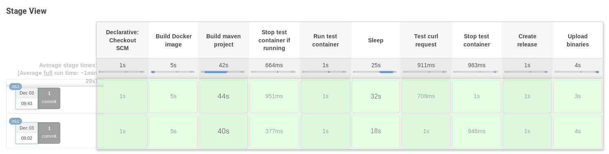

# 12. Jenkins. As code

## The plan

1. fork [simple Java echo server](https://github.com/raonigabriel/spring-echo-example).
1. Notify Jenkins about new commits via webhook.
1. Run Jenkinsfile which for each commit will do:
    1. Build Docker maven image
    1. Build the project in builder container
    1. Run test container and make `curl` test of the service
    1. Create GitHub release and upload generated .jar

## [Test GitHub project](https://github.com/elegantsignal/spring-echo-example)

## Jenkinsfile

```groovy
import groovy.json.JsonSlurper

pipeline {
    agent any
    stages {
        stage('Build Docker image') {
            steps {
                script {
                    def customImage = docker.build("elegantsignal/spring-echo-example:latest")
                    customImage.inside {
                        sh 'echo "Test from docker"'
                    }
                }
            }
        }

        stage('Build maven project') { 
            agent {
                docker {
                    image "elegantsignal/spring-echo-example:latest"
                    args '-v /home/jenkins/jenkins_home/workspace/spring-echo-example:/home/maven/app'
                    reuseNode true
                }
            }
            steps {
                sh 'mvn clean package'
            }
        }

        stage('Stop test container if running') {
            steps {
                script {
                    sh 'docker container stop spring-echo-example-run || true'
                }
            }
        }

        stage('Run test container') {
            steps {
                script {
                    sh '''
docker run -it -d --rm \
    --name spring-echo-example-run \
    -v /home/jenkins/jenkins_home/workspace/spring-echo-example:/home/maven/app \
    -p 3333:8080 \
    --network=jenkins_default \
    elegantsignal/spring-echo-example:latest \
    java -jar ./target/spring-echo-example-1.0.0.jar
'''
                }
            }
        }

        stage('Sleep') {
            steps {
                script {
                    sh 'sleep 30'
                }
            }
        }

        stage('Test curl request') {
            steps {
                script {
                    url = "http://spring-echo-example-run:8080/index.html"
                    int status = sh(script: "curl -sLI -w '%{http_code}' $url -o /dev/null", returnStdout: true)
                    if (status != 406) {
                        error("Returned status code = $status when calling $url")
                    }
                }
            }
        }

        stage('Stop test container') {
            steps {
                script {
                    sh 'docker container stop spring-echo-example-run'
                }
            }
        }

        stage('Create release') {
            steps {
                script {
                    Date latestdate = new Date()
                    String tag_name = latestdate.format("yyMMdd.HHmm", TimeZone.getTimeZone('UTC'))
                    String name = "spring-echo-example-1.0.0"
                    String body = "this is a test release"

                    release_id = createRelease(tag_name, name, body).toString()
                    env.RELEASE_ID = release_id
                }
            }
        }

        stage('Upload binaries') {
            steps {
                sh '''
release_file="target/spring-echo-example-1.0.0.jar"

curl -H "Authorization: token $GITHUB_TOKEN" \
     -H "Accept: application/vnd.github.manifold-preview" \
     -H "Content-Type: application/octet-stream" \
     --data-binary @"$release_file" \
     "https://uploads.github.com/repos/$GITHUB_USER/$GITHUB_PROJECT/releases/$RELEASE_ID/assets?name=$(basename $release_file)"
'''
            }
        }
    }
}

def createRelease(tag_name, name, body) {
    def command = "{\"tag_name\":\"${tag_name}\", \"name\":\"${name}\", \"body\":\"${body}\"}"
    echo(command)
    response = httpRequest (consoleLogResponseBody: true,
        httpMode: 'POST',
        requestBody: command,
        customHeaders: [[maskValue: false, name: "Authorization", value: "token $env.GITHUB_TOKEN"]],
        url: "https://api.github.com/repos/$env.GITHUB_USER/$env.GITHUB_PROJECT/releases",
        validResponseCodes: '201')

    def json = new JsonSlurper().parseText(response.content)
    return json.id
}
```

