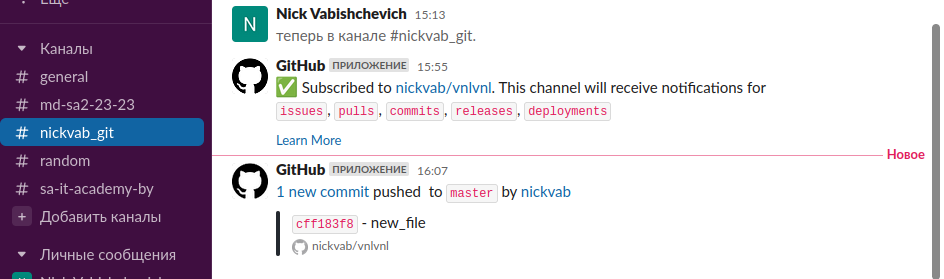
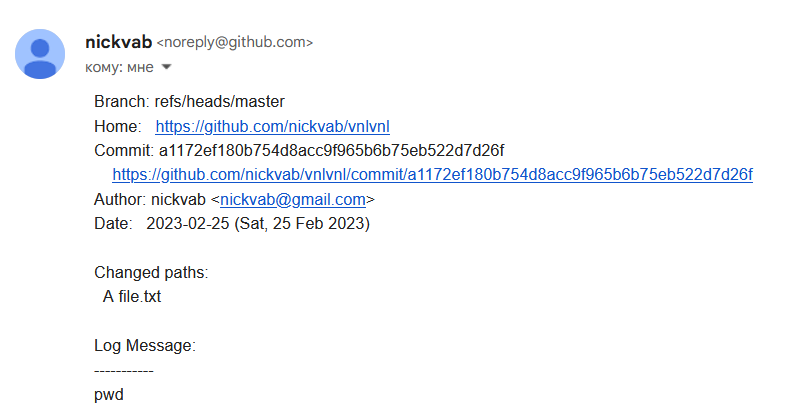

# 03.Git.Hosting

## Commands

### Generating SSH key

```bash
root@vnl-VirtualBox:/home/vnl# ssh-keygen
Generating public/private rsa key pair.
Enter file in which to save the key (/root/.ssh/id_rsa):
Created directory '/root/.ssh'.
Enter passphrase (empty for no passphrase):
Enter same passphrase again: 
Your identification has been saved in /root/.ssh/id_rsa.
Your public key has been saved in /root/.ssh/id_rsa.pub.
```

### Push local repo into remote 

```bash   
git remote add origin_githab git@github.com:nickvab/vnlvnl
git push -u origin_github --all
git remote add origin_gitlab git@gitlab.com:nickvab/vnlvnl
git push -u origin_gitlab --all
```

### Slack/email integration 





### Alias for script

```bash
touch git_push.sh
chmod +x git_push.sh
alias git-scr='/home/vnl/git/git_push.sh'
exec bash
```

### Script

```bash
#!/bin/bash

REPO=$(git remote)
for var in $REPO
do
git push --set-upstream $var --all
echo "Push done on $var"
done
```
