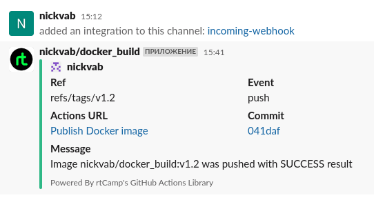

# 08.Docker.Docker-compose

## Action file action.yaml

```bash
name: Publish Docker image

on:
  push:
    tags:
      - "v*"
jobs:
  push_to_registries:
    name: Push Docker image
    runs-on: ubuntu-latest
    permissions:
      packages: write
      contents: read
    steps:
      - name: Check out the repo
        uses: actions/checkout@v2

      - name: Log in to the Docker hub
        uses: docker/login-action@v2
        with:
          username: nickvab
          password: ${{ secrets.DOCKERHUB_TOKEN }}

      - name: Log in to the Container registry
        uses: docker/login-action@v1
        with:
          registry: ghcr.io
          username: ${{ github.actor }}
          password: ${{ secrets.GHCR_TOKEN }}

      - name: Build and push Docker images
        uses: docker/build-push-action@v2
        with:
          context: .
          push: true
          tags: | 
            nickvab/docker_build:${{ github.ref_name }}
            ghcr.io/nickvab/docker_build:${{ github.ref_name }}

      - name: Send Slack SUCCESS notification
        uses: rtCamp/action-slack-notify@v2
        if: success()
        env:
          SLACK_CHANNEL: nickvab_git
          SLACK_COLOR: ${{ job.status }}
          SLACK_TITLE: Message
          SLACK_MESSAGE: 'Image ${{ github.repository }}:${{ github.ref_name }} was pushed with SUCCESS result'
          SLACK_USERNAME: ${{ github.repository }}
          SLACK_WEBHOOK: ${{ secrets.SLACK_WEBHOOK }}

      - name: Send Slack FAIL notification
        uses: rtCamp/action-slack-notify@v2
        if: failure()
        env:
          SLACK_CHANNEL: nickvab_git
          SLACK_COLOR: ${{ job.status }}
          SLACK_TITLE: Message
          SLACK_MESSAGE: 'Image ${{ github.repository }}:${{ github.ref_name }} was pushed with FAIL result'
          SLACK_USERNAME: ${{ github.repository }}
          SLACK_WEBHOOK: ${{ secrets.SLACK_WEBHOOK }}

```

## Links to repositories

[Github repository](https://github.com/nickvab/docker_build)

[Github container registry](https://github.com/users/nickvab/packages/container/package/docker_build)

[Docker hub repository](https://hub.docker.com/repository/docker/nickvab/docker_build/general)


## Slack notification


