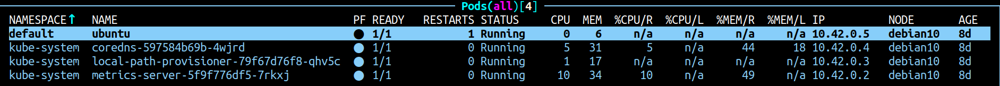

# 10.Kubernetes_installation.Workshop

## Localhost

### Install kubectl for local run

```bash
1662  curl -LO "https://dl.k8s.io/release/$(curl -L -s https://dl.k8s.io/release/stable.txt)/bin/linux/amd64/kubectl"
1663  sudo install -o root -g root -m 0755 kubectl /usr/local/bin/kubectl
1664  mkdir ~/.kube/
1665  scp -o ProxyCommand="ssh -W %h:%p -q jump_sa@178.124.206.53" root@192.168.203.3:/etc/rancher/k3s/k3s.yaml ~/.kube/config

root@vnl:/home/vnl/kubernetes/10.k3s# kubectl version --short
Client Version: v1.26.2
Kustomize Version: v4.5.7
Server Version: v1.25.7+k3s1
```

### Install k9s to maintain cluster

```bash
1677  wget https://go.dev/dl/go1.20.2.linux-amd64.tar.gz
1678  rm -rf /usr/local/go && tar -C /usr/local -xzf go1.20.2.linux-amd64.tar.gz
1679  vi ~/.profile 
...
export PATH=$PATH:/usr/local/go/bin

1680  source ~/.profile 
1681  wget https://github.com/derailed/k9s/releases/download/v0.27.3/k9s_Linux_amd64.tar.gz
1682  tar -C /usr/local/bin -xzf k9s_Linux_amd64.tar.gz
1683  k9s

```

### Print-screen of k9s with pods in all namespaces



## Kubernetes host

### Deployment shell pod in default namespace

```bash
1685  vi test-manifest.yaml

---
apiVersion: v1
kind: Pod
metadata:
  name: ubuntu
  labels:
    app: ubuntu
spec:
  containers:
  - image: ghcr.io/pluhin/busy-box:latest
    command:
      - "sleep"
      - "604800"
    imagePullPolicy: IfNotPresent
    name: ubuntu
  restartPolicy: Always

1686  kubectl apply -f test-manifest.yaml 
```

### start fail-pod


## GitHub

### Action file to check status of pods and create slack notification

action.yaml

```bash
---
name: Checking status of pods and creating slack notification
on: workflow_dispatch 
env:
  report: report.log
  fail_pods_report: fail_pods_report.log
jobs:
  my:
    runs-on: ubuntu-latest
    steps:
      - name: Connection to host
        run: |
           mkdir ~/.ssh
           eval `ssh-agent -s`
           ssh-add - <<< "${{ secrets.SSH_KEY }}" 
           ssh-keyscan ${{ secrets.PROXY_HOST }} >> ~/.ssh/known_hosts
           ssh ${{ secrets.PROXY_USERNAME }}@${{ secrets.PROXY_HOST}} ssh-keyscan ${{ secrets.HOST }} >> ~/.ssh/known_hosts
           ssh -o ProxyCommand="ssh -W %h:%p ${{ secrets.PROXY_USERNAME }}@${{ secrets.PROXY_HOST }}" ${{ secrets.USERNAME }}@${{ secrets.HOST }} "kubectl get pods -A" >> ${{ env.report }}  
      - name: Checking status of pods
        id: check
        run: |
           sed -i '/Running/d' ${{ env.report }} >> ${{ env.fail_pods_report }}
           sed -i '/Completed/d' ${{ env.report }} >> ${{ env.fail_pods_report }}
           echo "other_statuses=$(wc -l < ${{ env.report }})" >> $GITHUB_OUTPUT

      - name: Upload report
        if: steps.check.outputs.other_statuses > 1
        uses: actions/upload-artifact@v2
        with:
          path: ${{ env.report}}
      
      - name: slack Notification
        if: steps.check.outputs.other_statuses > 1
        uses: rtCamp/action-slack-notify@v2 
        env:
          SLACK_CHANNEL: nickvab_git
          SLACK_TITLE: 'Status of pods'
          SLACK_MESSAGE: 'Check your pods! You have status different from "Running" and "Completed"'
          SLACK_USERNAME: ${{ github.repository }}
          SLACK_WEBHOOK: ${{ secrets.SLACK_WEBHOOK }}
```

## Slack notification


