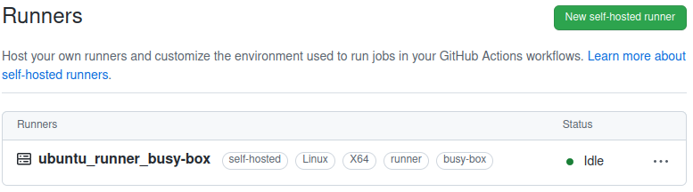

# 11.Kubernetes.Basic_objects

## Deployment of nginx service 

### adding application file nginx.yaml

```bash
kind: Service
apiVersion: v1
metadata:
  name: nginx
  labels:
    app: nginx
spec:
  selector:
    app: nginx
  ports:
  - port: 80
    protocol: TCP
    targetPort: 80
  type: ClusterIP
---
apiVersion: apps/v1
kind: Deployment
metadata:
  name: nginx
  labels:
    app: nginx
spec:
  replicas: 3
  selector:
    matchLabels:
      app: nginx
  template:
    metadata:
      labels:
        app: nginx
    spec:
      containers:
      - name: nginx
        image: nginx:latest
        imagePullPolicy: Always
        ports:
        - containerPort: 80
          protocol: TCP
```

### creating namespace for nginx and applying configuration

```bash
root@vnl:/home/vnl/kubernetes/11.k8s.objects.part1/HW# kubectl create ns nginx-test
namespace/nginx-test created
root@vnl:/home/vnl/kubernetes/11.k8s.objects.part1/HW# kubectl apply -f nginx.yaml -n nginx-test
service/nginx created
deployment.apps/nginx created
ingress.networking.k8s.io/ingress-sa created
```


### adding ingress-controller file and applying

```bash
root@vnl:/home/vnl/kubernetes/11.k8s.objects.part1/HW# kubectl apply -f ingress-controller.yaml 
namespace/ingress-nginx created
serviceaccount/ingress-nginx created
serviceaccount/ingress-nginx-admission created
role.rbac.authorization.k8s.io/ingress-nginx created
role.rbac.authorization.k8s.io/ingress-nginx-admission created
clusterrole.rbac.authorization.k8s.io/ingress-nginx created
clusterrole.rbac.authorization.k8s.io/ingress-nginx-admission created
rolebinding.rbac.authorization.k8s.io/ingress-nginx created
rolebinding.rbac.authorization.k8s.io/ingress-nginx-admission created
clusterrolebinding.rbac.authorization.k8s.io/ingress-nginx created
clusterrolebinding.rbac.authorization.k8s.io/ingress-nginx-admission created
configmap/ingress-nginx-controller created
service/ingress-nginx-controller created
service/ingress-nginx-controller-admission created
deployment.apps/ingress-nginx-controller created
job.batch/ingress-nginx-admission-create created
job.batch/ingress-nginx-admission-patch created
ingressclass.networking.k8s.io/nginx created
validatingwebhookconfiguration.admissionregistration.k8s.io/ingress-nginx-admission created
```


### adding ingress rule for host name (nginx-test.k8s-3.sa) 

```bash
root@vnl:/home/vnl/kubernetes/11.k8s.objects.part1/HW# vi nginx.yaml
.
.
.
---
apiVersion: networking.k8s.io/v1
kind: Ingress
metadata:
  name: ingress-sa
  annotations:
    kubernetes.io/ingress.class: nginx
    nginx.ingress.kubernetes.io/server-alias: "nginx-test.k8s-3.sa"
spec:
  rules:
    - host: nginx.k8s-3.sa
      http:
        paths:
          - path: /


root@vnl:/home/vnl/kubernetes/11.k8s.objects.part1/HW# kubectl apply -f nginx.yaml
service/nginx unchanged
deployment.apps/nginx unchanged
ingress.networking.k8s.io/ingress-sa created
```


### adding a line to the hosts file and checking the result

```bash
178.124.206.53 nginx-test.k8s-3.sa nginx.k8s-3.sa0
```


## Additional task

### deployment pod inside k8s which connected to github as self-hosted runner

```bash
apiVersion: v1
kind: Pod
metadata:
  name: ubuntu-self-hosted-runner
spec:
  containers:
  - name: ubuntu
    image: ghcr.io/pluhin/busy-box:latest
    command: ["/bin/sh","-c"]
    args:
      - mkdir actions-runner && cd actions-runner;
        curl -o actions-runner-linux-x64-2.303.0.tar.gz -L https://github.com/actions/runner/releases/download/v2.303.0/actions-runner-linux-x64-2.303.0.tar.gz;
        tar xzf ./actions-runner-linux-x64-2.303.0.tar.gz;
        export RUNNER_ALLOW_RUNASROOT='1';
        ./config.sh --name ubuntu_runner_busy-box --labels linux,runner,busy-box --runnergroup default --url https://github.com/nickvab/11.k8s --token $$$$$$$$$$$$$$$$$$$$$$$$$$$$$$;
        ./run.sh;
        sleep 65365
    imagePullPolicy: IfNotPresent
  restartPolicy: Always
```




