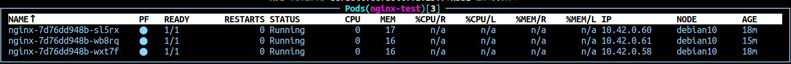
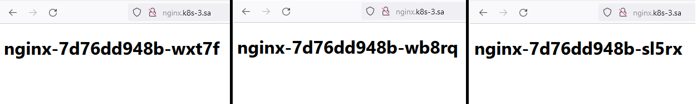
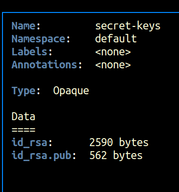
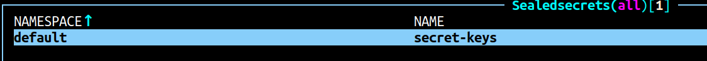
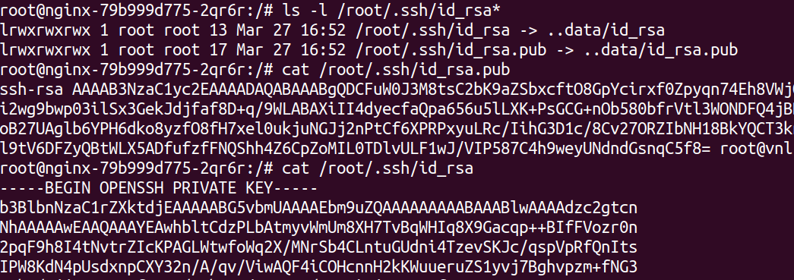

# 12.Kubernetes.Data.Security

## Preparing

### editing a configuration file nginx.yaml from 11.Kubernetes.Objects HW. Adding ConfigMap and InitContainer

```bash
---
apiVersion: v1
kind: ConfigMap
metadata:
  name: nginx-index
data:
  index.html: |
    <!DOCTYPE html><html><body>
    <h1>HOSTNAME</h1>
    </body></html>
.
.
.
      initContainers:
      - name: test
        image: nginx:latest
        command: ["bash", "-c", 'cd /tmp/; sed -e "s/HOSTNAME/$HOSTNAME/" index.html > /usr/share/nginx/html/index.html']
        volumeMounts:
        - name: nginx-index-mount
          mountPath: /tmp/index.html
          subPath: index.html
        - name: index
          mountPath: /usr/share/nginx/html/
      volumes:
      - name: nginx-index-mount
        configMap:
          name: nginx-index
      - name: index
        emptyDir: {}
```

### generating pair public and private keys and adding them to the pod for user root as secrets 

```bash
2120  ssh-keygen
2121  cat id_rsa | base64
2122  cat id_rsa.pub | base64
```

### using keys in init-secret.yaml

```bash
---
apiVersion: v1
kind: Secret
metadata:
  name: secret-keys
type: Opaque
data:
  id_rsa: id_rsa in base64
  id_rsa.pub: id_rsa.pub in base64
```

### getting a sealsecret using a kubeseal

```bash
2133  cat init_secret.yaml | kubeseal --format yaml > sealed_secret.yaml
2134  kubectl apply -f sealed_secret.yaml
```

### configuring mount path in nginx.yaml file for forwarding private and public keys

```bash
---
.
.
.
        volumeMounts:
        - name: index
          mountPath: /usr/share/nginx/html/
        - name: ssh-secrets
          mountPath: /root/.ssh/
      initContainers:
      - name: test
        image: nginx:latest
        command: ["bash", "-c", 'cd /tmp/; sed -e "s/HOSTNAME/$HOSTNAME/" index.html > /usr/share/nginx/html/index.html']
        volumeMounts:
        - name: nginx-index-mount
          mountPath: /tmp/index.html
          subPath: index.html
        - name: index
          mountPath: /usr/share/nginx/html/
        - name: ssh
          mountPath: /root/.ssh/
      volumes:
      - name: nginx-index-mount
        configMap:
          name: nginx-index
      - name: index
        emptyDir: {}
      - name: ssh
        emptyDir: {}
      - name: ssh-secrets
        secret:
          secretName: secret-keys
```
## Validation secrets and index.html

### index.html on different pods




### secrets




