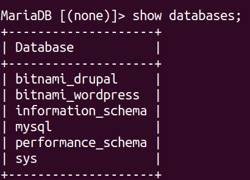
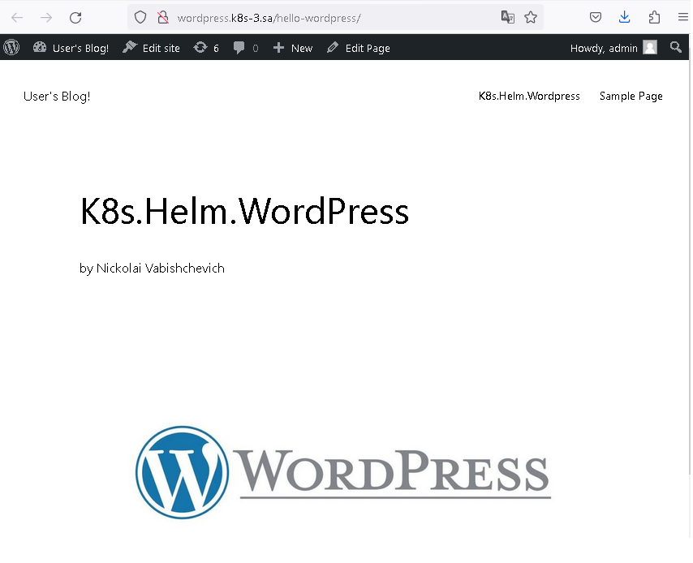
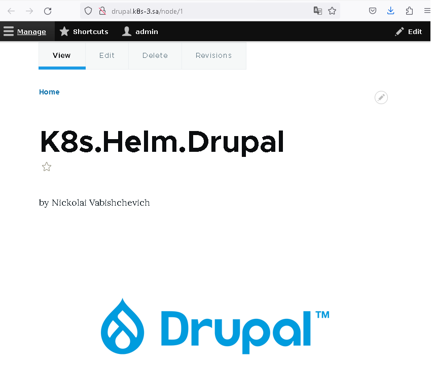

# 13.Kubernetes.Helm

## Preparing

### mariadb.yaml, ansible playbook for creating databases

```bash
---
- hosts: db_all
  vars:
    app_packages:
      - mariadb-server
      - mariadb-client
      - python3-pymysql
      - python3-mysqldb
    db_name: "{{ name_db | default('test') }}"
    db_user: "{{ user_db | default('test') }}"
    db_pass: "{{ pass_db | default('test') }}"
  pre_tasks:
  - name: Validate
    debug:
      msg:
       - "DB name: {{ db_name }}"
       - "DB user: {{ db_user }}"
       - "DB pass: {{ db_pass }}"

  - name: Prepare. Install packages
    apt:
      name: "curl"
      state: latest
      update_cache: yes
    tags: install
  tasks:
  - name: Add MariaDB repos
    shell: |
      curl -LsS -O https://downloads.mariadb.com/MariaDB/mariadb_repo_setup
      bash mariadb_repo_setup --mariadb-server-version=10.6
    tags: install
  - name: MySQL. Install packages
    apt:
      name: "{{ app_packages }}"
      state: latest
    environment:
      DEBIAN_FRONTEND: noninteractive
    tags: install

  - name: MySQL. add bind-address
    ini_file:
      dest: /etc/mysql/my.cnf
      section: mysqld
      option: "bind-address"
      value: "{{ ansible_host }}"

  - name: restart mysql if necessary
    command: service mysql restart

  - name: Test connect
    wait_for:
      host: "{{ ansible_host }}"
      port: 3306
      timeout: 3

  - mysql_db:
      name: "{{ db_name }}"
      state: absent
      login_unix_socket: /var/run/mysqld/mysqld.sock
    tags: never

  - mysql_db:
      name: "{{ db_name }}"
      encoding: utf8
      login_unix_socket: /var/run/mysqld/mysqld.sock

  - mysql_user:
      name: "{{ db_user }}"
      host: "%"
      password: "{{ db_pass }}"
      priv: "{{ db_name }}.*:ALL"
      login_unix_socket: /var/run/mysqld/mysqld.sock
    no_log: yes  
```

### ansible commands and result

```bash
ansible-playbook -i inv.yaml mariadb.yaml -e name_db=bitnami_wordpress -e user_db=bn_wordpress -e pass_db=bn_drupal
ansible-playbook -i inv.yaml mariadb.yaml -e name_db=bitnami_drupal -e user_db=bn_drupal -e pass_db=bn_drupal
```


### nfs-subdir-external.yaml. Creating namespaces, storageclasses and deploying nfs-provisioner

```bash
---
apiVersion: helm.cattle.io/v1
kind: HelmChart
metadata:
  name: nfs
  namespace: default
spec:
  chart: nfs-subdir-external-provisioner
  repo: https://kubernetes-sigs.github.io/nfs-subdir-external-provisioner
  targetNamespace: default
  set:
    nfs.server: 192.168.37.105
    nfs.path: /mnt/IT-Academy/nfs-data/sa2-23-23/Nickolai_Vabishchevich/
    storageClass.name: nfs
---
apiVersion: storage.k8s.io/v1
kind: StorageClass
metadata:
  name: nfs-wordpress
provisioner: cluster.local/nfs-nfs-subdir-external-provisioner
parameters:
  onDelete: "retain"
  pathPattern: "/wordpress/"
---
apiVersion: storage.k8s.io/v1
kind: StorageClass
metadata:
  name: nfs-drupal
provisioner: cluster.local/nfs-nfs-subdir-external-provisioner
parameters:
  onDelete: "retain"
  pathPattern: "/drupal/"
```

### helm commands

```bash
helm repo add my-repo https://charts.bitnami.com/bitnami

helm install sa-wordpress --set mariadb.enabled=false,externalDatabase.host=192.168.203.3,externalDatabase.user=bn_wordpress,externalDatabase.password=bn_wordpress,externalDatabase.database=bitnami_wordpress,global.storageClass=nfs-wordpress,wordpressUsername=admin,wordpressPassword=drupal my-repo/wordpress

helm install sa-drupal --set mariadb.enabled=false,externalDatabase.host=192.168.203.3,externalDatabase.user=bn_drupal,externalDatabase.password=bn_drupal,externalDatabase.database=bitnami_drupal,global.storageClass=nfs-drupal,drupalUsername=admin,drupalPassword=drupal my-repo/drupal
```

### adding ingresses file ingress.yaml

```bash
---
apiVersion: networking.k8s.io/v1
kind: Ingress
metadata:
  name: ingress-wordpress
  annotations:
    kubernetes.io/ingress.class: nginx
spec:
  rules:
    - host: wordpress.k8s-3.sa
      http:
        paths:
          - path: /
            pathType: Prefix
            backend:
              service:
                name: sa-wordpress
                port:
                  number: 80
---
apiVersion: networking.k8s.io/v1
kind: Ingress
metadata:
  name: ingress-drupal
  annotations:
    kubernetes.io/ingress.class: nginx
spec:
  rules:
    - host: drupal.k8s-3.sa
      http:
        paths:
          - path: /
            pathType: Prefix
            backend:
              service:
                name: sa-drupal
                port:
                  number: 80
```

### adding a line to the hosts file and checking the result

```bash
178.124.206.53 wordpress.k8s-3.sa drupal.k8s-3.sa
```

### wordpress



### drupal


