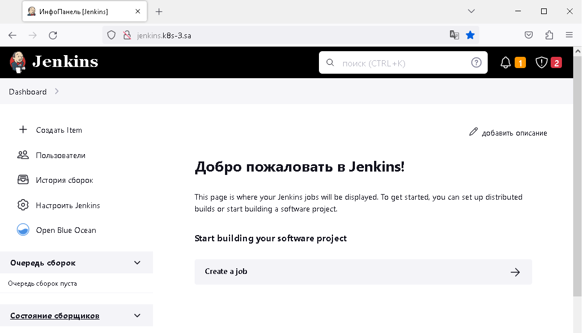

#14.Kubernetes.Application_deployment

###creating helm package for jenkins application

```bash
helm create jenkins
helm package jenkins
helm install jenkins helm-release/jenkins-0.1.0.tgz
```

### Link to my repo [https://github.com/nickvab/14.k8s.git](https://github.com/nickvab/14.k8s.git)

adding a line to the hosts file and checking the result

```bash
178.124.206.53 jenkins.k8s-3.sa
```

