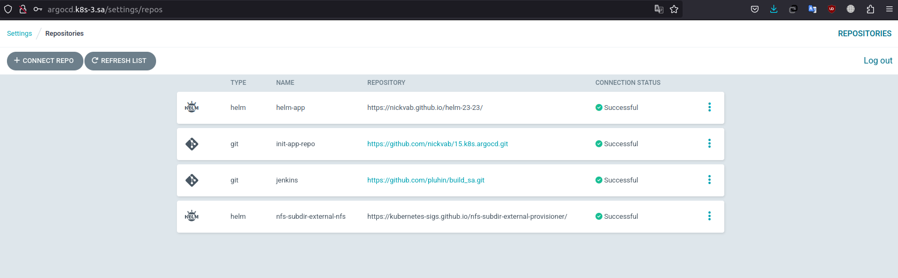
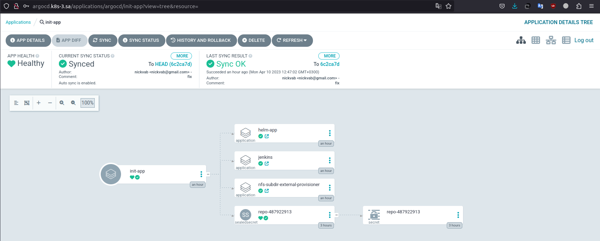

# 15.Kubernetes.CI CD

### deploying ArgoCD into cluster

```bash
kubectl create namespace argocd
wget https://raw.githubusercontent.com/argoproj/argo-cd/stable/manifests/install.yaml -O argocd-install.yaml
vi argocd-install.yaml
kubectl apply -f argocd-install.yaml -n argocd
```

### adding repositories with helm packages as source for deployment



Link to my HELM repo [https://github.com/nickvab/helm-23-23.git](https://github.com/nickvab/helm-23-23.git)

### creating separate repository which contains application manifests for ArgoCD

```bash
kubectl get application jenkins -n argocd -o yaml >jenkins.yaml
vi jenkins-helm.yaml
kubectl get application helm-app -n argocd -o yaml > helm-app.yaml
vi helm-app.yaml
kubectl get application nfs-subdir-external-provisioner -n argocd -o yaml > nfs-subdir-external-provisioner.yaml
vi nfs-subdir-external-provisioner.yaml
```

### adding git secrets objects as sealsecret objects

```bash
kubectl get secret repo-487922913 -n argocd -o yaml > secret_helm-app.yaml
cat sealed_secret_helm-app.yaml | kubeseal --format yaml > sealed_secret_helm-app.yaml
```

Link to my init-app repo [https://github.com/nickvab/15.k8s.argocd.git](https://github.com/nickvab/15.k8s.argocd.git)




