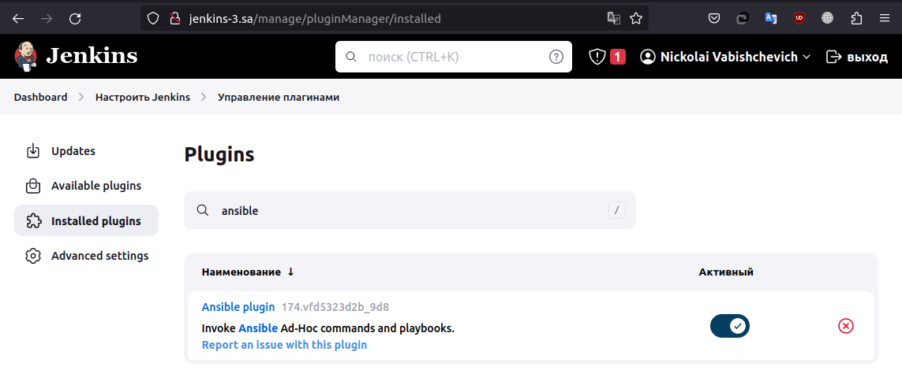
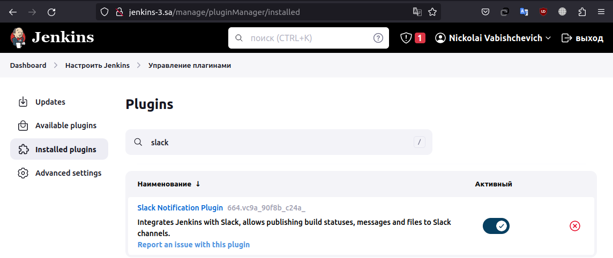
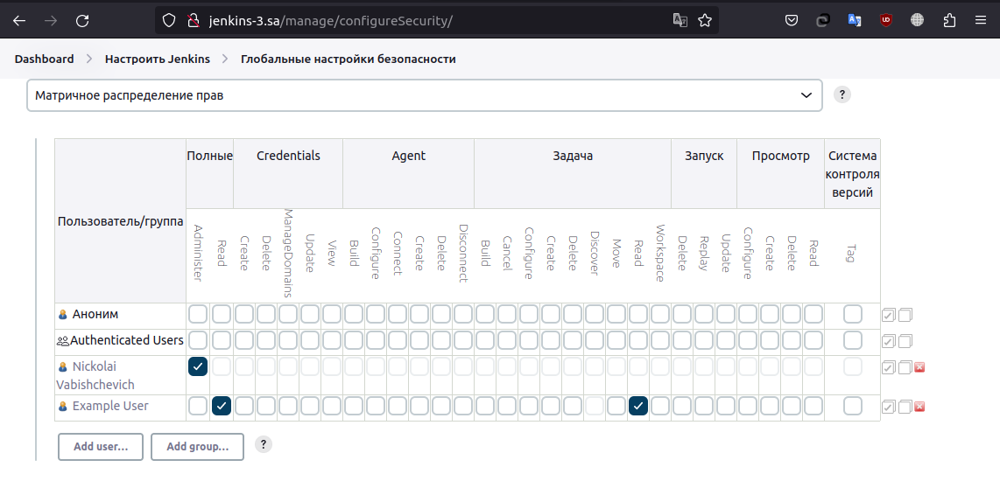
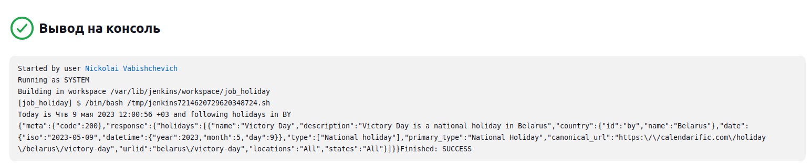
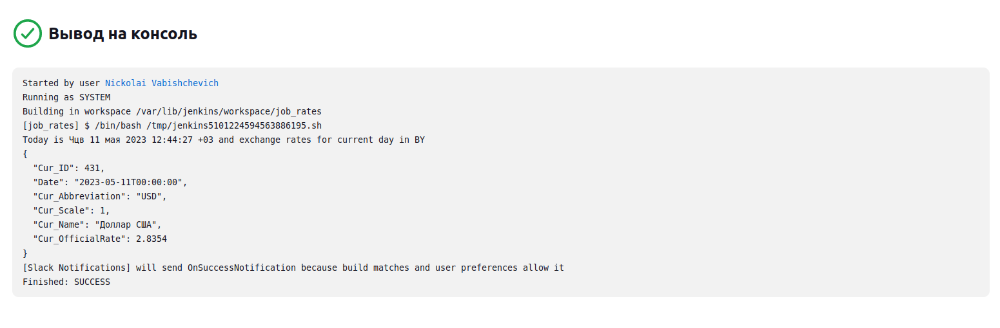
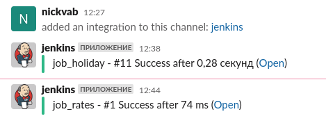

# 19.Jenkins.Start

## Installing jenkins and nginx

```bash
apt install openjdk-11-jre
java -version
curl -fsSL https://pkg.jenkins.io/debian-stable/jenkins.io-2023.key | sudo tee   /usr/share/keyrings/jenkins-keyring.asc > /dev/null
echo deb [signed-by=/usr/share/keyrings/jenkins-keyring.asc]   https://pkg.jenkins.io/debian-stable binary/ | sudo tee   /etc/apt/sources.list.d/jenkins.list > /dev/null
apt-get update
apt-get install jenkins
systemctl enable jenkins
systemctl start jenkins
cat /var/lib/jenkins/secrets/initialAdminPassword
apt-add-repository ppa:nginx/stable
apt update
apt install nginx
vi /etc/nginx/sites-available/jenkins
rm /etc/nginx/sites-enabled/*
ln -s /etc/nginx/sites-available/jenkins /etc/nginx/sites-enabled/
systemctl restart nginx
nginx -t
vi /etc/hosts
```

### installed plugins ansible and slack notification




### added restricted user to view Jobs, without any changes inside Jobs and Jenkins settings



## Creating jobs:

### checking if today holiday in Belarus



### informing about exchange rates for current day



### Slack notification



