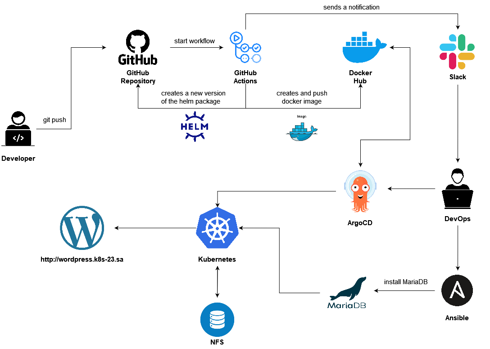

# Project report

**Project's reporter:** Nickolai Vabishchevich

**Group number:** md-sa2-23-23

## Description of application for deployment

**Name of application:** Wordpress

**Which programming language is this application written in:** PHP

**What kind of DB:** MariaDB

## Pipeline. High Level Design

## Technologies which were used in project

**Orchestration:** Kubernetes

**Automation tools:** Ansible, GitHub Actions, ArgoCD

**Other uses tools:** HELM, Docker, MariaDB

**SCM:** Github

**Notification:** Slack

## CI/CD description

The pipeline starts after uploading the contents of the local repository to the master branch on the remote GitHub repository. As a result of which the workflow-file is launched. It creates a docker image from files that are in the Docker folder with a new version tag. Then uploads the image to Dockerhub, creates a HELM package and sends a notification to slack channel. ArgoCD deploys application from helm package and docker image in k8s kluster. 

## Links

[Project Repository](https://github.com/nickvab/app_for_project)

[DockerHub Registry](https://hub.docker.com/repository/docker/nickvab/wordpress/general)
