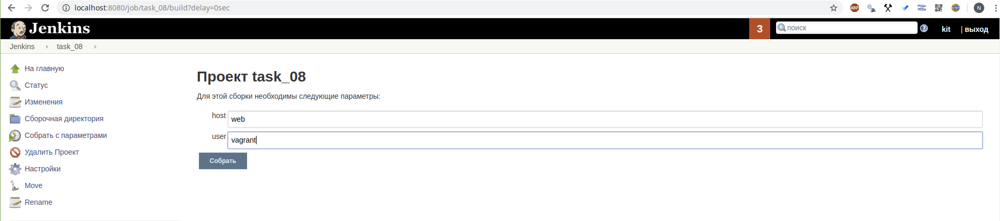

# 09.jenkins.routine




```bash
Started by user kit
Running as SYSTEM
Building in workspace /var/lib/jenkins/workspace/task_08
[task_08] $ ansible web -m "ping " -f 5
nginx1 | SUCCESS => {
    "changed": false, 
    "ping": "pong"
}
[task_08] $ ansible web -m shell -a "sudo apt-get install nmap -y" -f 5
 [WARNING]: Consider using 'become', 'become_method', and 'become_user' rather
than running sudo
nginx1 | SUCCESS | rc=0 >>
Reading package lists...
Building dependency tree...
Reading state information...
Suggested packages:
  ndiff
The following NEW packages will be installed:
  nmap
0 upgraded, 1 newly installed, 0 to remove and 151 not upgraded.
Need to get 0 B/5174 kB of archives.
After this operation, 24.0 MB of additional disk space will be used.
Selecting previously unselected package nmap.
(Reading database ... 
(Reading database ... 5%
(Reading database ... 10%
(Reading database ... 15%
(Reading database ... 20%
(Reading database ... 25%
(Reading database ... 30%
(Reading database ... 35%
(Reading database ... 40%
(Reading database ... 45%
(Reading database ... 50%
(Reading database ... 55%
(Reading database ... 60%
(Reading database ... 65%
(Reading database ... 70%
(Reading database ... 75%
(Reading database ... 80%
(Reading database ... 85%
(Reading database ... 90%
(Reading database ... 95%
(Reading database ... 100%
(Reading database ... 89092 files and directories currently installed.)
Preparing to unpack .../nmap_7.60-1ubuntu5_amd64.deb ...
Unpacking nmap (7.60-1ubuntu5) ...
Setting up nmap (7.60-1ubuntu5) ...
Processing triggers for man-db (2.8.3-2ubuntu0.1) ...debconf: unable to initialize frontend: Dialog
debconf: (Dialog frontend will not work on a dumb terminal, an emacs shell buffer, or without a controlling terminal.)
debconf: falling back to frontend: Readline
[task_08] $ ansible web -m shell -a "nmap 134.17.132.0/28 > output.txt" -f 5
nginx1 | SUCCESS | rc=0 >>

[task_08] $ ansible web -m shell -a "sudo apt remove nmap -y" -f 5
 [WARNING]: Consider using 'become', 'become_method', and 'become_user' rather
than running sudo
nginx1 | SUCCESS | rc=0 >>
Reading package lists...
Building dependency tree...
Reading state information...
The following packages were automatically installed and are no longer required:
  libblas3 liblinear3 liblua5.3-0
Use 'sudo apt autoremove' to remove them.
The following packages will be REMOVED:
  nmap
0 upgraded, 0 newly installed, 1 to remove and 151 not upgraded.
After this operation, 24.0 MB disk space will be freed.
(Reading database ... 
(Reading database ... 5%
(Reading database ... 10%
(Reading database ... 15%
(Reading database ... 20%
(Reading database ... 25%
(Reading database ... 30%
(Reading database ... 35%
(Reading database ... 40%
(Reading database ... 45%
(Reading database ... 50%
(Reading database ... 55%
(Reading database ... 60%
(Reading database ... 65%
(Reading database ... 70%
(Reading database ... 75%
(Reading database ... 80%
(Reading database ... 85%
(Reading database ... 90%
(Reading database ... 95%
(Reading database ... 100%
(Reading database ... 89903 files and directories currently installed.)
Removing nmap (7.60-1ubuntu5) ...
Processing triggers for man-db (2.8.3-2ubuntu0.1) ...
WARNING: apt does not have a stable CLI interface. Use with caution in scripts.
[task_08] $ ansible web -m shell -a "cat  output.txt" -f 5
nginx1 | SUCCESS | rc=0 >>

Starting Nmap 7.60 ( https://nmap.org ) at 2019-07-31 21:03 UTC
Nmap scan report for 134.17.132.1
Host is up (0.0053s latency).
All 1000 scanned ports on 134.17.132.1 are filtered

Nmap scan report for 134.17.132.4
Host is up (0.0067s latency).
All 1000 scanned ports on 134.17.132.4 are filtered

Nmap scan report for 134.17.132.5
Host is up (0.0037s latency).
All 1000 scanned ports on 134.17.132.5 are filtered

Nmap scan report for 134.17.132.7
Host is up (0.0039s latency).
All 1000 scanned ports on 134.17.132.7 are filtered

Nmap scan report for 134.17.132.8
Host is up (0.0042s latency).
All 1000 scanned ports on 134.17.132.8 are filtered

Nmap scan report for 134.17.132.14
Host is up (0.0053s latency).
All 1000 scanned ports on 134.17.132.14 are filtered

Nmap scan report for 134.17.132.15
Host is up (0.0088s latency).
All 1000 scanned ports on 134.17.132.15 are filtered

Nmap done: 16 IP addresses (7 hosts up) scanned in 154.31 seconds
Finished: SUCCESS

```