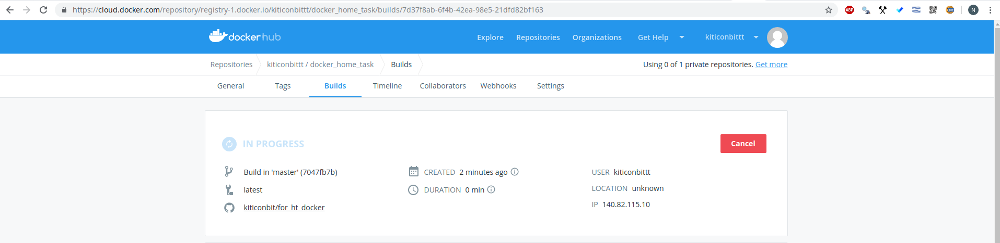

# 11.Docker.Lading

## Links
[Slack](https://app.slack.com/client/TFBPBNB2L/CLB0D42TD/app_profile/A676ADMV5)
[Github](https://github.com/kiticonbit/for_ht_docker)
[Dockerhub](https://cloud.docker.com/repository/docker/kiticonbittt/docker_home_task/)


## Dockerfile
```bash
FROM python:3.6.9-alpine

MAINTAINER n.pastukhov@velcom.by

WORKDIR /opt

COPY . /opt

RUN pip3 install --trusted-host pypi.python.org -r requirements.txt


EXPOSE 5050

CMD ["python3", "test.py"]
```


## Build
```bash
kit@kit-ThinkPad-L380-Yoga:~/Documents/temp/11.docker$ docker build --tag=kiticonbittt/docker_home_task:v1 --no-cache .
Sending build context to Docker daemon  4.096kB
Step 1/7 : FROM python:3.6.9-alpine
 ---> f00bde8f9c15
Step 2/7 : MAINTAINER n.pastukhov@velcom.by
 ---> Running in 7e2129cdc647
Removing intermediate container 7e2129cdc647
 ---> c26a1f949057
Step 3/7 : WORKDIR /opt
 ---> Running in a2af1c7e4dfb
Removing intermediate container a2af1c7e4dfb
 ---> d76bca75603a
Step 4/7 : COPY . /opt
 ---> 30751ee22d61
Step 5/7 : RUN pip3 install --trusted-host pypi.python.org -r requirements.txt
 ---> Running in f197d57e0b9f
Collecting flask (from -r requirements.txt (line 1))
  Downloading https://files.pythonhosted.org/packages/9b/93/628509b8d5dc749656a9641f4caf13540e2cdec85276964ff8f43bbb1d3b/Flask-1.1.1-py2.py3-none-any.whl (94kB)
Collecting itsdangerous>=0.24 (from flask->-r requirements.txt (line 1))
  Downloading https://files.pythonhosted.org/packages/76/ae/44b03b253d6fade317f32c24d100b3b35c2239807046a4c953c7b89fa49e/itsdangerous-1.1.0-py2.py3-none-any.whl
Collecting Jinja2>=2.10.1 (from flask->-r requirements.txt (line 1))
  Downloading https://files.pythonhosted.org/packages/1d/e7/fd8b501e7a6dfe492a433deb7b9d833d39ca74916fa8bc63dd1a4947a671/Jinja2-2.10.1-py2.py3-none-any.whl (124kB)
Collecting click>=5.1 (from flask->-r requirements.txt (line 1))
  Downloading https://files.pythonhosted.org/packages/fa/37/45185cb5abbc30d7257104c434fe0b07e5a195a6847506c074527aa599ec/Click-7.0-py2.py3-none-any.whl (81kB)
Collecting Werkzeug>=0.15 (from flask->-r requirements.txt (line 1))
  Downloading https://files.pythonhosted.org/packages/d1/ab/d3bed6b92042622d24decc7aadc8877badf18aeca1571045840ad4956d3f/Werkzeug-0.15.5-py2.py3-none-any.whl (328kB)
Collecting MarkupSafe>=0.23 (from Jinja2>=2.10.1->flask->-r requirements.txt (line 1))
  Downloading https://files.pythonhosted.org/packages/b9/2e/64db92e53b86efccfaea71321f597fa2e1b2bd3853d8ce658568f7a13094/MarkupSafe-1.1.1.tar.gz
Building wheels for collected packages: MarkupSafe
  Building wheel for MarkupSafe (setup.py): started
  Building wheel for MarkupSafe (setup.py): finished with status 'done'
  Stored in directory: /root/.cache/pip/wheels/f2/aa/04/0edf07a1b8a5f5f1aed7580fffb69ce8972edc16a505916a77
Successfully built MarkupSafe
Installing collected packages: itsdangerous, MarkupSafe, Jinja2, click, Werkzeug, flask
Successfully installed Jinja2-2.10.1 MarkupSafe-1.1.1 Werkzeug-0.15.5 click-7.0 flask-1.1.1 itsdangerous-1.1.0
WARNING: You are using pip version 19.1.1, however version 19.2 is available.
You should consider upgrading via the 'pip install --upgrade pip' command.
Removing intermediate container f197d57e0b9f
 ---> 3938ac2f5dec
Step 6/7 : EXPOSE 5050
 ---> Running in 85c273a18b92
Removing intermediate container 85c273a18b92
 ---> bea075ec7f7a
Step 7/7 : CMD ["python3", "test.py"]
 ---> Running in 6b7c1a65d2b5
Removing intermediate container 6b7c1a65d2b5
 ---> 30c55349046e
Successfully built 30c55349046e
Successfully tagged kiticonbittt/docker_home_task:v1

```

## Docker images
```bash
kit@kit-ThinkPad-L380-Yoga:~/Documents/temp/11.docker$ docker images
REPOSITORY                      TAG                 IMAGE ID            CREATED             SIZE
kiticonbittt/docker_home_task   v1                  30c55349046e        2 minutes ago       106MB
python                          3.6.9-alpine        f00bde8f9c15        9 days ago          94.9MB
portainer/portainer             latest              da2759008147        7 weeks ago         75.4MB
registry                        2                   f32a97de94e1        4 months ago        25.8MB

```

## Run docker container
```bash
kit@kit-ThinkPad-L380-Yoga:~/Documents/temp/11.docker$ docker run -d -p 80:5050 kiticonbittt/docker_home_task:v1
4ec2ef48ef55f86285085c71251cba4ddde61512068d70df670681e7a1a457c5

```

## Curl
```bash
kit@kit-ThinkPad-L380-Yoga:~/Documents/temp/11.docker$ curl localhost
<h3>Hello World from Nikita Pastukhov!</h3>
```

## Docker login
```bash
kit@kit-ThinkPad-L380-Yoga:~/Documents/temp/11.docker$ docker login
Login with your Docker ID to push and pull images from Docker Hub. If you don't have a Docker ID, head over to https://hub.docker.com to create one.
Username: kiticonbittt
Password: 
WARNING! Your password will be stored unencrypted in /home/kit/.docker/config.json.
Configure a credential helper to remove this warning. See
https://docs.docker.com/engine/reference/commandline/login/#credentials-store

Login Succeeded
```

## Docker push
```bash
kit@kit-ThinkPad-L380-Yoga:~/Documents/temp/11.docker$ docker push kiticonbittt/docker_home_task:v1
The push refers to repository [docker.io/kiticonbittt/docker_home_task]
4c1a5b1c36be: Pushed 
684a166b54b2: Pushed 
223ac23e07c4: Mounted from library/python 
4701c3ce4fd3: Mounted from library/python 
f1064cf9fa6f: Mounted from library/python 
622ce7163ec3: Mounted from library/python 
1bfeebd65323: Mounted from library/python 
v1: digest: sha256:df6d6936ed7dd4c47b70c9baed67bd6af522dabb4aa1f16f2dbfa131ba3b1ab3 size: 1786

```

## Push to repository
```bash
kit@kit-ThinkPad-L380-Yoga:~/Documents/temp/11.docker$ git push -u origin master
Counting objects: 3, done.
Delta compression using up to 8 threads.
Compressing objects: 100% (3/3), done.
Writing objects: 100% (3/3), 284 bytes | 284.00 KiB/s, done.
Total 3 (delta 2), reused 0 (delta 0)
remote: Resolving deltas: 100% (2/2), completed with 2 local objects.
To github.com:kiticonbit/for_ht_docker.git
   c00e250..7047fb7  master -> master
Branch 'master' set up to track remote branch 'master' from 'origin'.

```
# In progress



# Success


# Slack notiff


