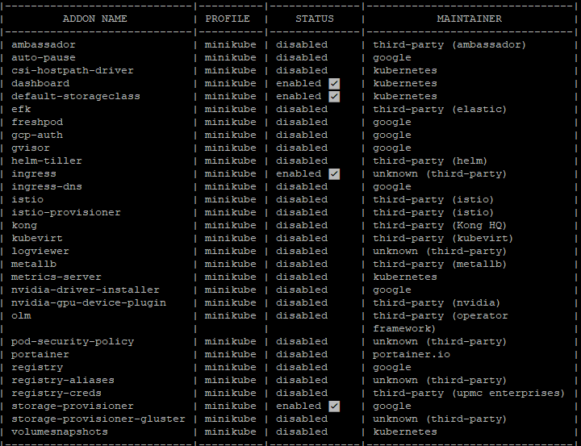
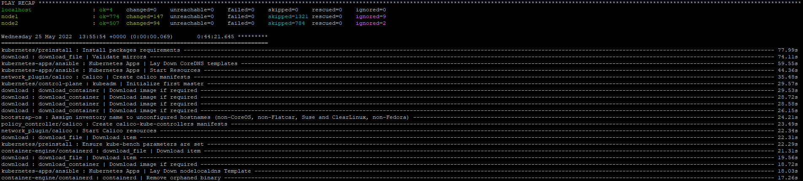

## Access to the dashboard


## Enable plugin: ingress

```
minikube addons list
```


## Run minikube with different HW options (RAM/CPU)

```
minikube start --memory=2048 --cpus=2 --vm-driver=none
* minikube v1.25.2 on Ubuntu 20.04
* Using the none driver based on user configuration
* Starting control plane node minikube in cluster minikube
* Running on localhost (CPUs=3, Memory=4903MB, Disk=40185MB) ...
* OS release is Ubuntu 20.04.3 LTS
* Preparing Kubernetes v1.23.3 on Docker 20.10.16 ...
  - kubelet.resolv-conf=/run/systemd/resolve/resolv.conf
  - kubelet.housekeeping-interval=5m
    > kubeadm.sha256: 64 B / 64 B [--------------------------] 100.00% ? p/s 0s
    > kubelet.sha256: 64 B / 64 B [--------------------------] 100.00% ? p/s 0s
    > kubectl.sha256: 64 B / 64 B [--------------------------] 100.00% ? p/s 0s
    > kubeadm: 43.12 MiB / 43.12 MiB [---------------] 100.00% 1.92 MiB p/s 23s
    > kubectl: 44.43 MiB / 44.43 MiB [---------------] 100.00% 1.60 MiB p/s 28s
    > kubelet: 118.75 MiB / 118.75 MiB [-------------] 100.00% 2.90 MiB p/s 41s
  - Generating certificates and keys ...
  - Booting up control plane ...
  - Configuring RBAC rules ...
* Configuring local host environment ...
*
! kubectl and minikube configuration will be stored in /root
! To use kubectl or minikube commands as your own user, you may need to relocate them. For example, to overwrite your own settings, run:
*
  - sudo mv /root/.kube /root/.minikube $HOME
  - sudo chown -R $USER $HOME/.kube $HOME/.minikube
*
* This can also be done automatically by setting the env var CHANGE_MINIKUBE_NONE_USER=true
* Verifying Kubernetes components...
  - Using image gcr.io/k8s-minikube/storage-provisioner:v5
* Enabled addons: default-storageclass, storage-provisioner
* Done! kubectl is now configured to use "minikube" cluster and "default" namespace by default
```

## Deployment k8s cluster inside IT-ACADEMY environment




