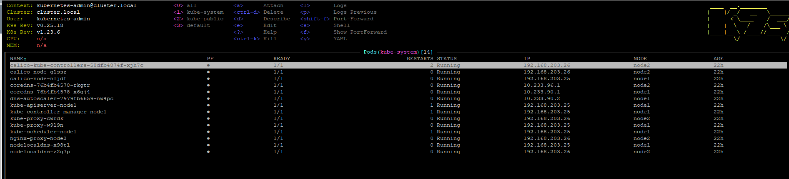
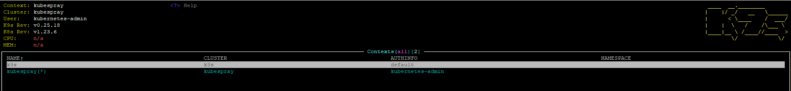

## Setup kubectl for local run (aliases)
```
kgno
NAME    STATUS   ROLES                  AGE   VERSION
node1   Ready    control-plane,master   22h   v1.23.6
node2   Ready    <none>                 22h   v1.23.6

kgpoall
NAMESPACE     NAME                                       READY   STATUS    RESTARTS      AGE
kube-system   calico-kube-controllers-58dfb4874f-xjh7c   1/1     Running   2 (22h ago)   22h
kube-system   calico-node-glssz                          1/1     Running   0             22h
kube-system   calico-node-nljdf                          1/1     Running   0             22h
kube-system   coredns-76b4fb4578-rkgtr                   1/1     Running   0             22h
kube-system   coredns-76b4fb4578-x6gj4                   1/1     Running   0             22h
kube-system   dns-autoscaler-7979fb6659-nw4pc            1/1     Running   0             22h
kube-system   kube-apiserver-node1                       1/1     Running   1             22h
kube-system   kube-controller-manager-node1              1/1     Running   1             22h
kube-system   kube-proxy-cwrdk                           1/1     Running   0             22h
kube-system   kube-proxy-w9l9n                           1/1     Running   0             22h
kube-system   kube-scheduler-node1                       1/1     Running   1             22h
kube-system   nginx-proxy-node2                          1/1     Running   0             22h
kube-system   nodelocaldns-x98tl                         1/1     Running   0             22h
kube-system   nodelocaldns-z2q7p                         1/1     Running   0             22h

```
## Print-screen of k9s with pods in kube-system namespace



## Finish deployment k3s
```
k3s kubectl get node
NAME       STATUS   ROLES                  AGE     VERSION
test2022   Ready    control-plane,master   2m28s   v1.23.6+k3s1
```

## Add config from k3s add to existing config
```
kubectl config get-contexts
CURRENT   NAME        CLUSTER     AUTHINFO           NAMESPACE
          k3s         k3s         default
*         kubespray   kubespray   kubernetes-admin
```


## Kubectl config
```
apiVersion: v1
clusters:
- cluster:
    certificate-authority-data: 
    server: https://127.0.0.1:6445
  name: kubespray
- cluster:
    server: https://127.0.0.1:6443
  name: k3s
contexts:
- context:
    cluster: kubespray
    user: kubernetes-admin
  name: kubespray
- context:
    cluster: k3s
    user: default
  name: k3s
current-context: kubespray
kind: Config
preferences: {}
users:
- name: kubernetes-admin
  user:
    client-certificate-data: 
    client-key-data: 
- name: k3s
  user:
    client-certificate-data: 
    client-key-data: 
```